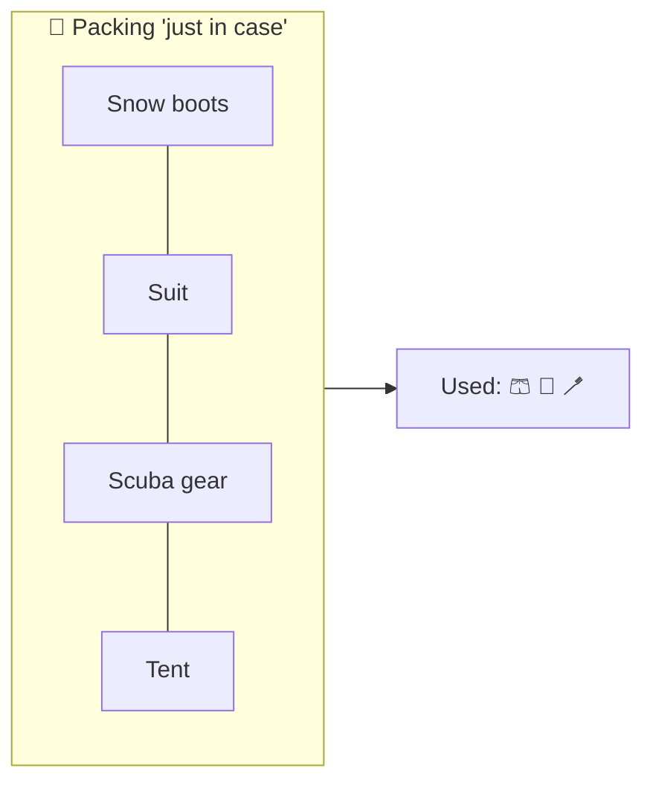
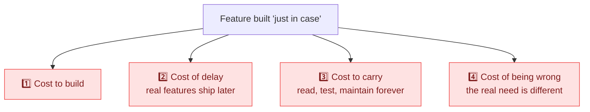
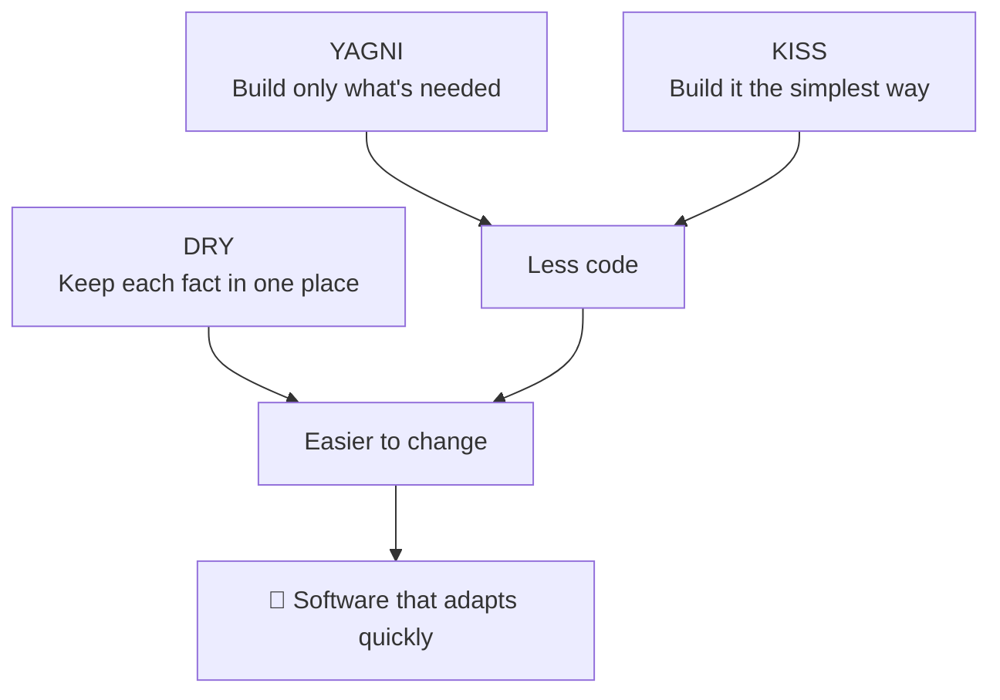

## The big idea

You are packing for a weekend trip. "What if it snows? What if there's a wedding? What if I go scuba diving?" You end up dragging a 30 kg suitcase and using 10% of it.



**YAGNI = You Aren't Gonna Need It.** It comes from Extreme Programming (XP):

> 📘 *"Always implement things when you actually need them, never when you just foresee that you need them."* (Ron Jeffries)

## The hidden cost of "just in case" code

Speculative code isn't free even if nobody uses it. You pay for it four times:



The 4th cost is the big one: when the need finally arrives, it is almost never *exactly* what you guessed. So you rework it anyway.

## Example: the configurable everything

**Task:** export a list of orders as CSV.

```js
// ❌ YAGNI violation: nobody asked for PDF, XML, plugins or custom delimiters
class ExportEngine {
  constructor({ format = "csv", delimiter = ",", encoding = "utf-8", plugins = [], compression = null } = {}) {
    this.formatters = { csv: new CsvFormatter(), pdf: new PdfFormatter(), xml: new XmlFormatter() };
    // … 300 lines
  }
}
```

```js
// ✅ Exactly what was asked
function ordersToCsv(orders) {
  const header = "id,customer,total";
  const rows = orders.map((o) => `${o.id},${escapeCsv(o.customer)},${o.total}`);
  return [header, ...rows].join("\n");
}
```

If PDF export is requested next quarter, you'll add it *then*, knowing the real requirements.

## YAGNI doesn't mean "write rigid code"

YAGNI is about **features and speculative flexibility**. It is *not* an excuse to skip good practices.

| ❌ YAGNI says don't build… | ✅ …but always do |
| --- | --- |
| A plugin system nobody asked for | Clean, small functions |
| Support for 5 databases "in case we switch" | Tests |
| Admin dashboard for a feature with 3 users | Clear names and structure |
| Generic `BaseAbstractManager<T>` classes | Error handling and security |
| Caching layer before measuring slowness | Code that is *easy to change* later |

> 💡 **The secret:** clean, well-tested code is what *makes* YAGNI safe. When code is easy to change, you don't need to predict the future, because you can adapt when it arrives.

## YAGNI, KISS and DRY together



- **YAGNI** decides *what* to build (less).
- **KISS** decides *how* to build it (simply).
- **DRY** keeps what you built *consistent* (one source of truth).

## When looking ahead IS fine

- **Hard-to-reverse decisions:** database choice, public API shape, data model, security. Think these through.
- **Known, committed requirements:** if it's on this sprint's board, it's not speculation.
- **Cheap options:** using an ID type that can scale (UUID) costs nothing now.

## Key takeaways

- Build for today's real requirements, not imagined future ones.
- Speculative code costs you to build, delay, carry and rework.
- YAGNI ≠ sloppy. Clean, tested code is what lets you change safely later.
- Do think ahead for decisions that are expensive to reverse.

## Try it yourself

Look for a function parameter, config option or class in your code that has **never** been used with anything but its default value. Could you delete it?
