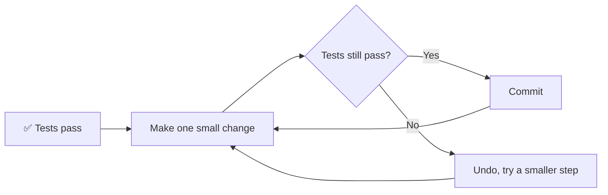
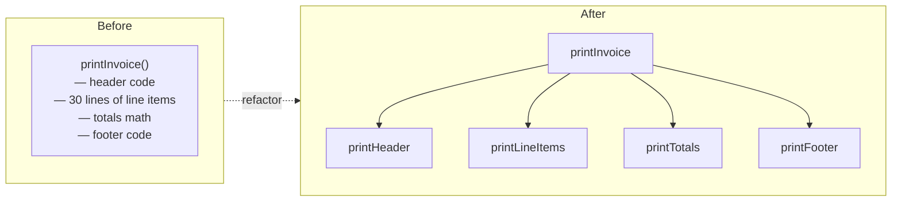
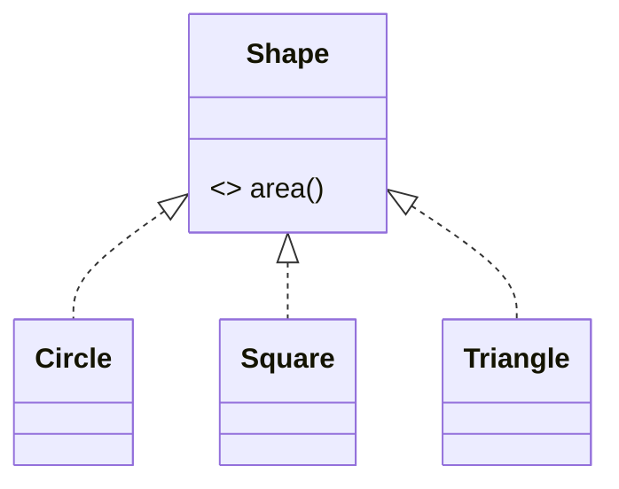
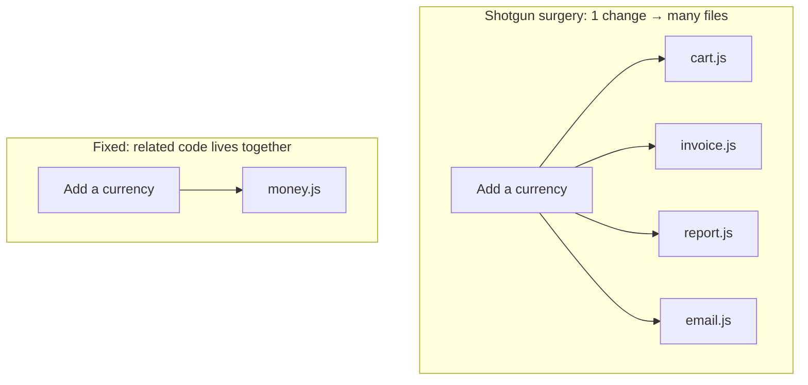

## The big idea

A strange smell in the kitchen doesn't prove something is rotten, but it tells you to check the fridge. A **code smell** is the same: a surface sign that *probably* points to a deeper design problem.

**Refactoring** means changing the *structure* of code **without changing what it does**. Like tidying a room: nothing leaves, it just ends up in the right place.



> ⚠️ **Never refactor without tests.** Tests are your safety net: they prove behaviour didn't change.

## The smell catalogue

| # | Smell | Looks like | Fix (refactoring) |
| --- | --- | --- | --- |
| 1 | **Long function** | 80+ lines, many comments splitting sections | Extract Function |
| 2 | **Large class** | `UserManager` with 40 methods | Extract Class |
| 3 | **Long parameter list** | `create(a, b, c, d, e, f)` | Introduce Parameter Object |
| 4 | **Duplicated code** | Same logic copy-pasted | Extract Function, pull up |
| 5 | **Feature envy** | A method uses another object's data more than its own | Move Function |
| 6 | **Primitive obsession** | Money as `number`, email as `string` everywhere | Replace Primitive with Object |
| 7 | **Switch statements** | Same `switch(type)` in many places | Replace Conditional with Polymorphism |
| 8 | **Shotgun surgery** | One change needs edits in 10 files | Move related code together |
| 9 | **Dead code** | Unused functions, flags, commented code | Delete it |
| 10 | **Magic numbers** | `if (status === 3)` | Replace with Named Constant |

## Smell → fix, with pictures

### Long function → Extract Function



### Feature envy → Move Function

```js
// ❌ This method lives in Order but only cares about Customer's data
class Order {
  shippingLabel() {
    const c = this.customer;
    return `${c.firstName} ${c.lastName}\n${c.street}\n${c.zip} ${c.city}`;
  }
}

// ✅ Move it to the data it envies
class Customer {
  mailingLabel() {
    return `${this.firstName} ${this.lastName}\n${this.street}\n${this.zip} ${this.city}`;
  }
}
// order.customer.mailingLabel()
```

### Primitive obsession → Value Object

```js
// ❌ Money as a plain number: which currency? cents or dollars? rounding?
function addTax(price) { return price * 1.2; }

// ✅ A small object that knows its own rules
class Money {
  constructor(cents, currency) {
    if (!Number.isInteger(cents)) throw new Error("Money must be whole cents");
    this.cents = cents;
    this.currency = currency;
  }
  add(other) {
    if (other.currency !== this.currency) throw new Error("Currency mismatch");
    return new Money(this.cents + other.cents, this.currency);
  }
  multiply(factor) { return new Money(Math.round(this.cents * factor), this.currency); }
  format() { return new Intl.NumberFormat("en", { style: "currency", currency: this.currency }).format(this.cents / 100); }
}
```

### Switch statements → Polymorphism

```js
// ❌ This switch is repeated in area(), perimeter(), draw()…
function area(shape) {
  switch (shape.type) {
    case "circle": return Math.PI * shape.r ** 2;
    case "square": return shape.side ** 2;
  }
}

// ✅ Each shape knows how to compute its own area
class Circle { constructor(r) { this.r = r; } area() { return Math.PI * this.r ** 2; } }
class Square { constructor(s) { this.s = s; } area() { return this.s ** 2; } }
shapes.map((shape) => shape.area());
```



Adding a triangle now means adding **one class**, not hunting through every `switch`. (This is the **Open/Closed Principle**, covered in the SOLID lessons.)

### Shotgun surgery vs Divergent change



## A safe refactoring workflow

1. **Make sure tests exist** for the code you'll touch. If not, write a few *characterisation tests* that capture today's behaviour.
2. **Take tiny steps:** rename, extract, move, one at a time.
3. **Run tests after every step.**
4. **Commit often** so you can always go back.
5. **Don't mix refactoring with new features** in the same commit. Wear one hat at a time.

> 🎩 **Two hats (Kent Beck):** when you wear the *feature* hat you add behaviour; when you wear the *refactoring* hat you only restructure. Switch hats often, but never wear both at once.

## Let your IDE do it

Modern editors refactor safely for you: **Rename symbol** (F2), **Extract function / variable**, **Move to new file**. They update every reference automatically, which is much safer than find-and-replace.

## Key takeaways

- A smell is a *hint*, not a verdict. Investigate before changing.
- Refactoring changes structure, never behaviour, and needs tests.
- Learn the top smells: long function, large class, duplication, feature envy, primitive obsession, switch statements.
- Tiny steps, run tests, commit, repeat.
