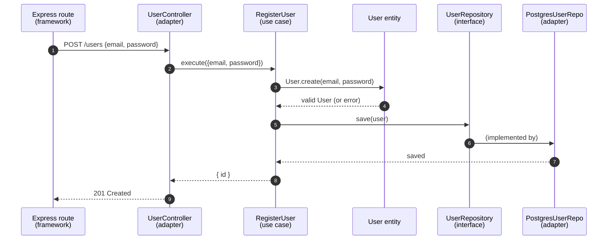
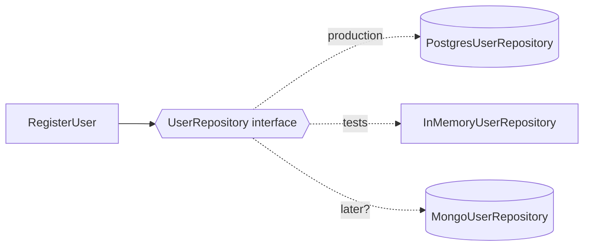

## The big idea

Think of a **power socket**. Your laptop doesn't care whether the electricity comes from solar, wind or coal; it only depends on the *socket shape*. You can switch the power plant without changing the laptop.

Clean Architecture does the same for code: your **business rules** (the valuable part) depend only on simple interfaces. The database, web framework and email provider plug in from outside and can be replaced.


> 💡 **The one rule to remember, the Dependency Rule:** source code dependencies point **inward only**. Inner layers never know about outer layers.

## The four layers

| Layer | Contains | Knows about | Example |
| --- | --- | --- | --- |
| 🟡 **Entities** (domain) | Core business objects and rules | Nothing else | `User`, `Order.total()` |
| 🟢 **Use cases** (application) | What the app *does*: one action each | Entities + interfaces | `RegisterUser`, `PlaceOrder` |
| 🔵 **Interface adapters** | Controllers, presenters, repositories | Use cases | `UserController`, `PostgresUserRepo` |
| 🟣 **Frameworks & drivers** | Express, React, Postgres, Stripe | Adapters | `app.listen()`, `pg.Pool` |

## Follow a registration request



Notice: `RegisterUser` calls `UserRepository`, which is an **interface**. It has no idea Postgres exists.

## The code, layer by layer

**1. Entity: pure business rules**

```js
// domain/User.js — no imports from frameworks or databases
export class User {
  constructor({ id, email, passwordHash }) {
    if (!email.includes("@")) throw new ValidationError("Invalid email");
    Object.assign(this, { id, email, passwordHash });
  }
}
```

**2. Use case: one application action**

```js
// application/RegisterUser.js
export class RegisterUser {
  // Dependencies are injected: only "shapes" (interfaces), never concrete classes
  constructor({ userRepository, passwordHasher, emailSender }) {
    Object.assign(this, { userRepository, passwordHasher, emailSender });
  }

  async execute({ email, password }) {
    if (await this.userRepository.findByEmail(email)) throw new ConflictError("Email taken");
    const user = new User({ email, passwordHash: await this.passwordHasher.hash(password) });
    const saved = await this.userRepository.save(user);
    await this.emailSender.sendWelcome(saved.email);
    return { id: saved.id };
  }
}
```

**3. Adapters: translate between the outside world and the use case**

```js
// adapters/PostgresUserRepository.js
export class PostgresUserRepository {
  constructor(pool) { this.pool = pool; }
  async findByEmail(email) {
    const { rows } = await this.pool.query("SELECT * FROM users WHERE email = $1", [email]);
    return rows[0] ? new User(rows[0]) : null;
  }
  async save(user) { /* INSERT … RETURNING id */ }
}

// adapters/UserController.js
export const userController = (registerUser) => async (req, res) => {
  const result = await registerUser.execute(req.body);
  res.status(201).json(result);
};
```

**4. Composition root: wire everything together, once**

```js
// main.js — the ONLY place that knows every concrete class
const registerUser = new RegisterUser({
  userRepository: new PostgresUserRepository(pool),
  passwordHasher: new BcryptHasher(),
  emailSender: new SendGridEmailSender(apiKey),
});
app.post("/users", userController(registerUser));
```

## Why bother? Testing becomes trivial

Because the use case only depends on interfaces, you can test it with in-memory fakes. No database, no network, milliseconds per test.

```js
test("rejects duplicate emails", async () => {
  const userRepository = new InMemoryUserRepository([{ id: 1, email: "a@b.com" }]);
  const registerUser = new RegisterUser({ userRepository, passwordHasher: fakeHasher, emailSender: fakeSender });

  await expect(registerUser.execute({ email: "a@b.com", password: "secret123" })).rejects.toThrow(ConflictError);
});
```



## Folder structure

```text
src/
├── domain/          # entities + business rules (no dependencies)
│   └── User.js
├── application/     # use cases + interfaces they need
│   └── RegisterUser.js
├── adapters/        # controllers, repositories, gateways
│   ├── UserController.js
│   └── PostgresUserRepository.js
└── main.js          # composition root: wires it all up
```

## Related names you'll hear

- **Hexagonal Architecture / Ports & Adapters** (Alistair Cockburn): same idea. *Ports* are interfaces, *adapters* plug into them.
- **Onion Architecture** (Jeffrey Palermo): same idea, drawn as an onion.
- All three share the core rule: **business logic in the centre, infrastructure at the edges.**

## When NOT to use it

For a small script, a prototype or a simple CRUD app, the layers add ceremony without much benefit (remember **KISS** and **YAGNI**). Clean Architecture pays off when the business logic is rich and the app will live for years.

## Key takeaways

- Dependencies point inward. The domain knows nothing about frameworks or databases.
- Use cases depend on **interfaces**; concrete implementations are injected.
- One composition root wires everything together.
- Payoff: fast tests, swappable infrastructure, business rules you can read in isolation.
