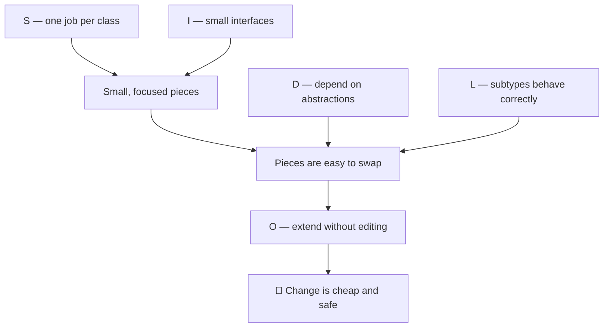

## The big idea

SOLID is a set of five principles collected by **Robert C. Martin ("Uncle Bob")** in the early 2000s. They answer one question:

> 🎯 **How do I structure code so that a change in one place doesn't break ten other places?**


## The five letters in one sentence each

| Letter | Principle | In plain words | Real-life analogy |
| --- | --- | --- | --- |
| **S** | Single Responsibility | A class should have only **one reason to change**. | A chef cooks; a waiter serves. |
| **O** | Open / Closed | Add new behaviour by **adding code**, not editing old code. | Plug a new lens onto a camera. |
| **L** | Liskov Substitution | A subtype must work **anywhere its parent works**. | Any charger with the right plug should charge your phone. |
| **I** | Interface Segregation | Many **small, specific interfaces** beat one huge one. | A TV remote doesn't need a microwave's buttons. |
| **D** | Dependency Inversion | Depend on **abstractions**, not concrete details. | Lamps depend on the socket, not the power plant. |

## How they connect



- **S** and **I** keep things *small*.
- **D** and **L** make small things *swappable*.
- Swappable pieces give you **O**: new features by adding code, not rewriting it.

## A tiny before/after preview

```js
// ❌ Breaks almost every SOLID rule
class Report {
  generate(data) { /* build numbers */ }
  toPdf() { /* PDF logic */ }
  toExcel() { /* Excel logic */ }
  saveToMySql() { const db = new MySqlConnection(); /* … */ }
  email() { const smtp = new GmailSmtp(); /* … */ }
}
```

```js
// ✅ SOLID version
class ReportGenerator { generate(data) { /* numbers only */ } }           // S

class PdfExporter { export(report) {} }                                    // O: add new exporters
class ExcelExporter { export(report) {} }                                  //    without editing old ones

class ReportService {
  constructor(repository, notifier) {                                     // D: injected abstractions
    this.repository = repository;
    this.notifier = notifier;
  }
  async publish(report, exporter) {
    const file = exporter.export(report);                                 // L: any exporter works
    await this.repository.save(file);
    await this.notifier.notify("Report ready");
  }
}
```

## Do I need SOLID in JavaScript?

Yes, although it looks a little different from Java or C#:

- JavaScript has no `interface` keyword, but it has **duck typing**: *"if it has a `send()` method, it's a sender"*. TypeScript adds real interfaces.
- Functions are first-class, so you can often pass a **function** where Java would pass an object implementing an interface.
- SOLID applies to **modules, functions and React components** too, not only classes.

## Common misunderstandings

- ❌ "SOLID means more classes." It means *better-divided* responsibilities, not more files for their own sake.
- ❌ "Apply all five everywhere from day one." Use them when code starts to hurt (see **YAGNI**).
- ❌ "SOLID is only for OOP." The ideas apply to functions, modules and services.

## Key takeaways

- SOLID = five principles for code that is easy to change.
- **S**, **I**: keep pieces small. **D**, **L**: keep pieces swappable. **O**: extend by adding.
- The next five lessons cover each letter with pictures and before/after code.
