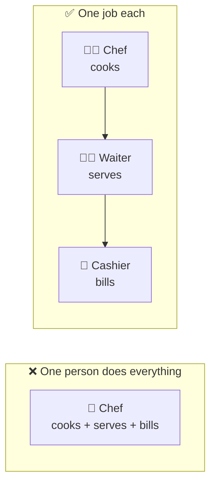
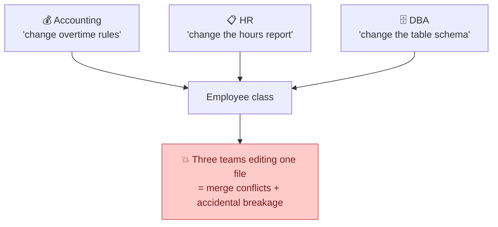

## The big idea

In a restaurant, the chef cooks, the waiter serves and the cashier handles payments. If the chef also did the accounting, then a new tax law would force a change in *the kitchen*. That makes no sense.



> 📘 **SRP:** *"A module should be responsible to one, and only one, actor."* An **actor** is a group of people who request changes: accounting, marketing, the security team…

"One reason to change" really means **one group of people who would ask for a change**.

## Spot the hidden responsibilities

```js
// ❌ Three actors, one class
class Employee {
  calculatePay() { /* rules from ACCOUNTING */ }
  reportHours() { /* format from HR */ }
  save() { /* SQL from the DBA / ops team */ }
}
```



**The real danger:** `calculatePay()` and `reportHours()` might share a helper like `regularHours()`. Accounting changes that helper for pay rules, and the HR report silently breaks.

## The fix: split by actor

```js
// ✅ One reason to change each
class Employee {
  constructor(id, name, hourlyRate) { Object.assign(this, { id, name, hourlyRate }); }
}

class PayCalculator {          // changes only when ACCOUNTING asks
  calculate(employee, timesheet) { /* … */ }
}

class HoursReporter {          // changes only when HR asks
  report(employee, timesheet) { /* … */ }
}

class EmployeeRepository {     // changes only when the DATABASE changes
  save(employee) { /* … */ }
}
```


## A frontend example

SRP applies to React components too.

```jsx
// ❌ Fetching + state + formatting + rendering in one component
function UserProfile({ id }) {
  const [user, setUser] = useState(null);
  useEffect(() => { fetch(`/api/users/${id}`).then((r) => r.json()).then(setUser); }, [id]);
  if (!user) return <Spinner />;
  const joined = new Date(user.createdAt).toLocaleDateString("en-GB", { year: "numeric", month: "long" });
  return <div><h2>{user.name}</h2><p>Member since {joined}</p></div>;
}
```

```jsx
// ✅ Each piece has one job
function useUser(id) {                              // data fetching
  return useQuery({ queryKey: ["user", id], queryFn: () => api.getUser(id) });
}

const formatMemberSince = (date) =>                 // formatting
  new Date(date).toLocaleDateString("en-GB", { year: "numeric", month: "long" });

function UserProfile({ id }) {                      // rendering
  const { data: user, isLoading } = useUser(id);
  if (isLoading) return <Spinner />;
  return <div><h2>{user.name}</h2><p>Member since {formatMemberSince(user.createdAt)}</p></div>;
}
```

## How to test for SRP

Ask these questions about any class or module:

1. **Describe it without "and".** "It calculates pay" ✅ vs "It calculates pay *and* saves *and* emails" ❌.
2. **Who would ask me to change this?** More than one team or role means more than one responsibility.
3. **Do its methods use different fields?** If half the methods use fields A and B, and the other half use C and D, it's two classes glued together.

## Don't overdo it

SRP doesn't mean *"one method per class"*. A `Money` class with `add`, `subtract`, `format` and `equals` has **one** responsibility: representing money. Splitting it into four classes would hurt readability.

> 💡 Group things that change **together**; separate things that change for **different reasons**.

## Key takeaways

- One class/module = one reason to change = one actor who requests changes.
- Mixed responsibilities cause merge conflicts and "I changed X and Y broke" bugs.
- Split by *who* asks for changes, not by counting methods.
- Applies to functions, classes, modules, React components and services.
