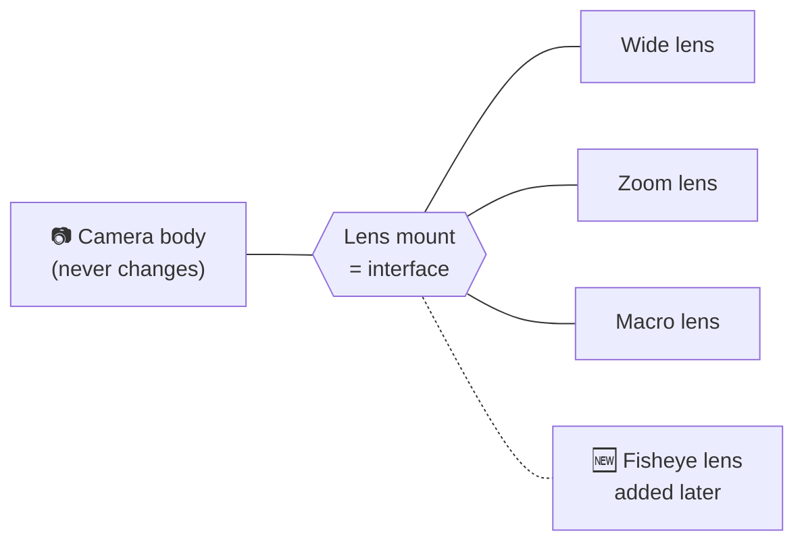
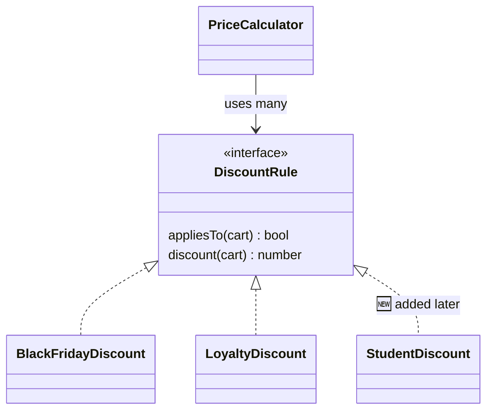

## The big idea

A camera body has a lens mount. When you want to shoot wildlife, you don't open the camera and resolder its insides; you **plug in a new lens**. The camera is:

- **Open for extension:** new lenses can be added.
- **Closed for modification:** the camera body never changes.



> 📘 **OCP (Bertrand Meyer, 1988):** *"Software entities should be open for extension, but closed for modification."*

## Why editing working code is risky

Every time you open a working, tested function to add an `else if`, you risk breaking the cases that already worked, and you must re-test all of them.

## Before: the growing `if/else`

```js
// ❌ Every new payment method = edit this function again
function processPayment(order, method) {
  if (method === "card") {
    return stripe.charge(order.total, order.cardToken);
  } else if (method === "paypal") {
    return paypal.createPayment(order.total, order.email);
  } else if (method === "crypto") {
    return coinbase.charge(order.total, order.wallet);
  }
  // Next month: Apple Pay → edit again. Then Klarna → edit again…
  throw new Error("Unknown payment method");
}
```

## After: plug-in strategies

```js
// ✅ Each payment method is a separate "plug-in" with the same shape
const cardPayment   = { pay: (order) => stripe.charge(order.total, order.cardToken) };
const paypalPayment = { pay: (order) => paypal.createPayment(order.total, order.email) };
const cryptoPayment = { pay: (order) => coinbase.charge(order.total, order.wallet) };

const paymentMethods = new Map([
  ["card", cardPayment],
  ["paypal", paypalPayment],
  ["crypto", cryptoPayment],
]);

// This function is now CLOSED: it never needs to change again
function processPayment(order, methodName) {
  const method = paymentMethods.get(methodName);
  if (!method) throw new ValidationError(`Unsupported payment method: ${methodName}`);
  return method.pay(order);
}

// Adding Apple Pay = ADD code, don't EDIT code
paymentMethods.set("applepay", { pay: (order) => applePay.charge(order.total, order.token) });
```


## With classes and TypeScript

```ts
interface DiscountRule {
  appliesTo(cart: Cart): boolean;
  discount(cart: Cart): number;
}

class BlackFridayDiscount implements DiscountRule {
  appliesTo = (cart: Cart) => isBlackFriday(new Date());
  discount = (cart: Cart) => cart.total * 0.3;
}

class LoyaltyDiscount implements DiscountRule {
  appliesTo = (cart: Cart) => cart.customer.yearsActive >= 3;
  discount = (cart: Cart) => cart.total * 0.1;
}

// Closed for modification: new rules never touch this class
class PriceCalculator {
  constructor(private rules: DiscountRule[]) {}

  total(cart: Cart): number {
    const best = Math.max(0, ...this.rules.filter((r) => r.appliesTo(cart)).map((r) => r.discount(cart)));
    return cart.total - best;
  }
}
```



## OCP is everywhere you look

| Tool | Extension point |
| --- | --- |
| Express / Koa | Middleware: `app.use(myMiddleware)` |
| VS Code | Extensions |
| Webpack / Vite | Plugins and loaders |
| React | Components via `children` and render props |
| ESLint | Custom rules |

None of these tools need to change their source code when you add something new.

## Don't overdo it

You can't predict every future change, and building extension points everywhere violates **YAGNI**. A good rule:

> 💡 Write the simple `if` first. When the **second or third** variation appears, refactor to an extension point.

## Key takeaways

- Add new behaviour by **adding** code (new classes, functions, config), not **editing** tested code.
- Use polymorphism, strategy maps, plugins or middleware to create extension points.
- Growing `if/else` or `switch` on a "type" is the classic sign that OCP is needed.
- Introduce extension points when real variation appears, not before.
