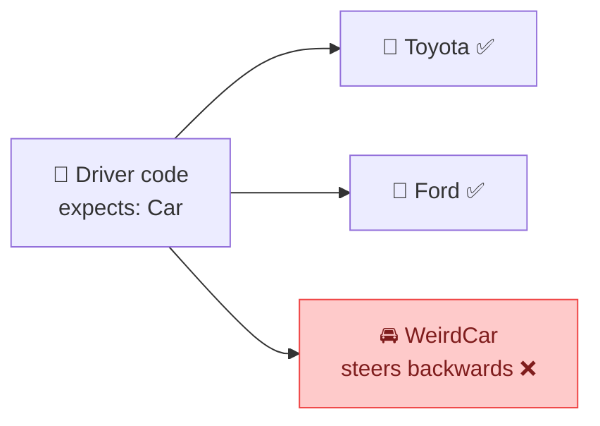
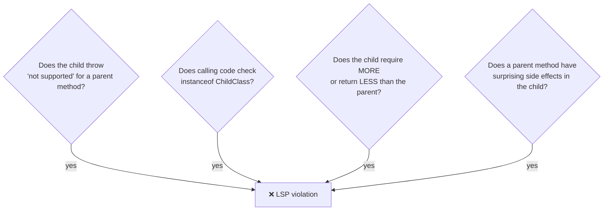
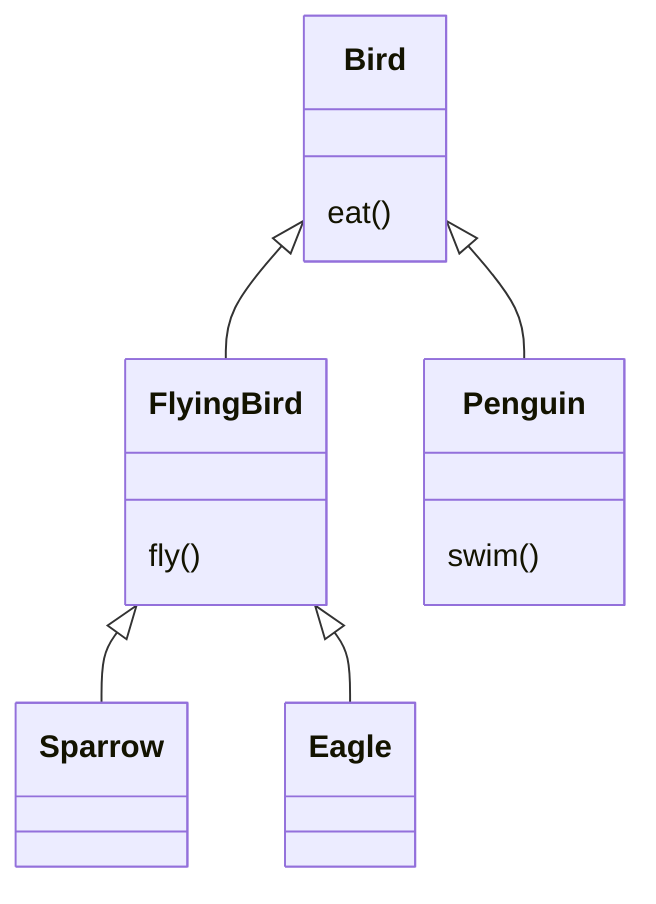

## The big idea

You rent a car. The contract says "a car". Whether you get a Toyota or a Ford, you expect a steering wheel, pedals and gears to work the same way. If one "car" steers backwards, it isn't really a valid substitute, even if it's technically a car.



> 📘 **LSP (Barbara Liskov, 1987):** *Objects of a subtype must be replaceable for objects of the parent type without breaking the program.*

In plain words: **a child class must keep every promise the parent class makes.**

## The classic trap: Square extends Rectangle

In maths, a square *is* a rectangle. So inheritance seems natural:

```js
class Rectangle {
  setWidth(w) { this.width = w; }
  setHeight(h) { this.height = h; }
  area() { return this.width * this.height; }
}

class Square extends Rectangle {
  // A square must keep both sides equal…
  setWidth(w) { this.width = w; this.height = w; }
  setHeight(h) { this.width = h; this.height = h; }
}
```

Now some perfectly reasonable code that works with `Rectangle`:

```js
function stretch(rect) {
  rect.setWidth(5);
  rect.setHeight(4);
  console.assert(rect.area() === 20, "Expected 5 × 4 = 20");
}

stretch(new Rectangle()); // ✅ 20
stretch(new Square());    // ❌ 16 — setHeight(4) also changed the width!
```


`Square` broke a promise that `Rectangle` made: *"setting the height doesn't change the width."* That is an LSP violation.

### The fix: don't force the inheritance

```js
// ✅ Both are shapes; neither pretends to be the other
class Rectangle {
  constructor(width, height) { Object.assign(this, { width, height }); }
  area() { return this.width * this.height; }
}

class Square {
  constructor(side) { this.side = side; }
  area() { return this.side ** 2; }
}

const shapes = [new Rectangle(5, 4), new Square(3)];
shapes.forEach((s) => console.log(s.area())); // any shape works with area()
```

> 💡 "**Is-a**" in the real world doesn't always mean "**is-a**" in code. In code, inheritance means *behaves like*.

## How to recognise an LSP violation



### Red flag 1: "not implemented" methods

```js
class Bird { fly() { /* flap */ } }

class Penguin extends Bird {
  fly() { throw new Error("Penguins can't fly"); } // ❌ breaks every caller of Bird.fly()
}
```

**Fix:** model the capability separately.

```js
class Bird { eat() {} }
class FlyingBird extends Bird { fly() {} }
class Sparrow extends FlyingBird {}
class Penguin extends Bird { swim() {} }
```



### Red flag 2: `instanceof` checks

```js
// ❌ The caller has to know about the special case
function makeBirdsFly(birds) {
  birds.forEach((bird) => {
    if (bird instanceof Penguin) return; // patching around a broken hierarchy
    bird.fly();
  });
}
```

## The contract rules (for the curious)

A child class must:

| Rule | Meaning | Example |
| --- | --- | --- |
| Accept the same or **more** inputs | Don't tighten preconditions | Parent accepts any number → child can't reject negatives |
| Return the same or **narrower** outputs | Don't loosen postconditions | Parent returns an array → child can't return `null` |
| Keep the parent's **invariants** | Rules that are always true | "balance never negative" stays true |
| Throw **no new kinds** of errors | Callers aren't ready for them | `ReadOnlyList.add()` throwing is a violation |

## LSP in everyday JavaScript

Even without classes, LSP applies to anything with a shared contract:

```js
// Any "storage" passed in must behave like the others
const memoryStorage = { get: (k) => map.get(k), set: (k, v) => map.set(k, v) };
const redisStorage = { get: (k) => redis.get(k), set: (k, v) => redis.set(k, v) };

function createCache(storage) { /* works with either, same promises */ }
```

If `redisStorage.get` returned a string `"null"` where `memoryStorage.get` returned `undefined`, callers would break. That is an LSP violation in duck-typed form.

## Key takeaways

- A subtype must be usable anywhere its parent is, **without surprises**.
- Red flags: `throw new Error("not supported")`, `instanceof` checks, changed side effects.
- Real-world "is-a" ≠ code "behaves-like-a". Prefer composition or separate types.
- LSP is what makes polymorphism (and the **Open/Closed Principle**) safe.
