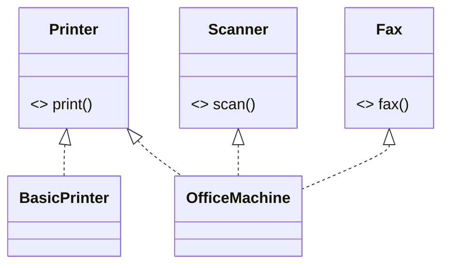
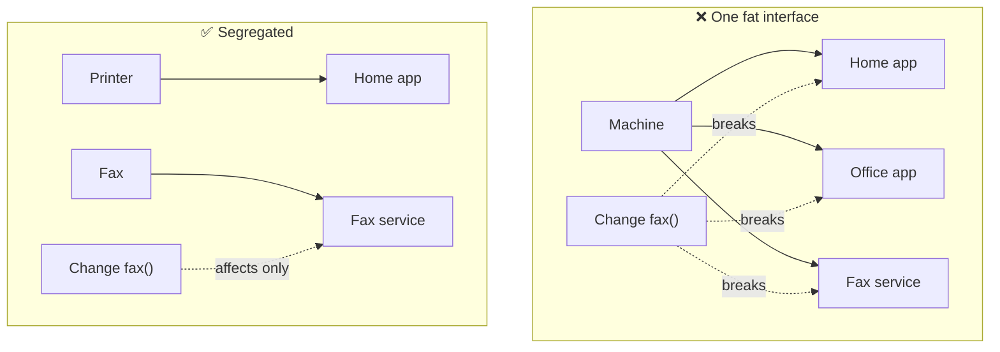

## The big idea

Imagine one universal remote with 80 buttons for the TV, the air conditioner, the garage door and the microwave. Your grandmother only wants to change channels. Every extra button is confusion and a chance to open the garage by mistake.


> 📘 **ISP:** *"Clients should not be forced to depend on methods they do not use."*

## The fat interface problem

```ts
// ❌ One interface for every kind of machine
interface Machine {
  print(doc: Document): void;
  scan(doc: Document): Image;
  fax(doc: Document, number: string): void;
  staple(doc: Document): void;
}

// A simple home printer is forced to "implement" things it can't do
class BasicPrinter implements Machine {
  print(doc: Document) { /* ✅ real */ }
  scan(): Image { throw new Error("Not supported"); }     // ❌
  fax(): void { throw new Error("Not supported"); }       // ❌
  staple(): void { throw new Error("Not supported"); }    // ❌
}
```

Notice those `throw new Error("Not supported")` lines. That's the same red flag we saw with **Liskov Substitution**: fat interfaces *cause* LSP violations.

## The fix: small, role-based interfaces

```ts
// ✅ One interface per capability
interface Printer { print(doc: Document): void; }
interface Scanner { scan(doc: Document): Image; }
interface Fax     { fax(doc: Document, number: string): void; }

class BasicPrinter implements Printer {
  print(doc: Document) { /* … */ }
}

class OfficeMachine implements Printer, Scanner, Fax {
  print(doc: Document) { /* … */ }
  scan(doc: Document): Image { /* … */ }
  fax(doc: Document, number: string) { /* … */ }
}

// Functions ask only for what they need
function printReport(printer: Printer, report: Document) {
  printer.print(report); // accepts BasicPrinter AND OfficeMachine
}
```



## Why it matters: fewer ripple effects

When clients depend on a fat interface, a change to *any* method forces *every* client to be recompiled, re-tested and possibly edited, even clients that never used that method.



## ISP in React: props

A component's props are its interface. Don't pass a giant object when the component only needs two fields.

```tsx
// ❌ Depends on the whole User (30 fields). Any change to User can affect it,
// and it is hard to reuse or test.
function Avatar({ user }: { user: User }) {
  return ;
}

// ✅ Asks for exactly what it uses
function Avatar({ src, name }: { src: string; name: string }) {
  return ;
}

<Avatar src={user.avatarUrl} name={user.displayName} />
<Avatar src={team.logoUrl} name={team.name} />  {/* now reusable for teams too! */}
```

## ISP in APIs and services

The same idea applies at a larger scale:

- **Backend for Frontend (BFF):** a mobile app and a web app each get an API shaped for their needs, instead of one giant API.
- **GraphQL:** clients request only the fields they need.
- **Repository interfaces:** a report job gets a `ReadOnlyOrderRepository`, not one with `delete()`.

```ts
interface OrderReader { findById(id: string): Promise<Order>; list(filter: Filter): Promise<Order[]>; }
interface OrderWriter { save(order: Order): Promise<void>; delete(id: string): Promise<void>; }

class ReportService { constructor(private orders: OrderReader) {} }   // can't delete by accident
class CheckoutService { constructor(private orders: OrderReader & OrderWriter) {} }
```

## Key takeaways

- Many small, focused interfaces beat one large, general one.
- If implementers throw "not supported", the interface is too fat.
- Functions and components should ask for the **minimum** they need.
- Smaller interfaces mean fewer ripple effects when things change.
