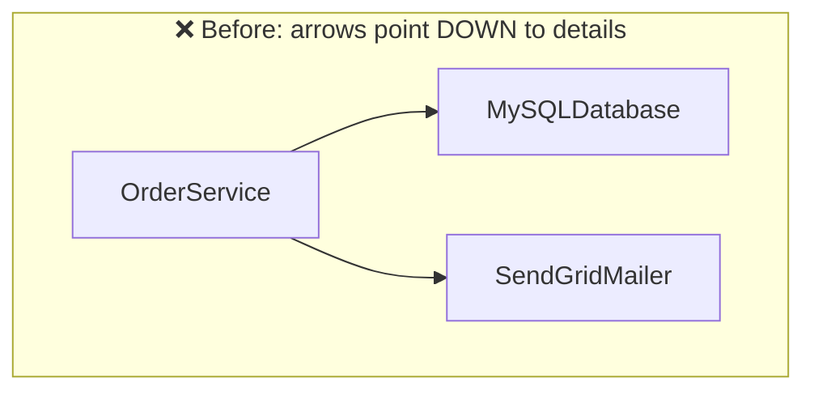
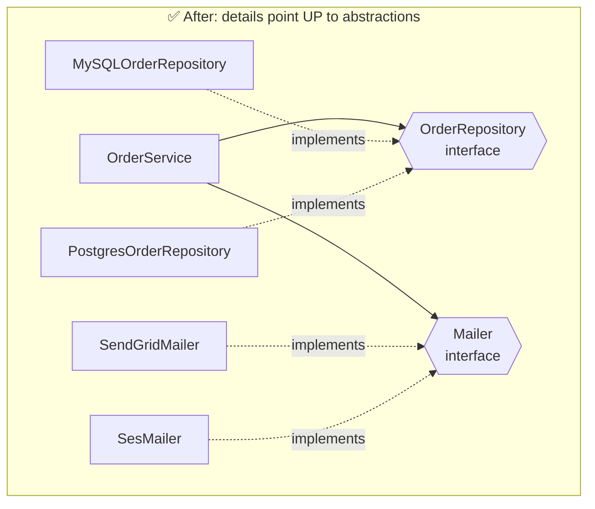
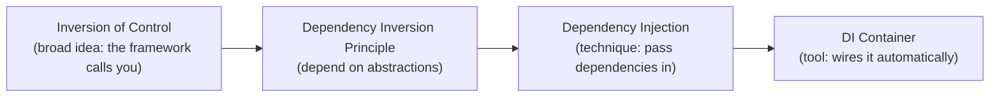

## The big idea

Your lamp doesn't have a wire soldered directly to the power plant. It has a **plug**, and the wall has a **socket**. Both depend on a shared standard, the *socket shape*. That's why you can move the lamp to any room and the utility company can switch from coal to solar.


> 📘 **DIP:**
> 1. *High-level modules should not depend on low-level modules. Both should depend on abstractions.*
> 2. *Abstractions should not depend on details. Details should depend on abstractions.*

- **High-level module:** your business logic (`OrderService`). This is what makes money.
- **Low-level module:** details (`MySQLDatabase`, `SendGridMailer`). These are replaceable.
- **Abstraction:** an interface or contract (`OrderRepository`, `Mailer`).

## Before: business logic glued to details

```js
import { MySQLDatabase } from "./mysql.js";
import { SendGridMailer } from "./sendgrid.js";

// ❌ OrderService creates its own concrete dependencies
class OrderService {
  constructor() {
    this.db = new MySQLDatabase("mysql://prod-server");   // hard-wired
    this.mailer = new SendGridMailer(process.env.SG_KEY); // hard-wired
  }

  async placeOrder(order) {
    await this.db.insert("orders", order);
    await this.mailer.send(order.email, "Order confirmed");
  }
}
```

Problems:

- 🧪 **Can't unit test** without a real MySQL server and real emails.
- 🔄 **Can't switch** to Postgres or AWS SES without editing business logic.
- 🔗 The *valuable* code depends on the *replaceable* code, which is backwards.



## After: invert the dependency

```js
// ✅ OrderService depends only on "shapes" it receives
class OrderService {
  constructor({ orderRepository, mailer }) {
    this.orderRepository = orderRepository; // anything with save(order)
    this.mailer = mailer;                   // anything with send(to, text)
  }

  async placeOrder(order) {
    await this.orderRepository.save(order);
    await this.mailer.send(order.email, "Order confirmed");
  }
}
```



See how the arrows from the details now point **up** toward the abstractions? That's the "inversion".

## Wiring it up: Dependency Injection

**DIP** is the principle; **Dependency Injection (DI)** is the most common technique to achieve it: *pass dependencies in from outside instead of creating them inside.*

```js
// Production: main.js / composition root
const orderService = new OrderService({
  orderRepository: new PostgresOrderRepository(pool),
  mailer: new SesMailer(awsConfig),
});

// Tests: plain fakes, no network
const sent = [];
const testService = new OrderService({
  orderRepository: { save: async () => {} },
  mailer: { send: async (to, text) => sent.push({ to, text }) },
});

await testService.placeOrder({ email: "a@b.com" });
expect(sent).toEqual([{ to: "a@b.com", text: "Order confirmed" }]);
```

### Three ways to inject

| Style | Example | When |
| --- | --- | --- |
| **Constructor** | `new OrderService({ repo, mailer })` | Most common, required dependencies |
| **Function parameter** | `placeOrder(order, { mailer })` | Functional code |
| **DI container** | NestJS `@Injectable()`, InversifyJS | Large apps with many dependencies |

```ts
// NestJS does the wiring for you
@Injectable()
export class OrderService {
  constructor(
    private readonly orderRepository: OrderRepository,
    private readonly mailer: Mailer,
  ) {}
}
```

## DIP with plain functions

In JavaScript you don't need classes. A higher-order function works just as well:

```js
const makePlaceOrder = ({ saveOrder, sendEmail }) => async (order) => {
  await saveOrder(order);
  await sendEmail(order.email, "Order confirmed");
};

const placeOrder = makePlaceOrder({ saveOrder: pgSaveOrder, sendEmail: sesSend });
```

## DIP vs DI vs IoC



## Key takeaways

- Business logic should depend on **interfaces**, never on concrete databases, APIs or SDKs.
- Details (MySQL, SendGrid) implement the interfaces; the arrows point *toward* the abstraction.
- Dependency Injection = pass dependencies in, from one composition root.
- Payoff: fast unit tests with fakes, and infrastructure you can swap without touching business rules.
- DIP is the backbone of **Clean Architecture**.
