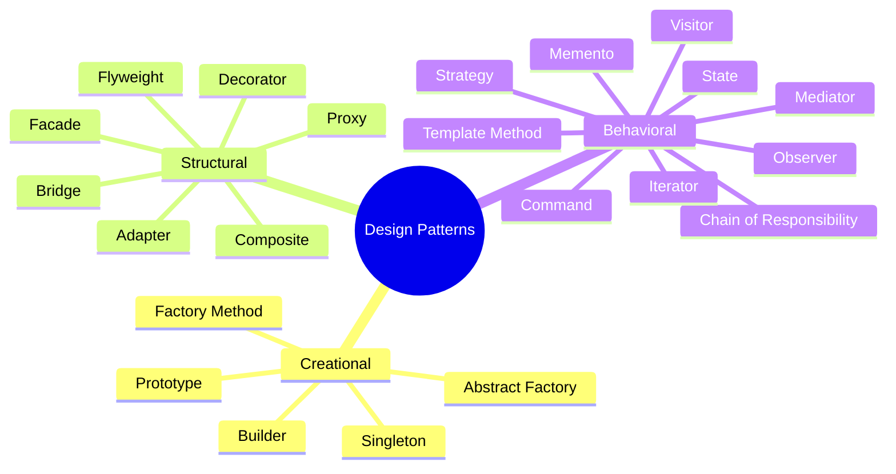
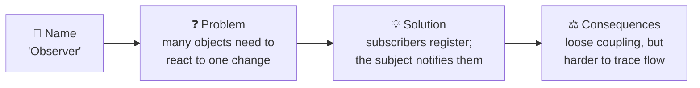
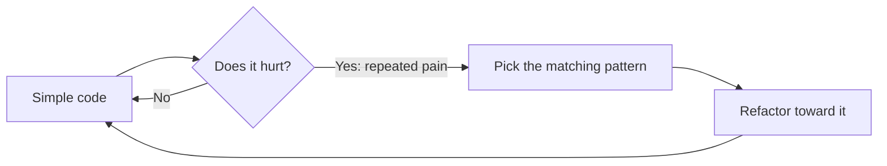

## The big idea

Architects don't reinvent the staircase for every building. They use known solutions, like "spiral staircase" or "L-shaped staircase", each with known trade-offs. When one architect says "spiral staircase", the other instantly pictures it.

Design patterns are the **staircases of software**: proven solutions with names, so developers can say *"let's use an Observer here"* instead of explaining 50 lines of code.

> 📘 In 1994, four authors (Gamma, Helm, Johnson, Vlissides, the **"Gang of Four" / GoF**) published *Design Patterns*, describing **23 patterns**. This course covers the 22 that are most useful today.

## The three families

| Family | Question it answers | Patterns |
| --- | --- | --- |
| 🏭 **Creational** | *How do I create objects?* | Factory Method, Abstract Factory, Builder, Prototype, Singleton |
| 🧱 **Structural** | *How do I connect objects into bigger structures?* | Adapter, Bridge, Composite, Decorator, Facade, Flyweight, Proxy |
| 🗣️ **Behavioral** | *How do objects talk and share work?* | Chain of Responsibility, Command, Iterator, Mediator, Memento, Observer, State, Strategy, Template Method, Visitor |

## Every pattern has four parts

Always learn the **problem** first. A pattern without its problem is a hammer looking for a nail.

## You already use patterns

| You wrote… | It's the… pattern |
| --- | --- |
| `button.addEventListener("click", fn)` | **Observer** |
| `app.use(middleware)` in Express | **Chain of Responsibility** |
| `array.sort((a, b) => a - b)` | **Strategy** |
| `for (const x of iterable)` | **Iterator** |
| `new Proxy(obj, handler)` | **Proxy** |
| A React Higher-Order Component | **Decorator** |
| `axios.create({ baseURL })` | **Factory** |
| A module-level `const db = new Pool()` | **Singleton** |

## The golden rules

> ⚠️ **Patterns are tools, not goals.**

1. **Start simple.** Write the plain solution first (**KISS**).
2. **Recognise the pain.** A growing `switch`, duplicated creation logic, tight coupling…
3. **Then reach for the pattern** that fixes *that* pain.
4. **Name it in code.** `PaymentStrategy` or `OrderEventEmitter` tells readers what's going on.

## Patterns in modern JavaScript

Many GoF patterns were designed for Java and C++ in the 1990s. JavaScript's **first-class functions**, **closures** and **modules** make several of them much simpler:

- **Strategy** → just pass a function.
- **Command** → a function (or an object with `execute`).
- **Singleton** → an ES module export (modules are cached).
- **Iterator** → built in with `Symbol.iterator` and generators.

This course shows the idiomatic JavaScript version of each.

## Key takeaways

- Design patterns are named, proven solutions to recurring design problems.
- Three families: **Creational** (making), **Structural** (connecting), **Behavioral** (communicating).
- The shared vocabulary is half the value.
- Learn the problem first; apply patterns only when the problem is real.
