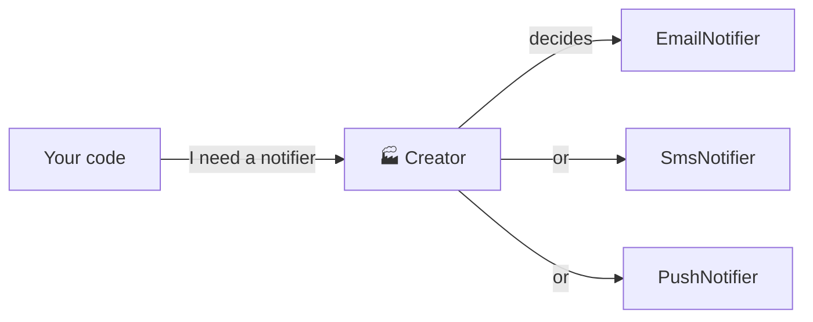
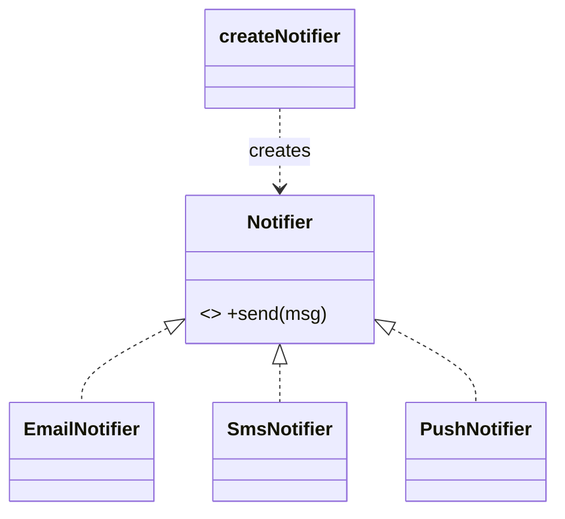
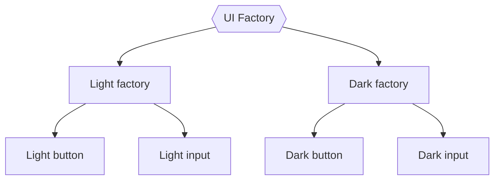
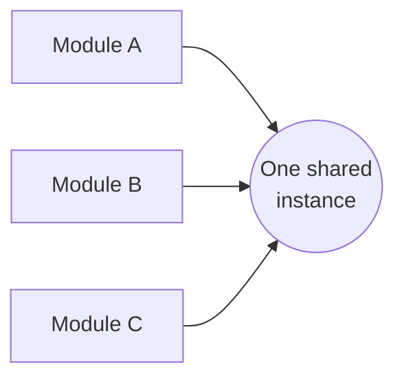

## Why creational patterns?

Writing `new ConcreteClass()` everywhere glues your code to specific classes. Creational patterns **hide the "how" of creating objects**, so the rest of the code only asks for *what* it needs.



---

## 1. Factory Method

> 🍕 **Analogy:** At a pizza shop you say *"one margherita"*. You don't knead the dough yourself. The kitchen (the factory) decides how to make it.

**Problem:** your code needs to create different types of objects depending on a condition, and you don't want `if/else` + `new` scattered everywhere.

```js
class EmailNotifier { send(msg) { console.log("📧", msg); } }
class SmsNotifier   { send(msg) { console.log("📱", msg); } }
class PushNotifier  { send(msg) { console.log("🔔", msg); } }

const notifiers = { email: EmailNotifier, sms: SmsNotifier, push: PushNotifier };

// The factory: one place that knows how to create notifiers
function createNotifier(type) {
  const Notifier = notifiers[type];
  if (!Notifier) throw new Error(`Unknown notifier: ${type}`);
  return new Notifier();
}

createNotifier(user.preferredChannel).send("Your order shipped!");
```



**Use when:** the exact type is decided at runtime (config, user input, environment).

---

## 2. Abstract Factory

> 🛋️ **Analogy:** A furniture store sells matching *collections*: a Modern chair + Modern sofa + Modern table, or a Victorian set. You never mix a Victorian chair with a Modern sofa.

**Problem:** you need to create **families of related objects** that must match each other.

```js
// Two families of UI components that must not be mixed
const lightTheme = {
  createButton: () => ({ render: () => "<button class='light'>OK</button>" }),
  createInput:  () => ({ render: () => "<input class='light'/>" }),
};

const darkTheme = {
  createButton: () => ({ render: () => "<button class='dark'>OK</button>" }),
  createInput:  () => ({ render: () => "<input class='dark'/>" }),
};

function buildLoginForm(uiFactory) {
  // Guaranteed to match: both come from the same factory
  return [uiFactory.createInput(), uiFactory.createButton()].map((c) => c.render()).join("");
}

buildLoginForm(prefersDark ? darkTheme : lightTheme);
```



**Use when:** products come in families (themes, database drivers, cloud providers: AWS vs GCP).

---

## 3. Builder

> 🍔 **Analogy:** At a burger counter you build your order step by step: bun → patty → cheese → no onions → extra sauce. Same process, many different results.

**Problem:** an object has **many optional parts**, and a constructor with 10 parameters is unreadable.

```js
// ❌ What does each argument mean?
new Request("GET", "/users", null, { Accept: "json" }, 5000, 3, true, false);
```

```js
// ✅ Builder: readable, step by step, with defaults
class RequestBuilder {
  #config = { method: "GET", headers: {}, timeout: 10_000, retries: 0 };

  url(url) { this.#config.url = url; return this; }
  method(method) { this.#config.method = method; return this; }
  header(key, value) { this.#config.headers[key] = value; return this; }
  timeout(ms) { this.#config.timeout = ms; return this; }
  retries(count) { this.#config.retries = count; return this; }

  build() {
    if (!this.#config.url) throw new Error("url is required");
    return Object.freeze({ ...this.#config });
  }
}

const request = new RequestBuilder()
  .url("/users")
  .header("Accept", "application/json")
  .timeout(5000)
  .retries(3)
  .build();
```


**You've used it:** Knex / Prisma query builders, `new URLSearchParams().append()`, test data builders.

> 💡 In JavaScript, a single **options object** (`createRequest({ url, timeout })`) often does the job. Use a Builder when construction has *steps* or *validation*.

---

## 4. Prototype

> 🐑 **Analogy:** Dolly the sheep. Instead of building a sheep from scratch, you **clone** an existing one and tweak it.

**Problem:** creating an object is expensive or complex, and you need many similar copies.

```js
const baseEnemy = {
  health: 100,
  speed: 5,
  abilities: ["walk", "attack"],
  describe() { return `${this.type}: ❤️ ${this.health}, 🏃 ${this.speed}`; },
};

// Clone the prototype, then change only what is different
function cloneEnemy(overrides) {
  return { ...baseEnemy, abilities: [...baseEnemy.abilities], ...overrides };
}

const runner = cloneEnemy({ type: "Runner", speed: 12 });
const tank = cloneEnemy({ type: "Tank", health: 400, speed: 2 });

console.log(tank.describe()); // Tank: ❤️ 400, 🏃 2
```

> 📘 JavaScript itself is **prototype-based**: every object links to a prototype (`Object.create(proto)`). That's this pattern built into the language.

**Use when:** objects are costly to set up (loaded from a file, heavy computation) and you need many variants.

---

## 5. Singleton

> 🏛️ **Analogy:** A country has exactly **one** government. Everyone who asks "who's in charge?" gets the same answer.

**Problem:** you need **exactly one** instance of something shared: a database pool, a config object, a logger.

```js
// db.js — ES modules are evaluated ONCE and cached, so this is a singleton
import pg from "pg";

export const pool = new pg.Pool({ connectionString: process.env.DATABASE_URL, max: 10 });
```

```js
// anywhere.js
import { pool } from "./db.js"; // always the same pool
```

The classic class version:

```js
class Config {
  static #instance;
  static get instance() {
    return (Config.#instance ??= new Config());
  }
  constructor() {
    if (Config.#instance) throw new Error("Use Config.instance");
    this.values = loadConfigFromEnv();
  }
}
```



> ⚠️ **Use sparingly.** Singletons are *global state in disguise*: they make testing harder (tests share state) and hide dependencies. Prefer creating one instance in your composition root and **injecting** it (see *Dependency Inversion*).

---

## Cheat sheet

| Pattern | One-liner | Smell it fixes |
| --- | --- | --- |
| Factory Method | One place decides which class to create | `new` + `if/else` repeated everywhere |
| Abstract Factory | Create *matching families* of objects | Mixed-up variants (dark button + light input) |
| Builder | Build complex objects step by step | Constructors with many parameters |
| Prototype | Clone an existing object | Expensive, repetitive setup |
| Singleton | Exactly one shared instance | Multiple DB pools / configs by accident |

## Key takeaways

- Creational patterns separate **what you need** from **how it's made**.
- In JavaScript, functions, object literals and modules make most of them very light.
- Builder = readability for complex objects. Factory = one place for the `if/else`.
- Be careful with Singleton: prefer dependency injection.
