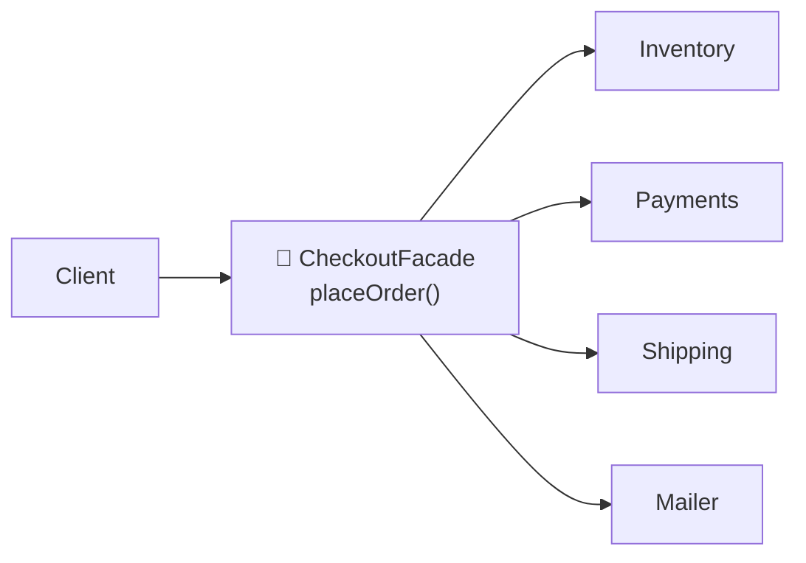
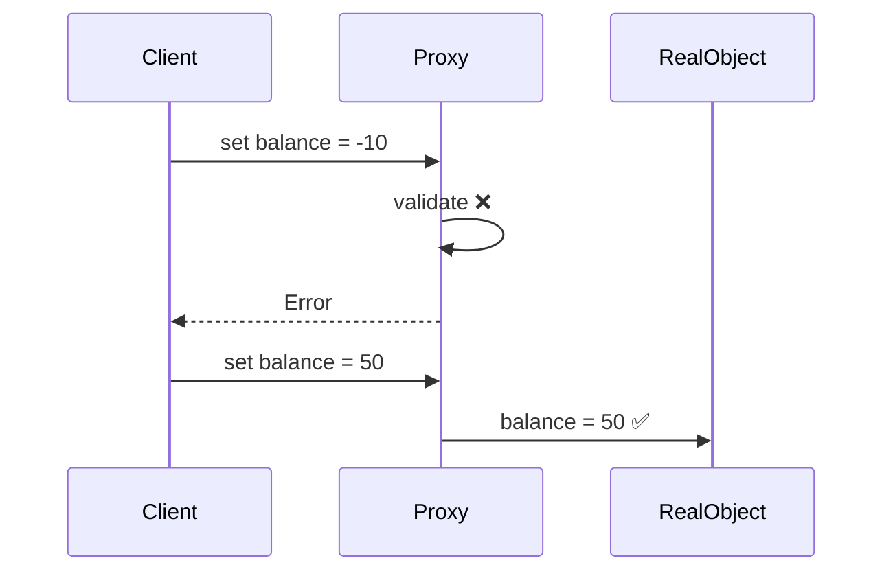
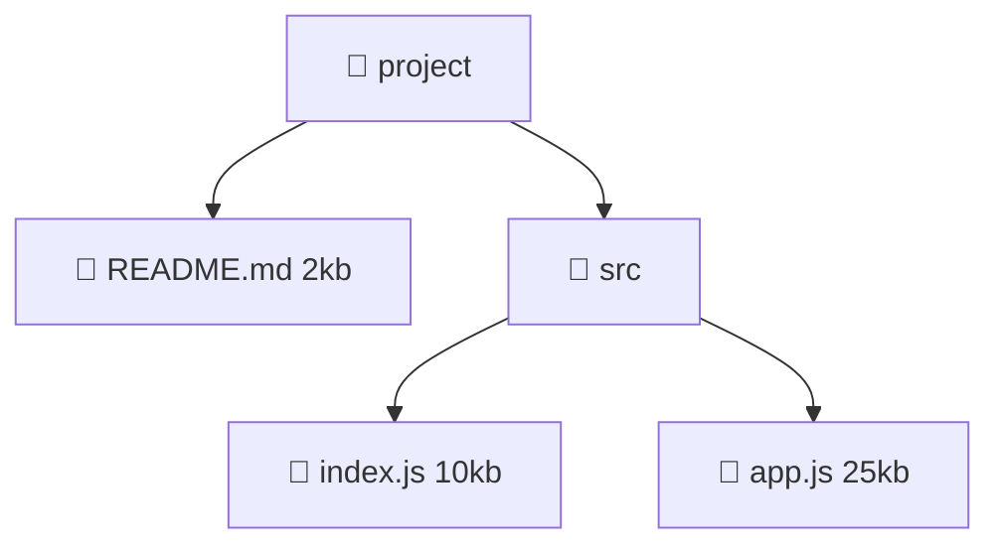
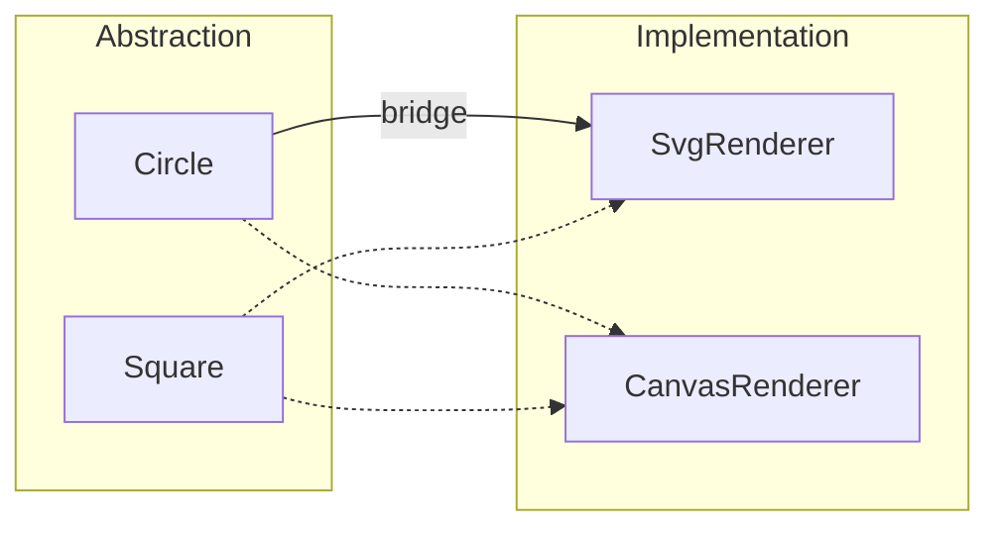

## Why structural patterns?

Structural patterns are about **assembling** objects: making incompatible pieces fit, adding features without editing classes, and hiding complexity behind simple fronts.

---

## 1. Adapter

> 🔌 **Analogy:** A travel plug adapter. Your US laptop plug doesn't fit a European socket; the adapter makes them compatible without changing either.

**Problem:** you want to use a class whose interface doesn't match what your code expects (typically a 3rd-party library).

```js
// Your app expects: logger.log(level, message)
// The new library offers: winston.write({ severity, text, ts })

class WinstonAdapter {
  constructor(winston) { this.winston = winston; }
  log(level, message) {
    this.winston.write({ severity: level.toUpperCase(), text: message, ts: Date.now() });
  }
}

const logger = new WinstonAdapter(winston); // the rest of the app is unchanged
logger.log("info", "Server started");
```


**Use when:** integrating legacy code, 3rd-party SDKs, or switching providers (Stripe → PayPal) behind a stable interface.

---

## 2. Decorator

> ☕ **Analogy:** Coffee + milk + caramel + whipped cream. Each topping **wraps** the drink, adds something (price, flavour), and it's still a coffee.

**Problem:** add responsibilities to an object **dynamically**, without subclassing for every combination.

```js
// Base function
const fetchUser = (id) => db.users.findById(id);

// Decorators: each wraps a function and returns a function with the same shape
const withLogging = (fn, name) => async (...args) => {
  console.time(name);
  try { return await fn(...args); } finally { console.timeEnd(name); }
};

const withCache = (fn, cache = new Map()) => async (key) => {
  if (!cache.has(key)) cache.set(key, await fn(key));
  return cache.get(key);
};

const withRetry = (fn, attempts = 3) => async (...args) => {
  for (let i = 1; ; i++) {
    try { return await fn(...args); } catch (e) { if (i >= attempts) throw e; }
  }
};

// Stack them like toppings
const getUser = withLogging(withCache(withRetry(fetchUser)), "getUser");
```


**You've used it:** Express middleware, React Higher-Order Components (`withRouter(Component)`), TypeScript/NestJS `@decorators`.

---

## 3. Facade

> 🏨 **Analogy:** A hotel concierge. You say *"I'd like dinner and theatre tickets"*. The concierge deals with the restaurant, the ticket office and the taxi. You deal with one person.

**Problem:** a subsystem has many complex parts; clients just want a simple way to use it.

```js
// Complex subsystem: inventory, payment, shipping, email…
class CheckoutFacade {
  constructor({ inventory, payments, shipping, mailer }) {
    Object.assign(this, { inventory, payments, shipping, mailer });
  }

  // One simple method hides ~6 steps
  async placeOrder(cart, customer) {
    await this.inventory.reserve(cart.items);
    const payment = await this.payments.charge(customer.card, cart.total);
    const shipment = await this.shipping.schedule(cart.items, customer.address);
    await this.mailer.sendConfirmation(customer.email, { payment, shipment });
    return { orderId: payment.id, trackingNumber: shipment.tracking };
  }
}
```



**You've used it:** jQuery (`$(".x").hide()` hid browser differences), `fetch()` over raw sockets, an SDK over a REST API.

---

## 4. Proxy

> 🪪 **Analogy:** A security guard at a building entrance. Same doorway, but the guard checks your badge, logs your visit, or says "come back later".

**Problem:** control access to an object: lazy loading, caching, access control, logging, validation.

```js
const user = { name: "Ana", role: "user", balance: 100 };

// JavaScript has Proxy built in
const guardedUser = new Proxy(user, {
  get(target, prop) {
    console.log(`read ${String(prop)}`);
    return target[prop];
  },
  set(target, prop, value) {
    if (prop === "role") throw new Error("role is read-only");
    if (prop === "balance" && value < 0) throw new Error("balance can't be negative");
    target[prop] = value;
    return true;
  },
});

guardedUser.balance = 50;  // ✅
guardedUser.role = "admin"; // ❌ throws
```



**You've used it:** Vue 3 reactivity (built on `Proxy`), MobX, API gateways, CDNs (a caching proxy), lazy-loaded images.

> 💡 **Proxy vs Decorator:** same shape. A Decorator **adds features**; a Proxy **controls access**.

---

## 5. Composite

> 🗂️ **Analogy:** Folders and files. A folder can contain files *and other folders*, and you can ask *any* of them "what's your size?"

**Problem:** treat individual objects and groups of objects **the same way** (tree structures).

```js
class File {
  constructor(name, size) { Object.assign(this, { name, size }); }
  getSize() { return this.size; }
}

class Folder {
  constructor(name, children = []) { Object.assign(this, { name, children }); }
  getSize() { return this.children.reduce((sum, child) => sum + child.getSize(), 0); }
}

const project = new Folder("project", [
  new File("README.md", 2),
  new Folder("src", [new File("index.js", 10), new File("app.js", 25)]),
]);

project.getSize(); // 37: the caller doesn't care what's a file or a folder
```



**You've used it:** the DOM tree, React component trees, menus with sub-menus, org charts.

---

## 6. Bridge

> 🎮 **Analogy:** Remote controls and devices. Any remote (basic, advanced) can work with any device (TV, radio). Remotes and devices evolve **independently**.

**Problem:** avoid a "class explosion" when two dimensions vary: `RedCircle`, `BlueCircle`, `RedSquare`, `BlueSquare`…

```js
// Dimension 1: how to render
const svgRenderer = { circle: (r) => `<circle r="${r}"/>` };
const canvasRenderer = { circle: (r) => `ctx.arc(0, 0, ${r}, 0, 2 * Math.PI)` };

// Dimension 2: what shape. Shapes hold a *reference* (the bridge) to a renderer
class Circle {
  constructor(radius, renderer) { Object.assign(this, { radius, renderer }); }
  draw() { return this.renderer.circle(this.radius); }
}

new Circle(5, svgRenderer).draw();
new Circle(5, canvasRenderer).draw();
```



Without a bridge, 5 shapes × 4 renderers needs **20** classes (`SvgCircle`, `CanvasCircle`, …). With a bridge it needs 5 + 4 = **9**: the cost grows as **N + M** instead of **N × M**.

---

## 7. Flyweight

> 🌲 **Analogy:** A video game forest with 100,000 trees. Every oak shares **one** 3D model and texture; each tree only stores its own position.

**Problem:** huge numbers of similar objects eat memory.

```js
// Shared, heavy, unchanging data (intrinsic state)
const treeTypes = new Map();
function getTreeType(name, texture) {
  const key = `${name}:${texture}`;
  if (!treeTypes.has(key)) treeTypes.set(key, { name, texture, mesh: loadMesh(name) }); // heavy
  return treeTypes.get(key);
}

// Light, unique data per object (extrinsic state)
const forest = Array.from({ length: 100_000 }, () => ({
  x: Math.random() * 1000,
  y: Math.random() * 1000,
  type: getTreeType("oak", "oak.png"), // all share ONE object
}));
```

**You've used it:** string interning, React reusing element types, icon sprite sheets, character glyphs in text editors.

---

## Cheat sheet

| Pattern | One-liner | Picture |
| --- | --- | --- |
| Adapter | Make incompatible interfaces work together | 🔌 travel plug |
| Decorator | Wrap to add behaviour, same interface | ☕ coffee toppings |
| Facade | One simple front for a complex subsystem | 🏨 concierge |
| Proxy | Stand-in that controls access | 🪪 security guard |
| Composite | Treat single items and groups the same | 🗂️ folders & files |
| Bridge | Split two varying dimensions | 🎮 remotes × devices |
| Flyweight | Share heavy common state | 🌲 one tree model, many trees |

## Key takeaways

- **Adapter** changes an interface; **Decorator** adds behaviour; **Proxy** controls access; **Facade** simplifies.
- **Composite** is for trees; **Bridge** stops N × M class explosions; **Flyweight** saves memory.
- JavaScript's higher-order functions and built-in `Proxy` make these patterns short and natural.
