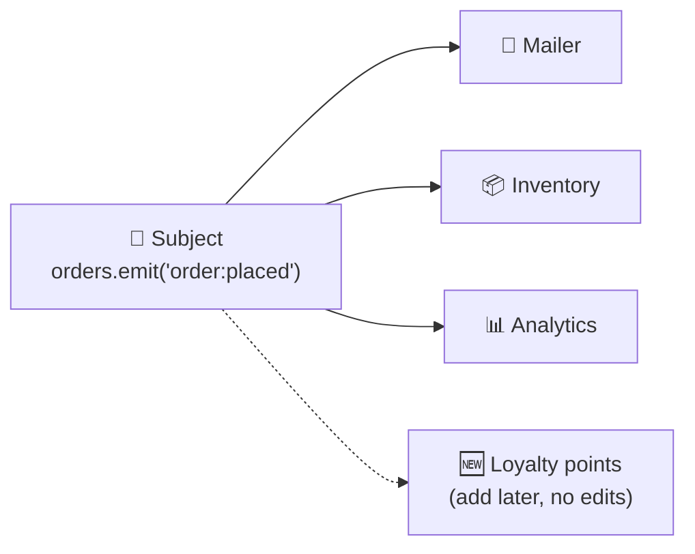
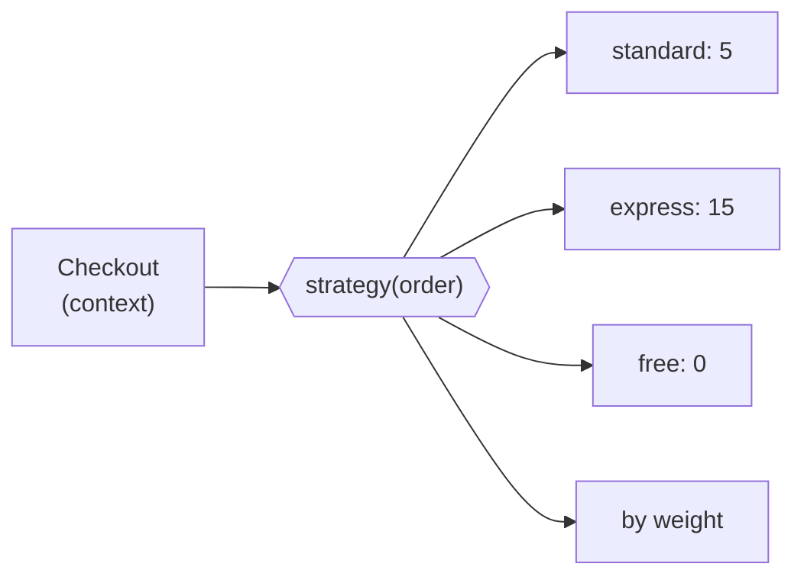
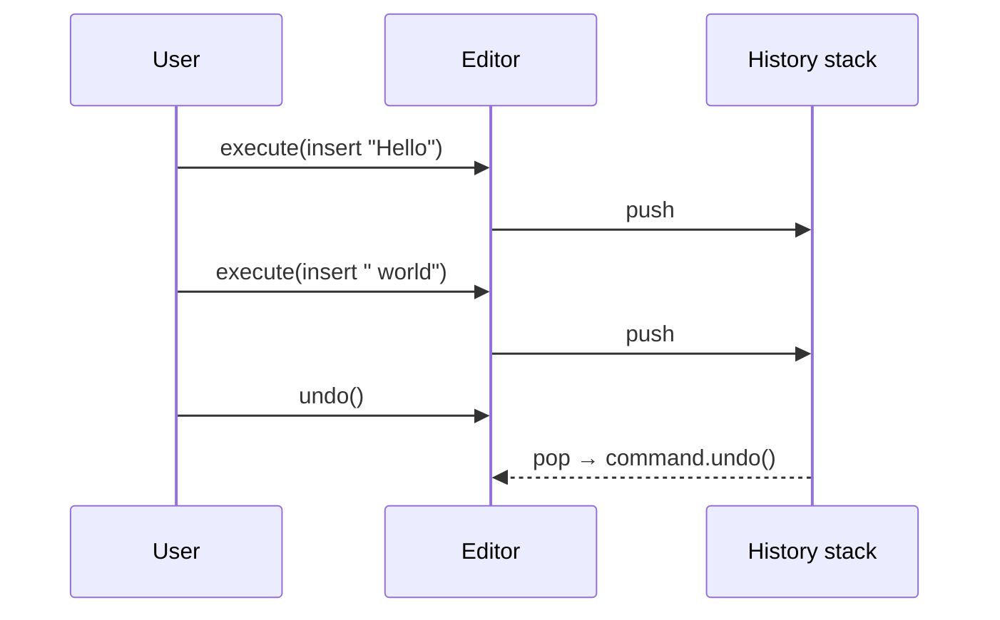
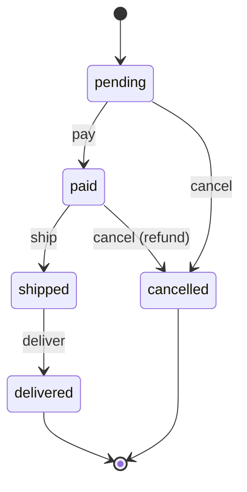

## Why behavioral patterns?

Behavioral patterns are about **communication and responsibility**: who talks to whom, who decides what, and how to change behaviour without rewriting code.

---

## 1. Observer (Pub/Sub)

> 📰 **Analogy:** A YouTube channel. You **subscribe** once; every new video, you get notified. The channel doesn't know or care who you are.

**Problem:** when one object changes, many others need to react, but you don't want them tightly coupled.

```js
class EventEmitter {
  #listeners = new Map();

  on(event, listener) {
    if (!this.#listeners.has(event)) this.#listeners.set(event, new Set());
    this.#listeners.get(event).add(listener);
    return () => this.#listeners.get(event).delete(listener); // unsubscribe function
  }

  emit(event, payload) {
    this.#listeners.get(event)?.forEach((listener) => listener(payload));
  }
}

const orders = new EventEmitter();

// Subscribers don't know about each other
orders.on("order:placed", (order) => mailer.sendReceipt(order));
orders.on("order:placed", (order) => inventory.reserve(order.items));
orders.on("order:placed", (order) => analytics.track("purchase", order.total));

// The publisher doesn't know who listens
orders.emit("order:placed", { id: 1, total: 99, items: ["book"] });
```



**You've used it:** `addEventListener`, Node's `EventEmitter`, RxJS, Redux `store.subscribe`, React state → re-render, **Kafka and message queues** at a system level.

> ⚠️ **Always unsubscribe** when a listener is no longer needed (for example in React `useEffect` cleanup), or you'll leak memory.

---

## 2. Strategy

> 🗺️ **Analogy:** Google Maps offers routes by car, bike, walking or transit. Same goal (get from A to B), interchangeable algorithms, picked at runtime.

**Problem:** you have several ways to do the same task and want to switch between them without `if/else` chains.

```js
// Each strategy: same signature, different algorithm
const shippingStrategies = {
  standard: (order) => 5,
  express:  (order) => 15,
  free:     (order) => 0,
  weight:   (order) => order.weightKg * 2.5,
};

function shippingCost(order, strategyName) {
  const strategy = shippingStrategies[strategyName] ?? shippingStrategies.standard;
  return strategy(order);
}
```



In JavaScript, **a strategy is usually just a function**. You use it every time you write:

```js
users.sort((a, b) => a.age - b.age);     // sorting strategy
passport.use(new GoogleStrategy(...));   // auth strategy (literally named!)
```

**Strategy vs Open/Closed:** Strategy is the most common way to achieve OCP: add a new strategy, don't edit the context.

---

## 3. Command

> 🧾 **Analogy:** A waiter writes your order on a ticket. The ticket can be queued, handed to any chef, cancelled or reprinted. The **request became an object**.

**Problem:** you want to queue, log, undo or redo operations.

```js
class TextEditor {
  text = "";
  #history = [];

  execute(command) {
    command.do(this);
    this.#history.push(command);
  }

  undo() {
    this.#history.pop()?.undo(this);
  }
}

// Each command knows how to do AND undo itself
const insert = (value) => ({
  do: (editor) => { editor.text += value; },
  undo: (editor) => { editor.text = editor.text.slice(0, -value.length); },
});

const editor = new TextEditor();
editor.execute(insert("Hello"));
editor.execute(insert(" world"));
editor.undo();
console.log(editor.text); // "Hello"
```



**You've used it:** Ctrl+Z in every editor, Redux actions (`{ type: "ADD_TODO" }` is a command object), job queues (BullMQ), CQRS commands.

---

## 4. State

> 🚦 **Analogy:** A traffic light behaves differently when it's green, yellow or red. Pressing the pedestrian button does different things depending on the current state.

**Problem:** an object's behaviour depends on its state, and you're drowning in `if (status === ...)` checks.

```js
// ❌ Status checks everywhere
function cancel(order) {
  if (order.status === "pending") order.status = "cancelled";
  else if (order.status === "paid") { refund(order); order.status = "cancelled"; }
  else if (order.status === "shipped") throw new Error("Too late to cancel");
  // …repeat in pay(), ship(), deliver()…
}
```

```js
// ✅ Each state knows which actions are allowed and where they lead
const orderStates = {
  pending:   { pay: () => "paid",    cancel: () => "cancelled" },
  paid:      { ship: () => "shipped", cancel: (order) => { refund(order); return "cancelled"; } },
  shipped:   { deliver: () => "delivered" },
  delivered: {},
  cancelled: {},
};

function transition(order, action) {
  const handler = orderStates[order.status][action];
  if (!handler) throw new Error(`Cannot ${action} an order that is ${order.status}`);
  order.status = handler(order);
  return order;
}

transition(order, "pay");    // pending → paid
transition(order, "cancel"); // paid → cancelled (with refund)
```



**You've used it:** `useReducer` in React, XState state machines, TCP connection states, order and payment workflows.

> 💡 **State vs Strategy:** they look the same in code. In **Strategy** the *client* picks the algorithm. In **State** the object *switches itself* as its state changes.

---

## Cheat sheet

| Pattern | One-liner | Everyday example |
| --- | --- | --- |
| Observer | Notify many subscribers of a change | YouTube subscriptions |
| Strategy | Swap algorithms at runtime | Route by car / bike / walk |
| Command | Turn a request into an object (queue, undo) | Waiter's order ticket |
| State | Behaviour changes with internal state | Traffic light |

## Key takeaways

- **Observer** decouples "something happened" from "who reacts".
- **Strategy** replaces `if/else` over algorithms; in JS it's usually a function.
- **Command** makes actions storable: undo, queues, logs.
- **State** turns scattered status checks into an explicit state machine.
