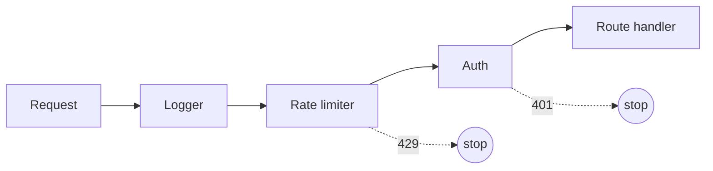
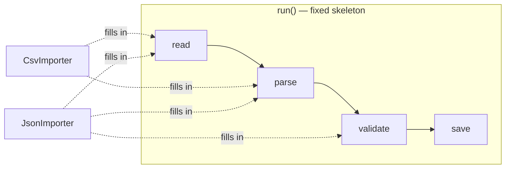
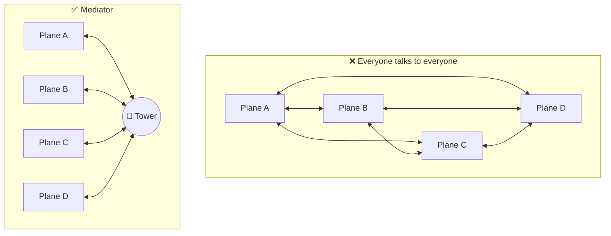

## 1. Chain of Responsibility

> 📞 **Analogy:** Calling customer support. Level 1 tries to help; if they can't, they pass you to Level 2, then to a specialist. Each handler either handles the request or passes it on.

```js
// Express middleware IS a chain of responsibility
app.use(requestLogger);     // log, then next()
app.use(rateLimiter);       // may stop the chain with 429
app.use(authenticate);      // may stop the chain with 401
app.get("/orders", listOrders);

function authenticate(req, res, next) {
  const user = verifyToken(req.headers.authorization);
  if (!user) return res.status(401).json({ error: "Unauthorized" }); // stop here
  req.user = user;
  next(); // pass along
}
```

A tiny chain from scratch:

```js
const chain = (...handlers) => (request) => {
  const run = (i) => (i < handlers.length ? handlers[i](request, () => run(i + 1)) : undefined);
  return run(0);
};

const handle = chain(
  (req, next) => (req.amount < 100 ? "✅ auto-approved" : next()),
  (req, next) => (req.amount < 5000 ? "👔 manager approved" : next()),
  (req) => "🏦 needs director approval",
);

handle({ amount: 2500 }); // "👔 manager approved"
```



---

## 2. Template Method

> 🍰 **Analogy:** Every cake recipe has the same skeleton: *prepare → mix → bake → decorate*. A chocolate cake and a carrot cake fill in the steps differently, but the order never changes.

```js
class DataImporter {
  // The template: fixed order of steps
  async run(source) {
    const raw = await this.read(source);
    const records = this.parse(raw);
    const valid = records.filter((r) => this.validate(r));
    await this.save(valid);
    return { imported: valid.length, skipped: records.length - valid.length };
  }
  validate(record) { return true; } // default hook, can be overridden
  async save(records) { await db.insertMany(records); }
}

class CsvImporter extends DataImporter {
  read(path) { return fs.promises.readFile(path, "utf8"); }
  parse(text) { return text.split("\n").slice(1).map((line) => line.split(",")); }
}

class JsonImporter extends DataImporter {
  read(url) { return fetch(url).then((r) => r.text()); }
  parse(text) { return JSON.parse(text); }
  validate(record) { return Boolean(record.email); }
}
```



**You've used it:** React class lifecycle methods, test frameworks (`beforeEach → test → afterEach`), NestJS lifecycle hooks.

> 💡 Modern alternative: pass the varying steps as **functions** (Strategy) instead of subclassing, i.e. composition over inheritance.

---

## 3. Iterator

> 📺 **Analogy:** A TV remote's "next channel" button. You don't need to know how channels are stored; you just press *next*.

JavaScript has the Iterator pattern **built in**: anything with `[Symbol.iterator]` works with `for…of`, spread and destructuring.

```js
class Playlist {
  constructor(songs) { this.songs = songs; }

  *[Symbol.iterator]() {             // a generator makes iterators easy
    for (const song of this.songs) yield song;
  }

  *shuffled() {
    const copy = [...this.songs].sort(() => Math.random() - 0.5);
    yield* copy;
  }
}

const playlist = new Playlist(["Song A", "Song B", "Song C"]);
for (const song of playlist) console.log(song);
const [first] = playlist.shuffled();
```

Iterators are **lazy**: they produce values only when asked, which is great for huge or infinite data:

```js
function* idGenerator() {
  let id = 1;
  while (true) yield id++;
}
const ids = idGenerator();
ids.next().value; // 1
ids.next().value; // 2
```

**You've used it:** arrays, `Map`, `Set`, `for await (const chunk of stream)`, paginated API helpers.

---

## 4. Mediator

> ✈️ **Analogy:** Planes don't talk to each other to decide who lands first. They all talk to the **control tower**, which coordinates everyone.

**Problem:** many objects talking directly to each other become a tangled web.



```js
// A chat room is a mediator between users
class ChatRoom {
  #members = new Map();
  join(user) { this.#members.set(user.name, user); user.room = this; }
  send(from, to, text) {
    const target = this.#members.get(to);
    if (!target) return from.receive("system", `${to} is offline`);
    target.receive(from.name, text);
  }
}

class User {
  constructor(name) { this.name = name; }
  send(to, text) { this.room.send(this, to, text); }       // talks only to the room
  receive(from, text) { console.log(`${this.name} ← ${from}: ${text}`); }
}
```

**You've used it:** a Redux store between components, an event bus, an API gateway, an orchestrator in a microservice saga.

---

## 5. Memento

> 💾 **Analogy:** Save points in a video game. Before the boss fight you save; if you lose, you load the snapshot.

**Problem:** capture an object's state so it can be restored later, without exposing its internals.

```js
class Editor {
  #content = "";
  #cursor = 0;

  type(text) { this.#content += text; this.#cursor = this.#content.length; }
  save() { return Object.freeze({ content: this.#content, cursor: this.#cursor }); } // memento
  restore(memento) { ({ content: this.#content, cursor: this.#cursor } = memento); }
  get content() { return this.#content; }
}

const editor = new Editor();
const history = [];

editor.type("Hello");
history.push(editor.save());   // 💾 snapshot
editor.type(" oops!!!");
editor.restore(history.pop()); // ⏪ back to "Hello"
```

**You've used it:** browser history, "Restore previous version" in Google Docs, Redux DevTools time travel, database transactions (rollback).

> 💡 **Memento vs Command for undo:** Memento stores **snapshots** (simple, memory-heavy). Command stores **operations** that know how to reverse themselves (lighter, more code).

---

## 6. Visitor

> 🧾 **Analogy:** A tax inspector visits a restaurant, a factory and a shop. Each business lets the inspector in, and the inspector applies the right rules to each. New inspectors (health, fire safety) can visit without changing the businesses.

**Problem:** add new operations to a set of object types **without changing those types**.

```js
// Node types (rarely change)
const num = (value) => ({ type: "num", value });
const add = (left, right) => ({ type: "add", left, right });
const mul = (left, right) => ({ type: "mul", left, right });

// Visitors: new operations over the same structure
const evaluate = {
  num: (n) => n.value,
  add: (n, visit) => visit(n.left) + visit(n.right),
  mul: (n, visit) => visit(n.left) * visit(n.right),
};

const print = {
  num: (n) => String(n.value),
  add: (n, visit) => `(${visit(n.left)} + ${visit(n.right)})`,
  mul: (n, visit) => `${visit(n.left)} × ${visit(n.right)}`,
};

const walk = (visitor) => function visit(node) { return visitor[node.type](node, visit); };

const expression = add(num(2), mul(num(3), num(4)));
walk(evaluate)(expression); // 14
walk(print)(expression);    // "(2 + 3 × 4)"
```

**You've used it:** Babel plugins and ESLint rules (they *visit* AST nodes), compilers, document exporters (to PDF, to HTML).

---

## Cheat sheet

| Pattern | One-liner | Everyday example |
| --- | --- | --- |
| Chain of Responsibility | Pass a request along until someone handles it | Support escalation, Express middleware |
| Template Method | Fixed skeleton, customisable steps | Cake recipe |
| Iterator | Walk a collection without knowing its insides | "Next channel" button |
| Mediator | Central hub instead of many-to-many links | Airport control tower |
| Memento | Save and restore snapshots | Game save points |
| Visitor | New operations without changing the types | Tax inspector |

## Key takeaways

- **Chain** is the idea behind every middleware system.
- **Template Method** fixes the order of steps; prefer passing functions in modern JS.
- **Iterator** is built into JavaScript via `Symbol.iterator` and generators.
- **Mediator** tames many-to-many communication.
- **Memento** gives you undo by snapshot. **Visitor** powers compilers and linters.
