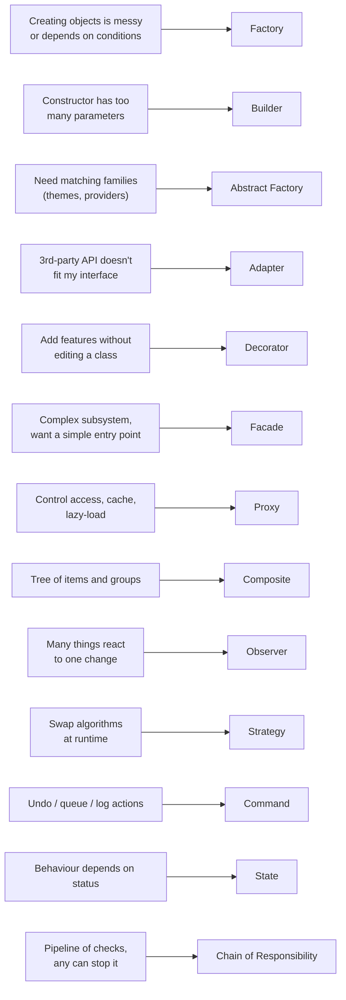
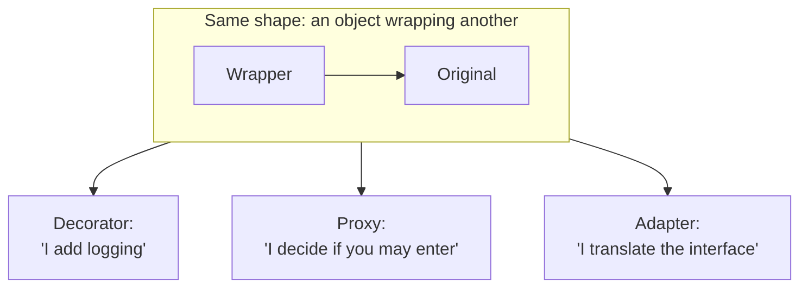

## Start from the pain, not the pattern

Find your problem in the left column, then follow the arrow.

## Look-alike patterns

Several patterns have the **same code shape** but different **intent**. The intent is what matters.

| These look alike… | The difference |
| --- | --- |
| **Decorator** vs **Proxy** | Decorator *adds* behaviour. Proxy *controls access* to the same behaviour. |
| **Adapter** vs **Facade** | Adapter makes *one* interface fit another. Facade simplifies *many* interfaces into one. |
| **Strategy** vs **State** | In Strategy the *caller* chooses. In State the object *changes itself*. |
| **Factory** vs **Builder** | Factory creates in *one call* and decides the type. Builder creates *step by step*. |
| **Observer** vs **Mediator** | Observer broadcasts one-to-many. Mediator coordinates many-to-many through a hub. |
| **Command** vs **Memento** (undo) | Command stores *operations* to reverse. Memento stores *snapshots* to restore. |
| **Composite** vs **Decorator** | Both wrap objects. Composite *groups many children*; Decorator wraps *exactly one*. |

## The top 8 to learn first

If you only have time for a few, learn these. They cover most real-world code:

1. 🏭 **Factory** — creating the right object from config or input
2. 🔌 **Adapter** — wrapping 3rd-party libraries
3. ☕ **Decorator** — middleware, HOCs, retry/cache/log wrappers
4. 🏨 **Facade** — service layers and SDKs
5. 📰 **Observer** — events everywhere, UI and backend
6. 🗺️ **Strategy** — pluggable algorithms (payments, pricing, auth)
7. 🚦 **State** — order and payment workflows
8. 📞 **Chain of Responsibility** — request pipelines

## Anti-patterns: when patterns go wrong

| Anti-pattern | What it looks like | Better |
| --- | --- | --- |
| **Patternitis** | `AbstractSingletonProxyFactoryBean` for a one-off task | Plain function first |
| **Singleton abuse** | Global state everywhere, flaky tests | Dependency injection |
| **God object** | One class that knows and does everything | Split by responsibility (SRP) |
| **Premature abstraction** | Interfaces with a single implementation "for flexibility" | Wait for the second use case |
| **Golden hammer** | "We use Observer for everything" | Pick per problem |

> 💡 **The best pattern is often no pattern.** A clear function with a good name beats a textbook pattern applied to a problem you don't have.

## Patterns at system scale

The same ideas reappear when you design whole systems, which you'll meet later in the Microservices and Kafka lessons:

| Object-level pattern | System-level cousin |
| --- | --- |
| Observer | Pub/Sub, Kafka topics, event-driven architecture |
| Facade | API Gateway, Backend for Frontend |
| Proxy | Reverse proxy, CDN, service mesh sidecar |
| Adapter | Anti-corruption layer |
| Command | Message queues, CQRS commands |
| Mediator | Saga orchestrator |
| Chain of Responsibility | Middleware pipelines, API gateway filters |
| Memento | Event sourcing snapshots |

## Key takeaways

- Start from the problem you have, then pick the pattern.
- Look-alike patterns differ in **intent**, not code shape.
- Learn the top 8 first; they cover most real code.
- Avoid patternitis: add a pattern when simple code starts to hurt.
- Object patterns scale up into system architecture patterns.
