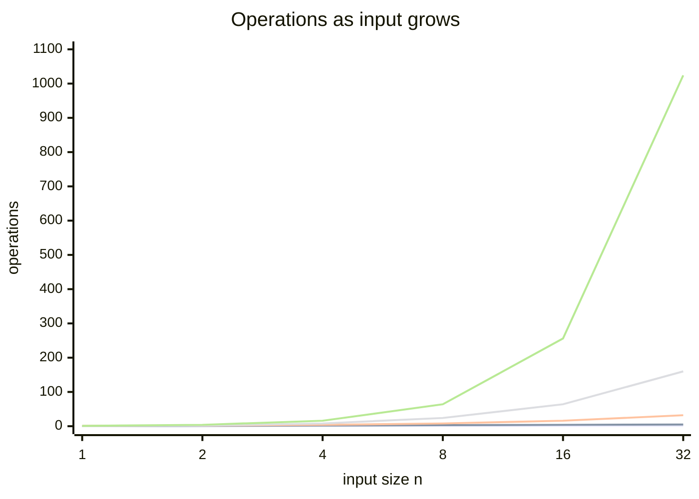
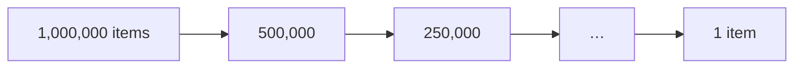
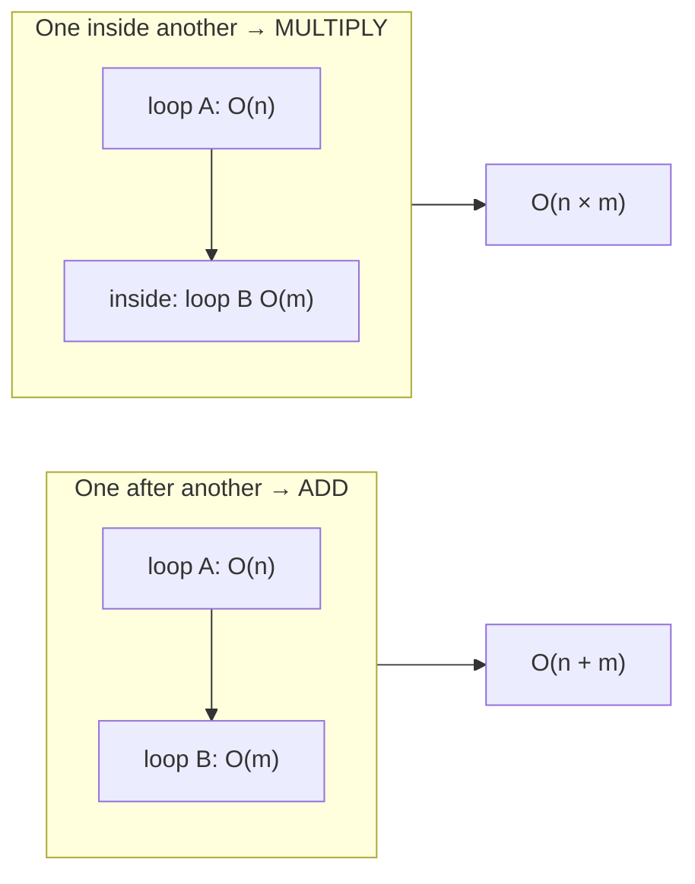

## The big idea

You need to deliver letters to houses on a street.

- **O(1):** you have one letter for the first house. Doesn't matter if the street has 10 or 10,000 houses.
- **O(n):** one letter for *every* house. Double the houses, double the work.
- **O(n²):** at every house, you walk back to visit *every other house*. Double the houses, **4×** the work.

**Big-O answers: "If my input gets 10× bigger, how much slower does my code get?"** It ignores exact seconds (which depend on your computer) and focuses on the *growth shape*.

## The growth curves



*From bottom to top: O(1), O(log n), O(n), O(n log n), O(n²). The steepest curve explodes fastest.*

| Big-O | Name | n = 1,000 → operations | Example |
| --- | --- | --- | --- |
| **O(1)** | Constant | 1 | Array index `arr[5]`, hash map lookup |
| **O(log n)** | Logarithmic | ~10 | Binary search |
| **O(n)** | Linear | 1,000 | Loop over an array once |
| **O(n log n)** | Linearithmic | ~10,000 | Good sorting (merge sort, `Array.sort`) |
| **O(n²)** | Quadratic | 1,000,000 | Nested loops over the same array |
| **O(2ⁿ)** | Exponential | 10³⁰⁰ 💀 | Naive recursive Fibonacci, all subsets |
| **O(n!)** | Factorial | 💀💀 | All permutations (brute-force travelling salesman) |


## Recognising complexity in code

```js
// O(1): same work no matter how big the array is
function first(arr) {
  return arr[0];
}

// O(n): one pass
function sum(arr) {
  let total = 0;
  for (const x of arr) total += x;
  return total;
}

// O(n²): nested loops over the same input
function hasDuplicate(arr) {
  for (let i = 0; i < arr.length; i++) {
    for (let j = i + 1; j < arr.length; j++) {
      if (arr[i] === arr[j]) return true;
    }
  }
  return false;
}

// O(log n): the problem is cut in half every step
function binarySearch(sorted, target) {
  let lo = 0, hi = sorted.length - 1;
  while (lo <= hi) {
    const mid = (lo + hi) >> 1;
    if (sorted[mid] === target) return mid;
    if (sorted[mid] < target) lo = mid + 1;
    else hi = mid - 1;
  }
  return -1;
}
```

### Why is halving "log n"?



You can only halve 1,000,000 about **20 times** before reaching 1. log₂(1,000,000) ≈ 20. That's why binary search is so fast.

## The 4 rules for calculating Big-O

**1. Drop constants.** `O(2n)` → `O(n)`. Two loops one after another are still linear.

```js
arr.forEach(log); // n
arr.forEach(log); // n  → O(2n) = O(n)
```

**2. Drop smaller terms.** `O(n² + n)` → `O(n²)`. For huge n, the n² part dominates everything.

**3. Different inputs get different letters.**

```js
function printPairs(colors, sizes) {
  for (const c of colors) for (const s of sizes) console.log(c, s); // O(a × b), not O(n²)
}
```

**4. Sequential steps add, nested steps multiply.**



## Watch out: hidden loops

Some one-liners hide a loop inside:

| Code | Cost |
| --- | --- |
| `arr.includes(x)`, `arr.indexOf(x)` | O(n) |
| `arr.slice()`, `[...arr]`, `arr.concat()` | O(n) |
| `arr.shift()`, `arr.unshift(x)` | O(n): every element moves |
| `arr.sort()` | O(n log n) |
| `str1 + str2` in a loop | may be O(n) each time |
| `set.has(x)`, `map.get(k)` | O(1) average ✅ |
| `arr.push(x)`, `arr.pop()` | O(1) amortised ✅ |

```js
// Looks like O(n), is actually O(n²): includes() loops inside the loop
const unique = [];
for (const x of arr) if (!unique.includes(x)) unique.push(x);

// ✅ O(n) with a Set
const uniqueFast = [...new Set(arr)];
```

## Space complexity

Big-O also measures **extra memory**:

```js
// O(1) space: a few variables, no matter the input size
function max(arr) { let m = -Infinity; for (const x of arr) m = Math.max(m, x); return m; }

// O(n) space: builds a new array as big as the input
function doubled(arr) { return arr.map((x) => x * 2); }
```

> 💡 Recursion uses space too: each pending call sits on the **call stack**. A recursion 10,000 levels deep uses O(10,000) stack space and may crash with "Maximum call stack size exceeded".

## Best, average and worst case

Big-O usually describes the **worst case**, because that's the one that wakes you up at 3 a.m.

- Searching an unsorted array: best O(1) (it's the first item), worst O(n) (it's last or missing).
- Quick sort: average O(n log n), worst O(n²) with bad pivots.

## Key takeaways

- Big-O = how work grows with input size, not exact time.
- Memorise the ladder: **1 < log n < n < n log n < n² < 2ⁿ < n!**
- Drop constants and smaller terms; add sequential steps, multiply nested ones.
- Watch for hidden loops like `includes`, `shift` and `slice` inside loops.
- Hash maps and sets turn many O(n) lookups into O(1). That's the next lessons' superpower.
