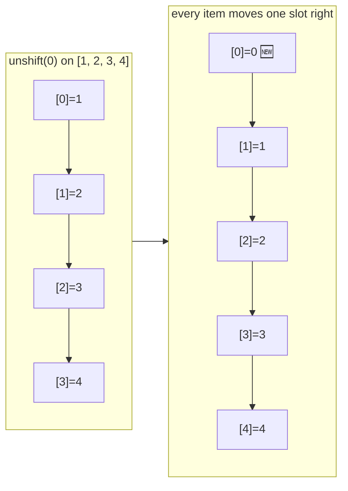
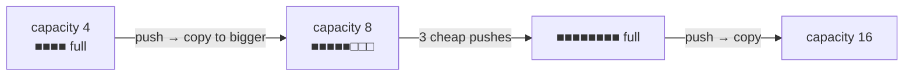
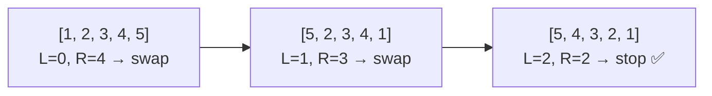

## The big idea

An array is like a **row of numbered lockers** in a school hallway. Because the lockers are side by side and numbered, you can walk straight to locker #42 without opening the first 41.


That's why `arr[i]` is **O(1)**: the computer calculates `start address + i × box size` and jumps there directly.

## The cost of each operation

| Operation | Code | Big-O | Why |
| --- | --- | --- | --- |
| Read by index | `arr[i]` | **O(1)** | Direct jump |
| Update by index | `arr[i] = x` | **O(1)** | Direct jump |
| Add at end | `arr.push(x)` | **O(1)*** | Next locker is free (*amortised) |
| Remove from end | `arr.pop()` | **O(1)** | Nothing moves |
| Add at start | `arr.unshift(x)` | **O(n)** | Every item shifts right |
| Remove from start | `arr.shift()` | **O(n)** | Every item shifts left |
| Insert in middle | `arr.splice(i, 0, x)` | **O(n)** | Items after `i` shift |
| Search (unsorted) | `arr.includes(x)` | **O(n)** | Check lockers one by one |

### Why is inserting at the front slow?



With 1 million items, that's 1 million moves. If you need fast adds and removes at *both* ends, use a **queue or deque** (see *Stacks & Queues*).

### What does "amortised O(1)" mean?

JavaScript arrays are **dynamic**: when full, the engine allocates a bigger block (often 2×) and copies everything over. That copy is O(n), but it happens so rarely that, *on average*, each `push` costs O(1).



## Essential array techniques

### 1. Loop once, track something

```js
// Find max, min, sum in one O(n) pass
function stats(nums) {
  let min = Infinity, max = -Infinity, sum = 0;
  for (const n of nums) {
    min = Math.min(min, n);
    max = Math.max(max, n);
    sum += n;
  }
  return { min, max, avg: sum / nums.length };
}
```

### 2. Prefix sums: answer range questions in O(1)

"What's the sum from index 2 to 5?" asked 10,000 times? Precompute once.

```js
const nums = [3, 1, 4, 1, 5, 9, 2];
// prefix[i] = sum of nums[0 .. i-1]
const prefix = [0];
for (const n of nums) prefix.push(prefix.at(-1) + n);
// prefix = [0, 3, 4, 8, 9, 14, 23, 25]

const rangeSum = (i, j) => prefix[j + 1] - prefix[i]; // O(1)
rangeSum(2, 5); // 4 + 1 + 5 + 9 = 19
```

### 3. In-place reversal with two pointers

```js
function reverse(arr) {
  let left = 0, right = arr.length - 1;
  while (left < right) {
    [arr[left], arr[right]] = [arr[right], arr[left]];
    left++;
    right--;
  }
  return arr;
}
```



## Strings

In JavaScript, strings are **immutable**: you can't change a character in place. Every "change" creates a new string.

```js
let s = "cat";
s[0] = "b";   // silently ignored
s = "b" + s.slice(1); // "bat": a brand-new string
```

> ⚠️ Building a string with `+=` inside a big loop may copy the string again and again. Collect parts in an array and `join("")` at the end.

```js
// ✅ Efficient string building
const parts = [];
for (const word of words) parts.push(word.toUpperCase());
const result = parts.join(" ");
```

### Classic string problems

**Is it a palindrome?** ("racecar" reads the same backwards)

```js
function isPalindrome(text) {
  const s = text.toLowerCase().replace(/[^a-z0-9]/g, "");
  let left = 0, right = s.length - 1;
  while (left < right) {
    if (s[left++] !== s[right--]) return false;
  }
  return true;
}
isPalindrome("A man, a plan, a canal: Panama"); // true
```

**Are two words anagrams?** ("listen" / "silent")

```js
function isAnagram(a, b) {
  if (a.length !== b.length) return false;
  const count = {};
  for (const ch of a) count[ch] = (count[ch] ?? 0) + 1;
  for (const ch of b) {
    if (!count[ch]) return false;
    count[ch]--;
  }
  return true;
}
```

Counting characters with an object/map is O(n). Sorting both strings and comparing works too, but costs O(n log n).

## Common interview gotchas

- **Off-by-one errors:** the last index is `arr.length - 1`.
- **Mutating while iterating:** removing items inside `forEach` skips elements. Iterate backwards or use `filter`.
- **`sort()` sorts as strings by default:** `[10, 9, 1].sort()` → `[1, 10, 9]`. Always pass `(a, b) => a - b`.
- **Empty input:** always ask "what if the array is empty?"

## Key takeaways

- Arrays give **O(1) access by index** because elements sit side by side in memory.
- Adding/removing at the **end** is cheap; at the **start or middle** is O(n).
- Prefix sums turn repeated range sums into O(1).
- Strings are immutable; build big strings with an array and `join`.
- Two pointers and counting maps solve a huge number of array/string problems.
