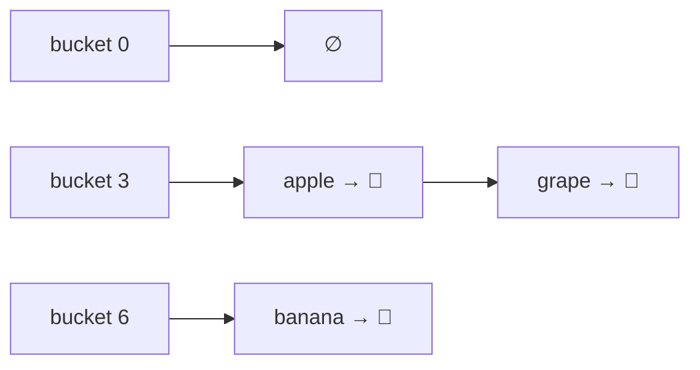
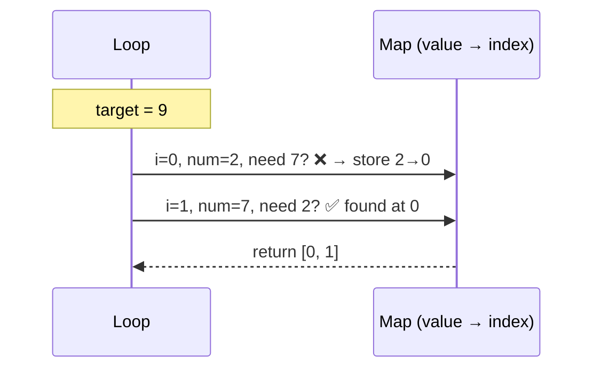
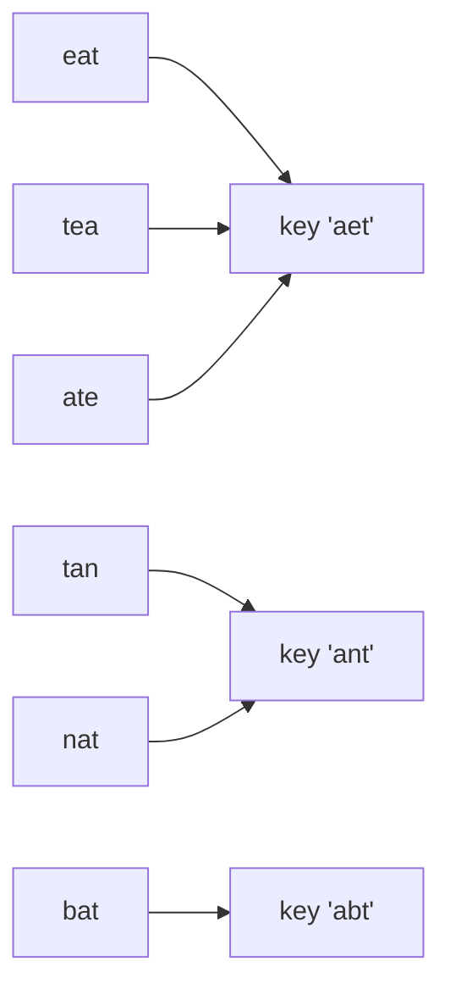

## The big idea

In a library with a million books, you don't search shelf by shelf. You look up the book in the **catalogue**, which tells you *exactly* which shelf it's on.

A **hash map** is that catalogue. A **hash function** turns a key (like `"apple"`) into a number (a bucket index), so the computer jumps straight to where the value lives.


| Operation | Array (unsorted) | Hash map / Set |
| --- | --- | --- |
| Find by key/value | O(n) | **O(1)** average |
| Insert | O(1) at end | **O(1)** average |
| Delete | O(n) | **O(1)** average |
| Keeps order? | Yes (by index) | JS `Map`/`Set`: insertion order |

## How hashing works (simplified)

```js
// A toy hash function: sum the character codes, then fit into N buckets
function hash(key, bucketCount) {
  let total = 0;
  for (const ch of key) total = (total * 31 + ch.charCodeAt(0)) >>> 0;
  return total % bucketCount;
}

hash("apple", 8);  // 3  → bucket 3
hash("banana", 8); // 6  → bucket 6
```

### Collisions

Two different keys can land in the same bucket. The usual fix is **chaining**: each bucket holds a small list.



If the hash function spreads keys well and the table grows when it gets full, those lists stay tiny, so lookups stay **O(1) on average**. (In the worst case, when everything collides, it's O(n).)

## Map vs Object vs Set in JavaScript

```js
// Map: any key type, keeps insertion order, has .size
const ages = new Map();
ages.set("ana", 31).set("bo", 25);
ages.get("ana");   // 31
ages.has("cy");    // false
ages.size;         // 2

// Set: unique values only
const seen = new Set([1, 2, 2, 3]);
seen.has(2);       // true
seen.size;         // 3

// Plain object: string/symbol keys only; fine for simple records
const counts = {};
counts["a"] = (counts["a"] ?? 0) + 1;
```

> 💡 Prefer **`Map`** for dynamic keys (user IDs, counts). Plain objects have inherited keys like `"constructor"` that can surprise you.

## Pattern 1: "Have I seen it before?" → Set

**Contains duplicate?**

```js
function hasDuplicate(nums) {
  const seen = new Set();
  for (const n of nums) {
    if (seen.has(n)) return true;
    seen.add(n);
  }
  return false;
}
// O(n) time instead of O(n²) with nested loops
```

## Pattern 2: "What do I need to complete it?" → Map

**Two Sum:** find two numbers that add up to a target. The most famous interview question.

```js
function twoSum(nums, target) {
  const indexOf = new Map(); // value → index
  for (let i = 0; i < nums.length; i++) {
    const needed = target - nums[i];
    if (indexOf.has(needed)) return [indexOf.get(needed), i];
    indexOf.set(nums[i], i);
  }
  return [];
}

twoSum([2, 7, 11, 15], 9); // [0, 1]
```



Brute force checks every pair: O(n²). The map remembers what we've seen: **O(n)**.

## Pattern 3: Counting → frequency map

**Most frequent element:**

```js
function mostFrequent(items) {
  const count = new Map();
  for (const item of items) count.set(item, (count.get(item) ?? 0) + 1);

  let best = null, bestCount = 0;
  for (const [item, c] of count) if (c > bestCount) [best, bestCount] = [item, c];
  return best;
}

mostFrequent(["🍎", "🍌", "🍎", "🍇", "🍎"]); // "🍎"
```

## Pattern 4: Grouping → map of lists

**Group anagrams:** `["eat","tea","tan","ate","nat","bat"]` → `[["eat","tea","ate"],["tan","nat"],["bat"]]`

```js
function groupAnagrams(words) {
  const groups = new Map();
  for (const word of words) {
    const key = [...word].sort().join(""); // "eat" → "aet"
    if (!groups.has(key)) groups.set(key, []);
    groups.get(key).push(word);
  }
  return [...groups.values()];
}
```



## Real-world uses

- **Caches** (Redis is essentially a giant networked hash map)
- **Database indexes** (hash indexes)
- **Deduplication**: "have we processed this event ID before?" (idempotency)
- **Counting**: word frequency, rate limiting per user
- **Routing**: URL path → handler

## Key takeaways

- Hash maps and sets give **O(1) average** insert, lookup and delete.
- A hash function maps keys to buckets; collisions are handled by chaining or probing.
- Four patterns solve a huge share of problems: **seen-set, complement map, frequency count, grouping**.
- When you see a nested loop that searches, ask: *can a Map remember this instead?*
