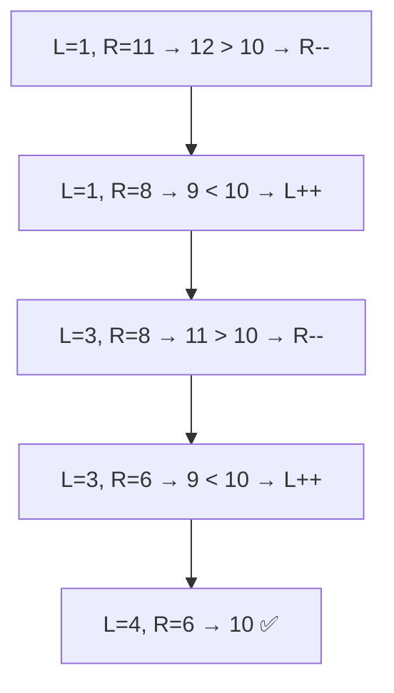
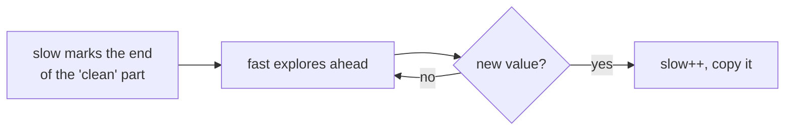
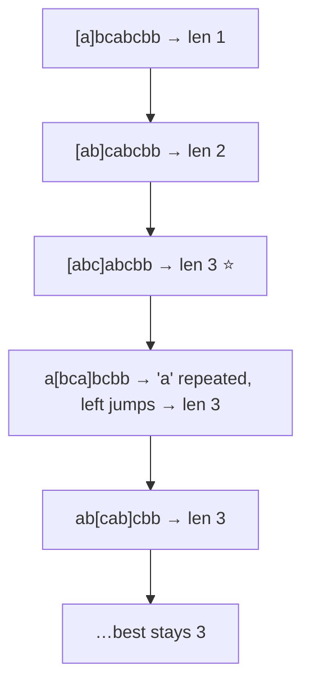
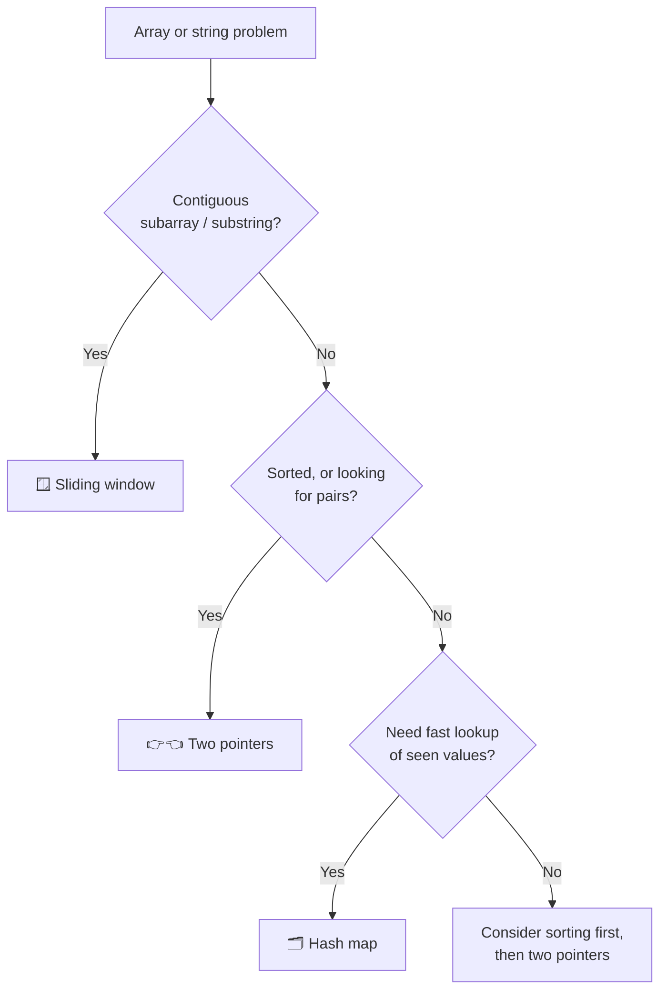

## Two Pointers

### The big idea

Two people searching a sorted bookshelf for two books whose prices add up to $50: one starts at the cheap end, one at the expensive end. Too expensive together? The right person steps left. Too cheap? The left person steps right. They meet in the middle having checked everything **in one pass**.


### Example: pair with target sum (sorted array)

```js
function pairWithSum(sorted, target) {
  let left = 0;
  let right = sorted.length - 1;

  while (left < right) {
    const sum = sorted[left] + sorted[right];
    if (sum === target) return [left, right];
    if (sum < target) left++;   // need bigger → move left pointer right
    else right--;               // need smaller → move right pointer left
  }
  return null;
}

pairWithSum([1, 3, 4, 6, 8, 11], 10); // [2, 3] → 4 + 6
```



**Why it works:** the array is sorted, so moving a pointer always changes the sum in a predictable direction. We never need to check pairs we've already ruled out.

### The three flavours of two pointers

| Flavour | Picture | Classic problems |
| --- | --- | --- |
| **Opposite ends** → ← | Start at both ends, move inward | Pair sum, palindrome, container with most water, reverse array |
| **Fast & slow** → →→ | Both start left, one moves faster | Remove duplicates, move zeroes, linked-list cycle |
| **Two arrays** | One pointer per array | Merge two sorted arrays, intersection |

### Example: remove duplicates in place (fast & slow)

```js
// [1, 1, 2, 2, 2, 3] → first 3 slots become [1, 2, 3], return 3
function removeDuplicates(sorted) {
  if (sorted.length === 0) return 0;
  let slow = 0; // last unique position
  for (let fast = 1; fast < sorted.length; fast++) {
    if (sorted[fast] !== sorted[slow]) {
      slow++;
      sorted[slow] = sorted[fast];
    }
  }
  return slow + 1;
}
```



---

## Sliding Window

### The big idea

Imagine looking at a long train through a window that shows exactly 3 carriages. To see the next group, you don't rebuild the window; you **slide** it: one carriage leaves on the left, one enters on the right.


Use it for problems about **contiguous subarrays or substrings**: "longest", "shortest", "maximum sum of k consecutive…".

### Fixed-size window: max sum of k consecutive numbers

```js
// ❌ Brute force: recompute every window → O(n × k)
// ✅ Slide: add the new element, subtract the old one → O(n)
function maxSumOfK(nums, k) {
  let windowSum = 0;
  for (let i = 0; i < k; i++) windowSum += nums[i];

  let best = windowSum;
  for (let right = k; right < nums.length; right++) {
    windowSum += nums[right] - nums[right - k]; // enter right, leave left
    best = Math.max(best, windowSum);
  }
  return best;
}

maxSumOfK([2, 1, 5, 1, 3, 2], 3); // 9 → [5, 1, 3]
```

### Variable-size window: longest substring without repeating characters

The window **grows** on the right and **shrinks** from the left whenever a rule is broken.

```js
function longestUniqueSubstring(s) {
  const lastSeen = new Map(); // char → last index
  let left = 0;
  let best = 0;

  for (let right = 0; right < s.length; right++) {
    const ch = s[right];
    if (lastSeen.has(ch) && lastSeen.get(ch) >= left) {
      left = lastSeen.get(ch) + 1; // jump past the previous copy
    }
    lastSeen.set(ch, right);
    best = Math.max(best, right - left + 1);
  }
  return best;
}

longestUniqueSubstring("abcabcbb"); // 3 → "abc"
```



### The sliding window template

```js
function slidingWindow(input) {
  let left = 0;
  let state = /* sum, count map, etc. */ 0;
  let best = 0;

  for (let right = 0; right < input.length; right++) {
    // 1. add input[right] to state
    while (/* window breaks the rule */ false) {
      // 2. remove input[left] from state
      left++;
    }
    // 3. update best using the window [left, right]
    best = Math.max(best, right - left + 1);
  }
  return best;
}
```

## How to recognise which technique



## Key takeaways

- **Two pointers:** move two indexes cleverly instead of nesting loops. Works best on sorted data.
- **Sliding window:** for contiguous ranges. Add on the right, remove on the left, never recompute.
- Both typically turn **O(n²) into O(n)** with O(1) extra space.
- Keywords: *sorted, pair, palindrome* → two pointers. *Subarray, substring, longest, k consecutive* → sliding window.
