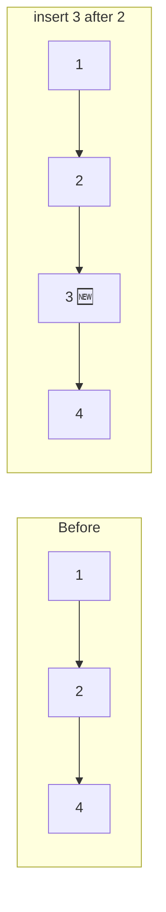
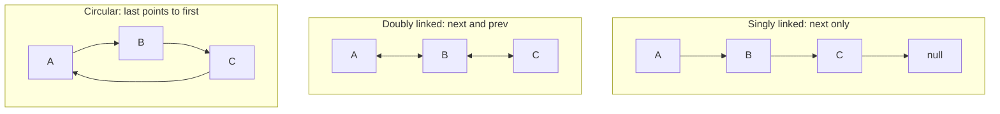
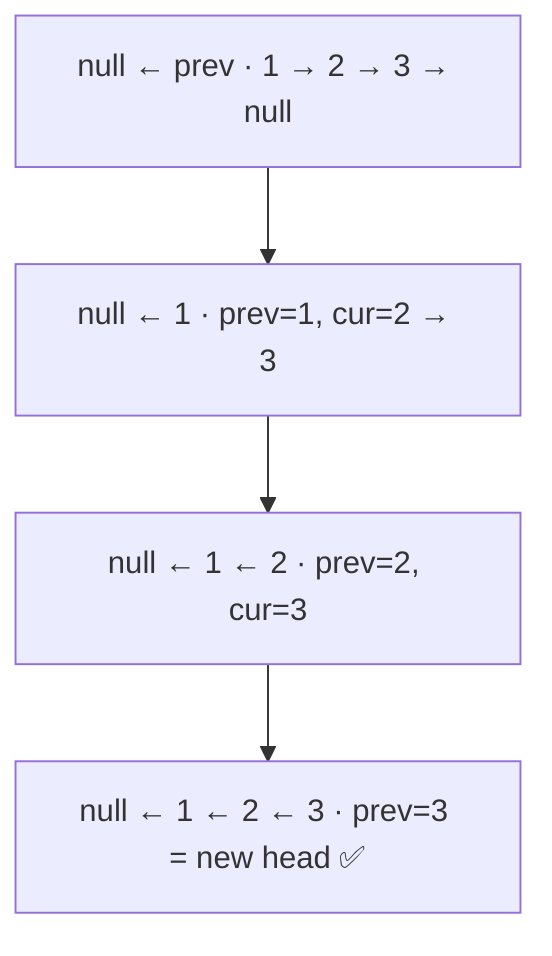
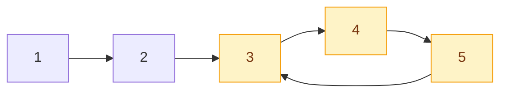

## The big idea

A **treasure hunt**: each clue tells you where the next clue is hidden. You can't jump to clue #7; you must follow the chain from clue #1. But adding a new clue in the middle is easy: just change where one clue points.


```js
class ListNode {
  constructor(value, next = null) {
    this.value = value;
    this.next = next;
  }
}

// 1 → 2 → 3 → null
const head = new ListNode(1, new ListNode(2, new ListNode(3)));
```

## Array vs Linked List

| Operation | Array | Linked list |
| --- | --- | --- |
| Access i-th element | **O(1)** | O(n): walk from the head |
| Insert/delete at start | O(n): shift everything | **O(1)**: change one pointer |
| Insert/delete in middle (node known) | O(n) | **O(1)** |
| Memory layout | One contiguous block | Nodes scattered, linked by pointers |
| Cache friendliness | ✅ great | ❌ worse |

**Insert after a node:** just rewire two arrows.



```js
function insertAfter(node, value) {
  node.next = new ListNode(value, node.next); // O(1)
}
```

## Types of linked lists



**Real uses:** browser back/forward history (doubly), music playlist on repeat (circular), LRU caches (doubly linked list + hash map), undo stacks, OS task scheduling.

## Technique 1: Traverse

```js
function toArray(head) {
  const values = [];
  for (let node = head; node !== null; node = node.next) values.push(node.value);
  return values;
}
```

## Technique 2: Reverse a linked list ⭐

The #1 linked-list interview question. Use three pointers: `prev`, `current`, `next`.

```js
function reverse(head) {
  let prev = null;
  let current = head;
  while (current !== null) {
    const next = current.next; // 1. remember where to go
    current.next = prev;       // 2. flip the arrow
    prev = current;            // 3. step prev forward
    current = next;            // 4. step current forward
  }
  return prev; // new head
}
```



Time O(n), space O(1).

## Technique 3: Fast & slow pointers (tortoise and hare)

Two pointers move through the list: **slow** moves 1 step, **fast** moves 2 steps.

### Find the middle

When fast reaches the end, slow is exactly in the middle.

```js
function middle(head) {
  let slow = head, fast = head;
  while (fast && fast.next) {
    slow = slow.next;
    fast = fast.next.next;
  }
  return slow;
}
```

### Detect a cycle (Floyd's algorithm)

On a circular running track, a fast runner eventually **laps** the slow runner. If the list has a loop, fast and slow will meet; if not, fast hits `null`.

```js
function hasCycle(head) {
  let slow = head, fast = head;
  while (fast && fast.next) {
    slow = slow.next;
    fast = fast.next.next;
    if (slow === fast) return true; // 🏃‍♂️ lapped the 🐢
  }
  return false;
}
```



O(n) time and **O(1) space**, unlike storing visited nodes in a Set (O(n) space).

## Technique 4: The dummy head

Many edge cases come from "what if I need to change the head?" A fake **dummy** node in front removes that special case.

```js
// Merge two sorted lists: 1→3→5 + 2→4 → 1→2→3→4→5
function mergeSorted(a, b) {
  const dummy = new ListNode(0);
  let tail = dummy;
  while (a && b) {
    if (a.value <= b.value) { tail.next = a; a = a.next; }
    else { tail.next = b; b = b.next; }
    tail = tail.next;
  }
  tail.next = a ?? b; // attach the leftovers
  return dummy.next;
}
```

## Common mistakes

- **Losing the rest of the list:** always save `current.next` *before* changing it.
- **Null pointer errors:** check `node && node.next` before `node.next.next`.
- **Forgetting to return the new head** after reversing or deleting the first node.
- **Drawing helps:** sketch boxes and arrows on paper before coding. Seriously.

## Key takeaways

- Linked lists trade O(1) index access for O(1) insert/delete at known positions.
- Reverse with `prev / current / next`: save, flip, step, step.
- Fast & slow pointers find the middle and detect cycles in O(1) space.
- A dummy head node removes edge cases around the first element.
