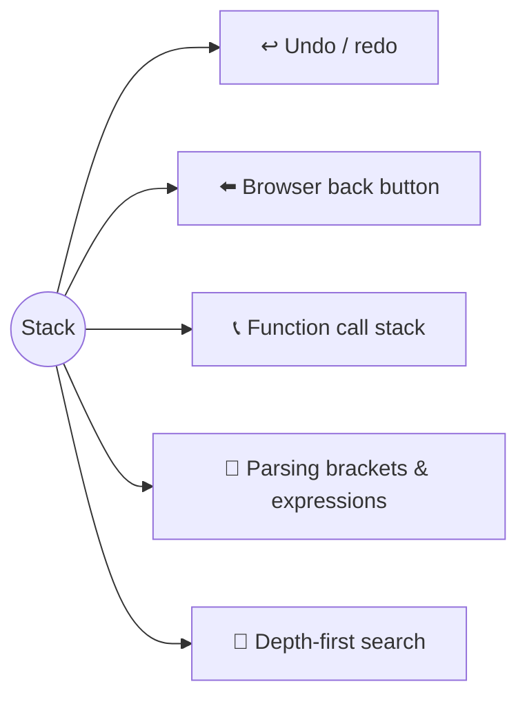
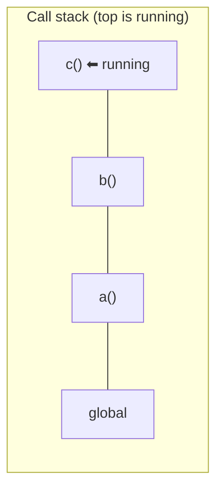
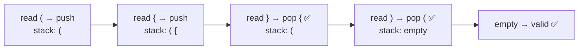
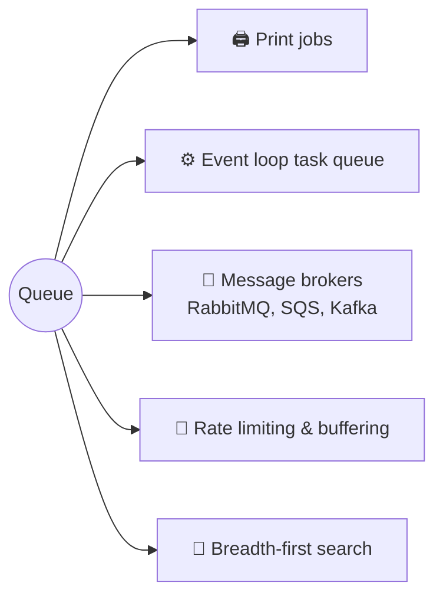
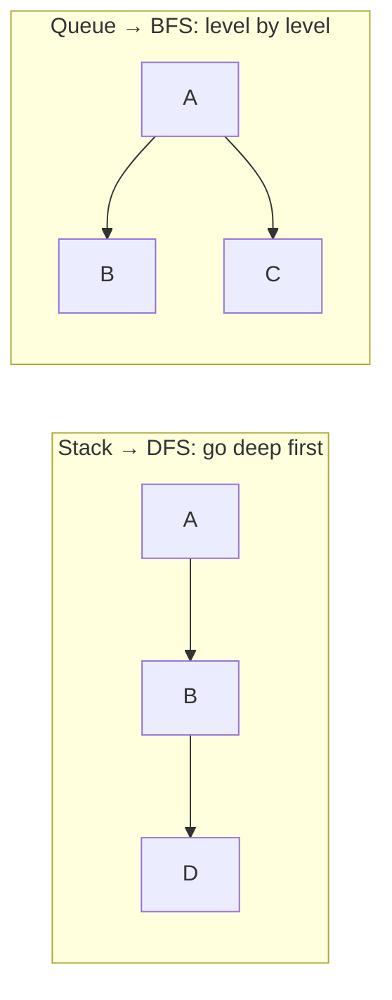

## The big idea


- **Stack (LIFO — Last In, First Out):** a pile of plates. You add to the top and take from the top.
- **Queue (FIFO — First In, First Out):** a line at a coffee shop. First to arrive, first to be served.

## Stack

| Operation | Meaning | JS | Cost |
| --- | --- | --- | --- |
| `push(x)` | put on top | `arr.push(x)` | O(1) |
| `pop()` | take from top | `arr.pop()` | O(1) |
| `peek()` | look at top | `arr.at(-1)` | O(1) |
| `isEmpty()` | | `arr.length === 0` | O(1) |

```js
const stack = [];
stack.push("a"); // ["a"]
stack.push("b"); // ["a", "b"]
stack.pop();     // "b" → ["a"]
```

### Where stacks appear



### The call stack

Every time a function calls another, JavaScript pushes a **frame** onto the call stack. When a function returns, its frame is popped.

```js
function a() { b(); }
function b() { c(); }
function c() { console.trace(); }
a();
```



Infinite recursion keeps pushing frames until: **"RangeError: Maximum call stack size exceeded"**. That's a *stack overflow*.

### Classic problem: valid parentheses ⭐

`"({[]})"` ✅ · `"([)]"` ❌ · `"(("` ❌

```js
function isValid(s) {
  const pairs = { ")": "(", "]": "[", "}": "{" };
  const stack = [];
  for (const ch of s) {
    if ("([{".includes(ch)) stack.push(ch);            // opener → push
    else if (stack.pop() !== pairs[ch]) return false;  // closer must match the top
  }
  return stack.length === 0; // nothing left open
}
```



### Monotonic stack: "next greater element"

For each number, find the next number to the right that is bigger. Brute force is O(n²); a stack does it in O(n).

```js
function nextGreater(nums) {
  const result = new Array(nums.length).fill(-1);
  const stack = []; // indexes still waiting for a bigger number
  for (let i = 0; i < nums.length; i++) {
    while (stack.length && nums[i] > nums[stack.at(-1)]) {
      result[stack.pop()] = nums[i];
    }
    stack.push(i);
  }
  return result;
}
nextGreater([2, 1, 5, 3, 6]); // [5, 5, 6, 6, -1]
```

Used for "daily temperatures", "stock span" and "largest rectangle in histogram".

## Queue

| Operation | Meaning | Cost (proper queue) |
| --- | --- | --- |
| `enqueue(x)` | join the back | O(1) |
| `dequeue()` | leave the front | O(1) |
| `peek()` | look at the front | O(1) |

> ⚠️ **JavaScript trap:** `arr.shift()` is **O(n)** because every element moves. Fine for small arrays; slow for big queues.

### An O(1) queue

```js
class Queue {
  #items = new Map();
  #head = 0;
  #tail = 0;

  enqueue(value) { this.#items.set(this.#tail++, value); }
  dequeue() {
    if (this.#head === this.#tail) return undefined;
    const value = this.#items.get(this.#head);
    this.#items.delete(this.#head++);
    return value;
  }
  get size() { return this.#tail - this.#head; }
}
```

### Where queues appear



### Queue flavours

| Type | Rule | Example |
| --- | --- | --- |
| **Queue** | First in, first out | Ticket line |
| **Deque** (double-ended) | Add/remove at both ends | Sliding window maximum |
| **Priority queue** | Highest priority out first | ER triage, Dijkstra (see *Heaps*) |
| **Circular buffer** | Fixed size, wraps around | Audio buffers, recent logs |

## Stack vs Queue in search

The **only** difference between depth-first and breadth-first search is the container:



You'll see this in the *Graphs* lesson.

## Key takeaways

- **Stack = LIFO** (plates). `push`/`pop` on a JS array are O(1).
- **Queue = FIFO** (a line). Avoid `shift()` on large arrays; use a proper queue.
- Stacks: undo, call stack, bracket matching, DFS, monotonic-stack problems.
- Queues: task scheduling, message brokers, the event loop, BFS.
