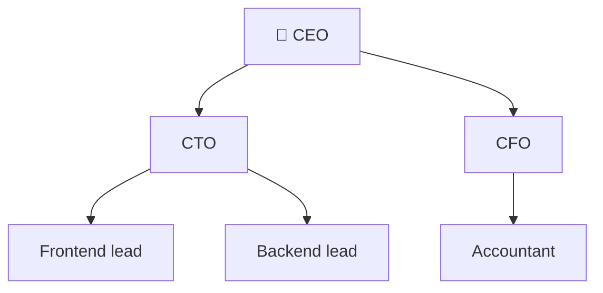
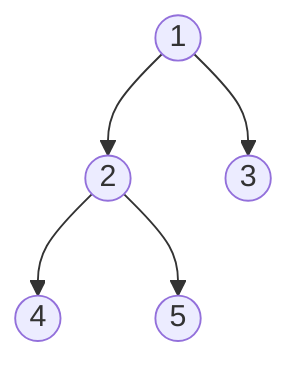
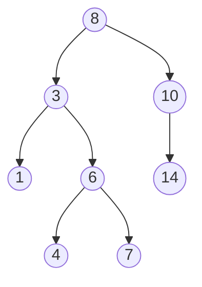
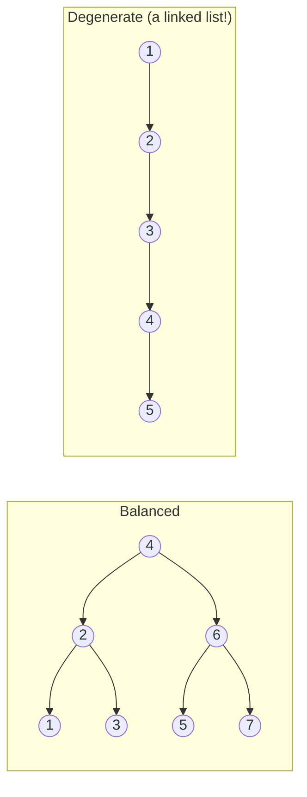

## The big idea

A **family tree** or a company **org chart**: one person at the top, each person has zero or more people below them, and nobody reports to two bosses. That's a tree.



You already use trees daily: **folders** on your computer, the **HTML DOM**, **JSON** objects, React component trees, and database **indexes** (B-trees).

## Tree vocabulary


| Word | Meaning |
| --- | --- |
| **Root** | The top node (no parent) |
| **Parent / child** | A node and the nodes directly below it |
| **Leaf** | A node with no children |
| **Edge** | The link between parent and child |
| **Depth** of a node | Number of edges from the root to it |
| **Height** of the tree | Longest path from the root down to a leaf |
| **Subtree** | A node plus everything below it |
| **Binary tree** | Every node has **at most 2** children (left and right) |

```js
class TreeNode {
  constructor(value, left = null, right = null) {
    this.value = value;
    this.left = left;
    this.right = right;
  }
}
```

## Trees love recursion

Every subtree is itself a tree. So most tree problems follow the same shape: *solve for the left subtree, solve for the right subtree, combine.*

```js
// Height of a tree
function height(node) {
  if (node === null) return 0;                              // base case: empty tree
  return 1 + Math.max(height(node.left), height(node.right)); // combine
}

// Count nodes
const count = (node) => (node ? 1 + count(node.left) + count(node.right) : 0);
```

## The four traversals

For this tree:



| Traversal | Order | Result | Used for |
| --- | --- | --- | --- |
| **Pre-order** | Root → Left → Right | 1, 2, 4, 5, 3 | Copying a tree, serialising |
| **In-order** | Left → Root → Right | 4, 2, 5, 1, 3 | BST → **sorted** order |
| **Post-order** | Left → Right → Root | 4, 5, 2, 3, 1 | Deleting a tree, computing folder sizes |
| **Level-order** (BFS) | Level by level | 1, 2, 3, 4, 5 | Shortest path, printing by level |

The three depth-first traversals are the same function with one line moved:

```js
function preorder(node, result = []) {
  if (node === null) return result;
  result.push(node.value);        // root first
  preorder(node.left, result);
  preorder(node.right, result);
  return result;
}

function inorder(node, result = []) {
  if (node === null) return result;
  inorder(node.left, result);
  result.push(node.value);        // root in the middle
  inorder(node.right, result);
  return result;
}

function postorder(node, result = []) {
  if (node === null) return result;
  postorder(node.left, result);
  postorder(node.right, result);
  result.push(node.value);        // root last
  return result;
}
```

**Level-order uses a queue:**

```js
function levelOrder(root) {
  if (!root) return [];
  const levels = [];
  let queue = [root];
  while (queue.length) {
    levels.push(queue.map((n) => n.value));
    queue = queue.flatMap((n) => [n.left, n.right].filter(Boolean));
  }
  return levels; // [[1], [2, 3], [4, 5]]
}
```

> 💡 **Memory trick:** "pre", "in" and "post" describe *when you visit the root*: before, in between, or after its children.

## Binary Search Tree (BST)

A BST adds one rule: **for every node, everything on the left is smaller and everything on the right is bigger.**



To find 7: 7 < 8 → go left · 7 > 3 → go right · 7 > 6 → go right · found! Each step **throws away half the tree**, just like binary search.

```js
function search(node, target) {
  while (node) {
    if (target === node.value) return node;
    node = target < node.value ? node.left : node.right;
  }
  return null;
}

function insert(node, value) {
  if (!node) return new TreeNode(value);
  if (value < node.value) node.left = insert(node.left, value);
  else node.right = insert(node.right, value);
  return node;
}
```

### Balanced vs unbalanced

| | Balanced BST | Unbalanced (worst case) |
| --- | --- | --- |
| Shape | Bushy, height ≈ log n | A long chain, height = n |
| Search / insert | **O(log n)** | O(n) 😢 |
| How it happens | Random inserts, or self-balancing trees | Inserting already-sorted data: 1, 2, 3, 4… |



Self-balancing trees (**AVL**, **Red-Black**) rotate nodes automatically to stay balanced. Databases use **B-trees**, wide trees with many keys per node, so a lookup touches only 3–4 disk pages even with millions of rows.

## Classic interview problems

```js
// Is this a valid BST? Every node must fit within a (min, max) range.
function isValidBST(node, min = -Infinity, max = Infinity) {
  if (!node) return true;
  if (node.value <= min || node.value >= max) return false;
  return isValidBST(node.left, min, node.value) && isValidBST(node.right, node.value, max);
}

// Invert (mirror) a binary tree
function invert(node) {
  if (!node) return null;
  [node.left, node.right] = [invert(node.right), invert(node.left)];
  return node;
}
```

## Key takeaways

- Trees model hierarchies: folders, DOM, org charts, JSON.
- Most tree problems are recursion: solve left, solve right, combine.
- Four traversals: pre-, in-, post-order (DFS) and level-order (BFS with a queue).
- In-order traversal of a BST gives **sorted** values.
- BST search is O(log n) only when the tree is balanced.
