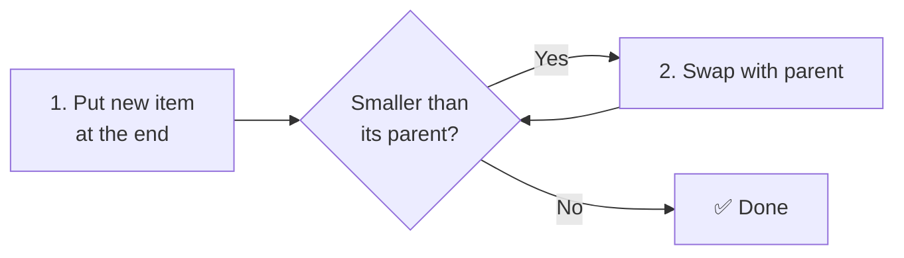
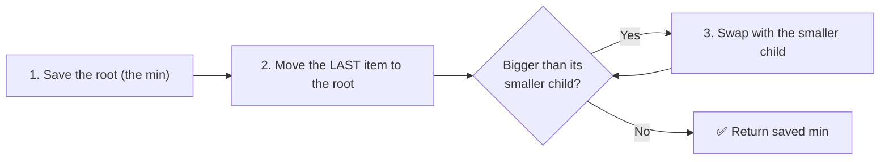
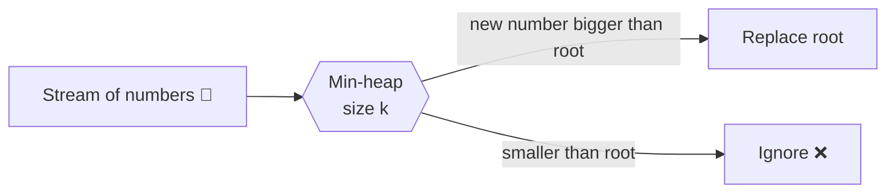

## The big idea

In a hospital emergency room, patients aren't treated first-come-first-served. The **most urgent** patient goes next, even if they just arrived. That's a **priority queue**, and a **heap** is the clever data structure that implements it efficiently.

| Structure | Get min | Insert | Remove min |
| --- | --- | --- | --- |
| Unsorted array | O(n) | O(1) | O(n) |
| Sorted array | O(1) | O(n) | O(1)* |
| **Binary heap** | **O(1)** | **O(log n)** | **O(log n)** |

## What is a heap?

A **min-heap** is a binary tree with two rules:

1. **Heap rule:** every parent is **smaller than or equal to** its children, so the smallest item is always at the root.
2. **Shape rule:** the tree is *complete*: filled level by level, left to right, with no gaps.

(A **max-heap** is the same with "bigger".)


### The array trick

Because the tree has no gaps, it fits perfectly in a plain array. No node objects needed:

| For the node at index `i` | Formula |
| --- | --- |
| Parent | `Math.floor((i - 1) / 2)` |
| Left child | `2 * i + 1` |
| Right child | `2 * i + 2` |

## Insert: add at the end, "bubble up"



## Remove min: take the root, "sink down"



The tree's height is log n, so each bubble-up or sink-down takes at most **O(log n)** swaps.

## A complete MinHeap in JavaScript

JavaScript has no built-in heap, so this is worth knowing by heart for interviews:

```js
class MinHeap {
  #items = [];
  #compare;

  constructor(compare = (a, b) => a - b) {
    this.#compare = compare;
  }

  get size() { return this.#items.length; }
  peek() { return this.#items[0]; }

  push(value) {
    const items = this.#items;
    items.push(value);
    let i = items.length - 1;
    while (i > 0) {                                   // bubble up
      const parent = (i - 1) >> 1;
      if (this.#compare(items[i], items[parent]) >= 0) break;
      [items[i], items[parent]] = [items[parent], items[i]];
      i = parent;
    }
  }

  pop() {
    const items = this.#items;
    if (items.length === 0) return undefined;
    const top = items[0];
    const last = items.pop();
    if (items.length > 0) {
      items[0] = last;
      let i = 0;
      while (true) {                                  // sink down
        const left = 2 * i + 1, right = left + 1;
        let smallest = i;
        if (left < items.length && this.#compare(items[left], items[smallest]) < 0) smallest = left;
        if (right < items.length && this.#compare(items[right], items[smallest]) < 0) smallest = right;
        if (smallest === i) break;
        [items[i], items[smallest]] = [items[smallest], items[i]];
        i = smallest;
      }
    }
    return top;
  }
}

const heap = new MinHeap();
[5, 3, 8, 1, 9].forEach((n) => heap.push(n));
heap.pop(); // 1
heap.pop(); // 3
```

For a **max-heap**, pass `(a, b) => b - a`. For objects: `(a, b) => a.priority - b.priority`.

## Pattern: Top K ⭐

"Find the **k largest** numbers in a stream of a million numbers."

Sorting is O(n log n). Better: keep a **min-heap of size k**. The heap's root is the *smallest of the top k*: anything smaller than it can't be in the top k.

```js
function topK(nums, k) {
  const heap = new MinHeap();
  for (const n of nums) {
    heap.push(n);
    if (heap.size > k) heap.pop(); // kick out the smallest
  }
  const result = [];
  while (heap.size) result.push(heap.pop());
  return result.reverse();
}

topK([3, 1, 5, 12, 2, 11, 9], 3); // [12, 11, 9]
```

Time **O(n log k)**, memory **O(k)**. Great when k is small and n is huge (even a stream that doesn't fit in memory).



## Pattern: merge K sorted lists

Put the first element of each list in a heap; repeatedly pop the smallest and push the next element from the same list. O(N log k) for N total elements. This is how databases and big-data tools merge sorted files.

## Where heaps are used

- **Task schedulers:** run the job with the nearest deadline first (OS schedulers, BullMQ delayed jobs).
- **Dijkstra's shortest path:** always expand the closest unvisited node (Google Maps–style routing).
- **Median of a stream:** a max-heap for the lower half + a min-heap for the upper half.
- **Rate limiters and timers:** the next timer to fire sits at the root.
- **Heap sort:** O(n log n) sorting with O(1) extra memory.

## Key takeaways

- A heap keeps the min (or max) at the root: peek O(1), push/pop O(log n).
- Stored in an array: children of `i` are `2i+1` and `2i+2`, parent is `(i-1)/2`.
- Insert = add at the end + bubble up. Remove = move last to root + sink down.
- **Top K** → min-heap of size k: O(n log k).
- Keywords in problems: *k largest, k smallest, closest, most frequent, schedule, merge sorted*.
