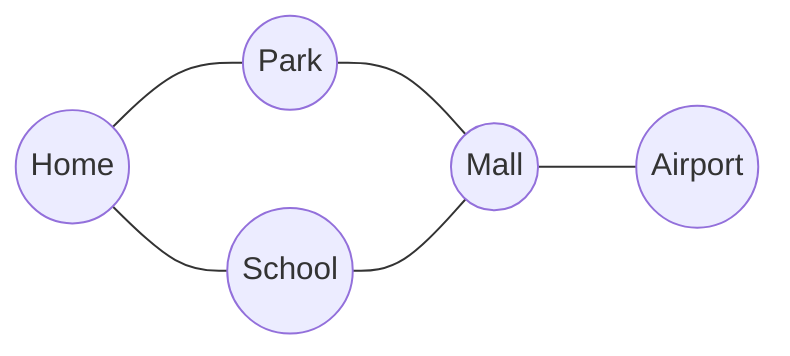
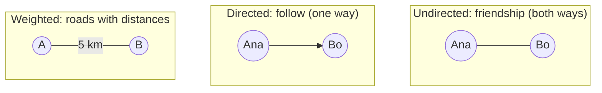
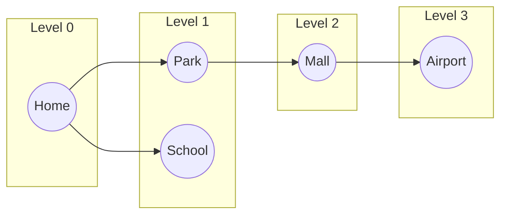
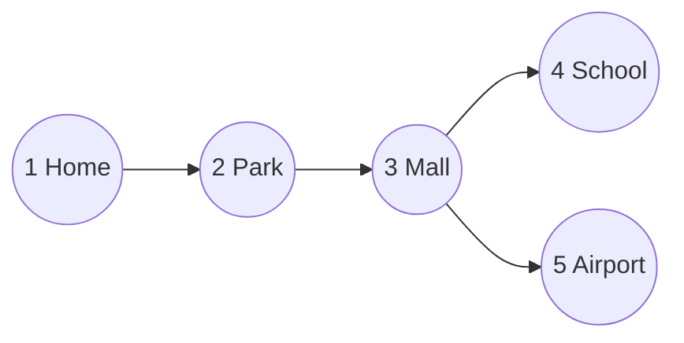
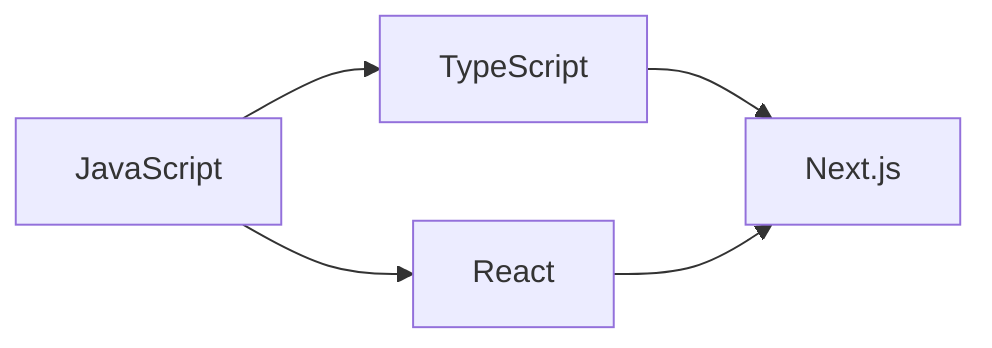

## The big idea

A **subway map**: stations are connected by lines. Some stations connect to many others; you can often reach a station by several routes. That's a **graph**: a set of **nodes** (vertices) connected by **edges**.



Trees are a special case of graphs (connected, no cycles). General graphs can have **cycles**, **many paths** and **disconnected parts**.

## Graphs are everywhere

| Real world | Nodes | Edges |
| --- | --- | --- |
| Google Maps | Intersections | Roads (weighted by distance) |
| Social network | People | Friendships / follows |
| The web | Pages | Links |
| npm | Packages | "depends on" |
| Microservices | Services | API calls |
| Course plan | Courses | Prerequisites |

## Types of graphs



## Storing a graph: adjacency list

The most common representation: a map from each node to the list of its neighbours.

```js
const graph = {
  Home:    ["Park", "School"],
  Park:    ["Home", "Mall"],
  School:  ["Home", "Mall"],
  Mall:    ["Park", "School", "Airport"],
  Airport: ["Mall"],
};
```


| | Adjacency list | Adjacency matrix |
| --- | --- | --- |
| Memory | O(V + E) ✅ | O(V²) |
| "Are A and B connected?" | O(degree) | **O(1)** |
| "List A's neighbours" | **O(degree)** | O(V) |
| Best for | Most real graphs (sparse) | Small, dense graphs |

## Breadth-First Search (BFS)

> 🌊 **Analogy:** Drop a stone in a pond. The ripple reaches everything 1 step away, then 2 steps, then 3…

BFS explores **level by level** using a **queue**. Its superpower: in an unweighted graph, it finds the **shortest path** (fewest edges).

```js
function shortestPath(graph, start, goal) {
  const queue = [[start]];            // queue of paths
  const visited = new Set([start]);

  while (queue.length) {
    const path = queue.shift();
    const node = path.at(-1);
    if (node === goal) return path;

    for (const next of graph[node] ?? []) {
      if (!visited.has(next)) {
        visited.add(next);             // mark when ENQUEUED, not when visited
        queue.push([...path, next]);
      }
    }
  }
  return null;
}

shortestPath(graph, "Home", "Airport"); // ["Home", "Park", "Mall", "Airport"]
```



## Depth-First Search (DFS)

> 🧭 **Analogy:** Exploring a maze. Follow one corridor as deep as it goes; at a dead end, **backtrack** to the last junction and try another way.

DFS uses a **stack**, usually the call stack via recursion.

```js
function dfs(graph, node, visited = new Set()) {
  if (visited.has(node)) return visited;
  visited.add(node);
  for (const next of graph[node] ?? []) dfs(graph, next, visited);
  return visited;
}

dfs(graph, "Home"); // Set { Home, Park, Mall, School, Airport }
```



## BFS vs DFS

| | BFS 🌊 | DFS 🧭 |
| --- | --- | --- |
| Container | Queue | Stack / recursion |
| Explores | Level by level | One branch as deep as possible |
| Shortest path (unweighted) | ✅ Yes | ❌ Not guaranteed |
| Memory | Can be large (a whole level) | Proportional to depth |
| Great for | Shortest path, nearest X, levels | Cycles, connected components, topological sort, mazes, backtracking |

Both run in **O(V + E)**: every node and edge is handled once.

## Grids are graphs too ⭐

Many interview problems hide a graph inside a 2D grid. Each cell is a node; its neighbours are up, down, left and right.

**Number of islands:** count groups of connected `1`s.

```js
function countIslands(grid) {
  const rows = grid.length, cols = grid[0].length;
  let islands = 0;

  function sink(r, c) {
    if (r < 0 || c < 0 || r >= rows || c >= cols || grid[r][c] !== "1") return;
    grid[r][c] = "0"; // mark visited by "sinking" the land
    sink(r + 1, c); sink(r - 1, c); sink(r, c + 1); sink(r, c - 1);
  }

  for (let r = 0; r < rows; r++) {
    for (let c = 0; c < cols; c++) {
      if (grid[r][c] === "1") {
        islands++;
        sink(r, c); // DFS removes the whole island
      }
    }
  }
  return islands;
}
```

```text
1 1 0 0 0        🏝️ 🏝️ 🌊 🌊 🌊
1 1 0 0 0        🏝️ 🏝️ 🌊 🌊 🌊
0 0 1 0 0   →    🌊 🌊 🏖️ 🌊 🌊     3 islands
0 0 0 1 1        🌊 🌊 🌊 🏜️ 🏜️
```

## Topological sort: dependency order

"In which order should I install packages / take courses / build services?" Only works on a **directed acyclic graph (DAG)**.



A valid order: JavaScript → TypeScript → React → Next.js.

```js
function topoSort(graph) {            // graph: node → nodes that depend on it
  const visited = new Set(), order = [];
  const visit = (node) => {
    if (visited.has(node)) return;
    visited.add(node);
    (graph[node] ?? []).forEach(visit);
    order.push(node);                 // post-order: after all dependents
  };
  Object.keys(graph).forEach(visit);
  return order.reverse();
}
```

## Weighted graphs: a peek at Dijkstra

When edges have weights (distances, costs), BFS isn't enough. **Dijkstra's algorithm** is "BFS with a priority queue": always expand the closest unvisited node next. It powers GPS navigation and network routing. (See *Heaps & Priority Queues*.)

## Key takeaways

- Graph = nodes + edges; directed or undirected, weighted or not.
- Store most graphs as an **adjacency list** (map of node → neighbours).
- **BFS** (queue) = level by level = shortest path in unweighted graphs.
- **DFS** (stack / recursion) = go deep, backtrack = cycles, components, topological sort.
- Always keep a **visited** set, or cycles will loop forever.
- 2D grids are graphs: neighbours are up, down, left and right.
