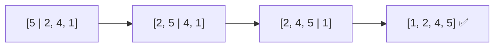
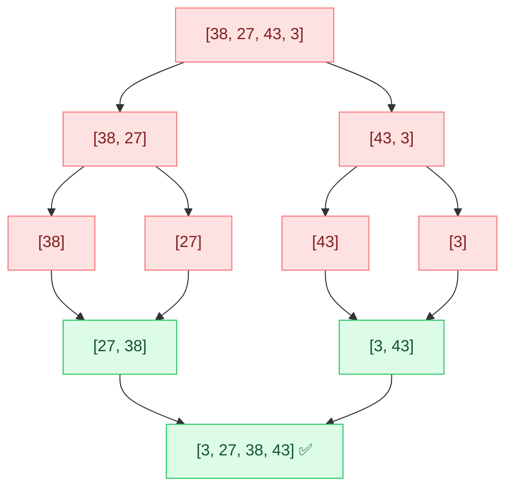
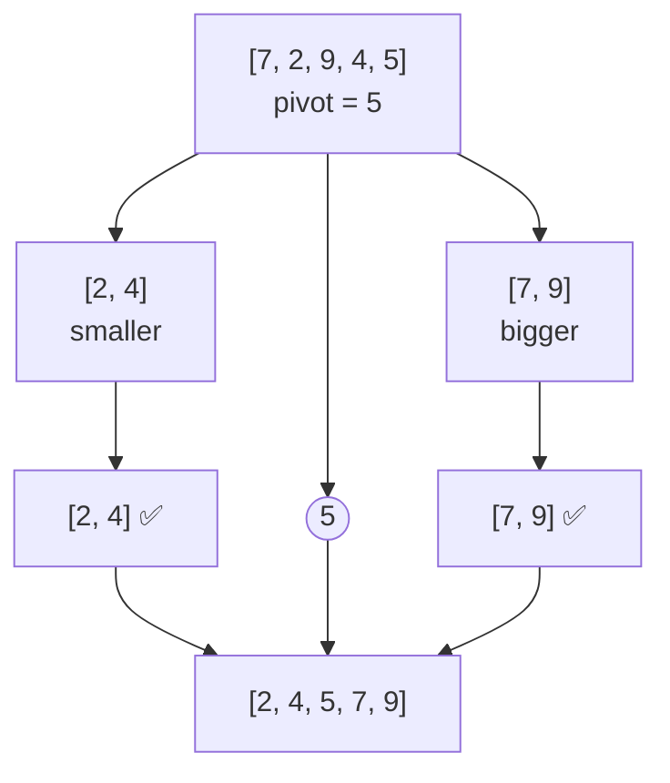

## The big idea

Sorting a hand of playing cards, organising books by title, ranking search results: sorting is one of the most common things computers do. Different algorithms trade **simplicity**, **speed** and **memory**.


| Algorithm | Best | Average | Worst | Extra memory | Stable? |
| --- | --- | --- | --- | --- | --- |
| Bubble sort | O(n) | O(n²) | O(n²) | O(1) | ✅ |
| Selection sort | O(n²) | O(n²) | O(n²) | O(1) | ❌ |
| Insertion sort | O(n) | O(n²) | O(n²) | O(1) | ✅ |
| **Merge sort** | O(n log n) | O(n log n) | O(n log n) | O(n) | ✅ |
| **Quick sort** | O(n log n) | O(n log n) | O(n²) | O(log n) | ❌ |
| Heap sort | O(n log n) | O(n log n) | O(n log n) | O(1) | ❌ |
| Counting sort | O(n + k) | O(n + k) | O(n + k) | O(k) | ✅ |

> 💡 **Stable** means equal items keep their original order. Sort users by city with a stable sort and, within each city, they stay in their previous order (for example, alphabetical). That matters when you sort by several keys.

## The simple O(n²) sorts

### Bubble sort: big items "bubble" to the end

Compare neighbours and swap if they're in the wrong order. After each pass, the largest remaining item has floated to the end.

```js
function bubbleSort(arr) {
  for (let end = arr.length - 1; end > 0; end--) {
    let swapped = false;
    for (let i = 0; i < end; i++) {
      if (arr[i] > arr[i + 1]) {
        [arr[i], arr[i + 1]] = [arr[i + 1], arr[i]];
        swapped = true;
      }
    }
    if (!swapped) break; // already sorted → O(n) best case
  }
  return arr;
}
```

### Insertion sort: like sorting playing cards in your hand

Take the next card and slide it left until it's in the right place.

```js
function insertionSort(arr) {
  for (let i = 1; i < arr.length; i++) {
    const card = arr[i];
    let j = i - 1;
    while (j >= 0 && arr[j] > card) {
      arr[j + 1] = arr[j]; // shift bigger cards right
      j--;
    }
    arr[j + 1] = card;
  }
  return arr;
}
```



Insertion sort is **very fast for small or nearly sorted arrays**. That's why real-world sorts use it for small chunks.

## Merge sort: divide and conquer

> 📚 **Analogy:** Two friends each sort half a pile of exam papers. Then you merge the two sorted piles by repeatedly taking the smaller top paper.

1. **Divide:** split the array in half until each piece has 1 item (a single item is already sorted).
2. **Conquer:** merge pairs of sorted pieces back together.



```js
function mergeSort(arr) {
  if (arr.length <= 1) return arr;
  const mid = arr.length >> 1;
  return merge(mergeSort(arr.slice(0, mid)), mergeSort(arr.slice(mid)));
}

function merge(left, right) {
  const result = [];
  let i = 0, j = 0;
  while (i < left.length && j < right.length) {
    result.push(left[i] <= right[j] ? left[i++] : right[j++]); // <= keeps it stable
  }
  return result.concat(left.slice(i), right.slice(j));
}
```

**Why n log n?** The array is halved log n times (the tree's height), and each level does O(n) merging work.

## Quick sort: pick a pivot, partition

> 🎓 **Analogy:** A teacher says "everyone shorter than Sam, stand left; taller, stand right." Then each group does the same, recursively.



```js
// Readable version (uses extra arrays)
function quickSort(arr) {
  if (arr.length <= 1) return arr;
  const pivot = arr[arr.length >> 1];
  const less = arr.filter((x) => x < pivot);
  const equal = arr.filter((x) => x === pivot);
  const greater = arr.filter((x) => x > pivot);
  return [...quickSort(less), ...equal, ...quickSort(greater)];
}
```

Real implementations partition **in place** (O(log n) memory) and pick a random or "median of three" pivot. Always choosing the first element as pivot on already-sorted data creates the **O(n²) worst case**.

## What does JavaScript's `sort()` use?

V8 (Chrome, Node.js) uses **TimSort**: a hybrid of merge sort and insertion sort. It's **stable**, O(n log n), and very fast on real-world data that is often partly sorted.

```js
// ⚠️ Default sort compares as STRINGS
[10, 9, 1, 100].sort();                 // [1, 10, 100, 9] 😱

// ✅ Always pass a comparator for numbers
[10, 9, 1, 100].sort((a, b) => a - b);  // [1, 9, 10, 100]

// Sort objects by several keys (stable sort makes this work)
users.sort((a, b) => a.city.localeCompare(b.city) || b.age - a.age);

// Don't mutate the original: toSorted() (ES2023)
const sorted = prices.toSorted((a, b) => a - b);
```

## Counting sort: beating n log n

Comparison sorts can't beat O(n log n). But if values are **small integers** in a known range (ages, exam scores 0–100), you can just **count** them:

```js
function countingSort(nums, max) {
  const counts = new Array(max + 1).fill(0);
  for (const n of nums) counts[n]++;
  return counts.flatMap((count, value) => Array(count).fill(value));
}
countingSort([3, 1, 2, 3, 0, 1], 3); // [0, 1, 1, 2, 3, 3] in O(n + k)
```

## Key takeaways

- Simple sorts (bubble, insertion, selection) are O(n²). Insertion sort shines on small or nearly sorted data.
- **Merge sort:** always O(n log n), stable, needs O(n) memory.
- **Quick sort:** O(n log n) on average, in place, O(n²) with bad pivots.
- JavaScript's `sort()` is TimSort (stable). **Always pass a comparator for numbers.**
- Counting sort beats n log n for small integer ranges.
