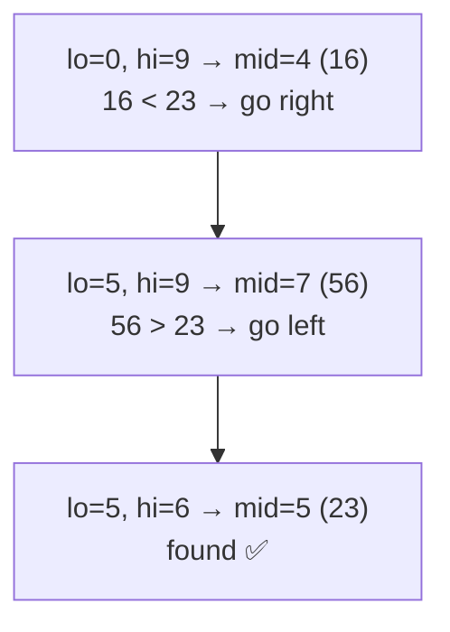
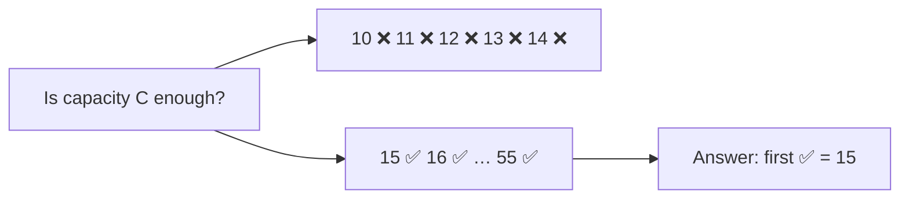

## The big idea

The number-guessing game: *"I'm thinking of a number between 1 and 100."* The smart strategy is to guess 50. "Higher!" Guess 75. "Lower!" Guess 62… Every guess **cuts the remaining options in half**, so you always win in 7 guesses or fewer.


| Items | Linear search (worst) | Binary search (worst) |
| --- | --- | --- |
| 100 | 100 | 7 |
| 1,000,000 | 1,000,000 | 20 |
| 1,000,000,000 | 1,000,000,000 | **30** |

> ⚠️ Binary search needs **sorted** data (or, more generally, a yes/no condition that flips only once).

## The classic algorithm

```js
function binarySearch(sorted, target) {
  let lo = 0;
  let hi = sorted.length - 1;

  while (lo <= hi) {                        // search space [lo, hi] is not empty
    const mid = lo + Math.floor((hi - lo) / 2);
    if (sorted[mid] === target) return mid;
    if (sorted[mid] < target) lo = mid + 1; // target is in the right half
    else hi = mid - 1;                      // target is in the left half
  }
  return -1;                                 // not found
}

binarySearch([2, 5, 8, 12, 16, 23, 38, 56, 72, 91], 23); // 5
```



## The three classic bugs

| Bug | Wrong | Right |
| --- | --- | --- |
| Loop condition | `while (lo < hi)` with `hi = length - 1` misses the last element | `while (lo <= hi)` |
| Infinite loop | `lo = mid` or `hi = mid` can stop shrinking | `lo = mid + 1`, `hi = mid - 1` |
| Overflow (other languages) | `(lo + hi) / 2` overflows on huge ints | `lo + (hi - lo) / 2` |

> 💡 **Test with tiny arrays:** `[]`, `[1]`, `[1, 2]`, and a target smaller than, larger than, and missing from the array. Off-by-one bugs show up immediately.

## Variation: find the first / last position

"Find the **first** index where `x` appears" in `[1, 2, 2, 2, 3]`. When you find a match, don't stop: record it and **keep searching left**.

```js
function firstIndexOf(sorted, target) {
  let lo = 0, hi = sorted.length - 1, answer = -1;
  while (lo <= hi) {
    const mid = lo + ((hi - lo) >> 1);
    if (sorted[mid] >= target) {
      if (sorted[mid] === target) answer = mid;
      hi = mid - 1; // keep looking left
    } else {
      lo = mid + 1;
    }
  }
  return answer;
}

firstIndexOf([1, 2, 2, 2, 3], 2); // 1
```

## The real superpower: search on a condition

Binary search works on anything where a yes/no question flips **exactly once**:

```text
index:      0     1     2     3     4     5     6
condition:  ❌    ❌    ❌    ✅    ✅    ✅    ✅
                              ↑ find the first ✅
```

```js
// Generic: smallest x in [lo, hi] where isOk(x) is true
function firstTrue(lo, hi, isOk) {
  while (lo < hi) {
    const mid = lo + ((hi - lo) >> 1);
    if (isOk(mid)) hi = mid;    // mid might be the answer; keep it
    else lo = mid + 1;
  }
  return lo;
}
```

### Example: first bad version

Versions 1..n; from some version on, every build is broken. Find the first broken one with the fewest checks.

```js
const firstBad = firstTrue(1, n, (version) => isBadVersion(version));
```

This is exactly what **`git bisect`** does to find the commit that introduced a bug!

### Example: binary search on the answer ⭐

*"Ship packages (in order) within D days. What's the minimum truck capacity?"* The answer lies between the heaviest package and the total weight. If capacity C works, every bigger capacity works too, so the condition flips once. Binary search the capacity:

```js
function minCapacity(weights, days) {
  const canShip = (capacity) => {
    let neededDays = 1, load = 0;
    for (const w of weights) {
      if (load + w > capacity) { neededDays++; load = 0; }
      load += w;
    }
    return neededDays <= days;
  };
  const lo = Math.max(...weights);
  const hi = weights.reduce((a, b) => a + b, 0);
  return firstTrue(lo, hi, canShip);
}

minCapacity([1, 2, 3, 4, 5, 6, 7, 8, 9, 10], 5); // 15
```



Recognise it when a problem asks for the **minimum or maximum value that satisfies a condition**: "minimum speed", "smallest capacity", "maximum distance".

## Rotated sorted arrays

`[15, 18, 22, 3, 7, 10]` was sorted, then rotated. At every step, **one half is still sorted**; check if the target lies in that half.

```js
function searchRotated(nums, target) {
  let lo = 0, hi = nums.length - 1;
  while (lo <= hi) {
    const mid = (lo + hi) >> 1;
    if (nums[mid] === target) return mid;
    if (nums[lo] <= nums[mid]) {                     // left half is sorted
      if (nums[lo] <= target && target < nums[mid]) hi = mid - 1;
      else lo = mid + 1;
    } else {                                         // right half is sorted
      if (nums[mid] < target && target <= nums[hi]) lo = mid + 1;
      else hi = mid - 1;
    }
  }
  return -1;
}
```

## Key takeaways

- Binary search = halve the search space each step = **O(log n)**.
- Needs sorted data, or any condition that flips from ❌ to ✅ exactly once.
- Watch the classic bugs: `<=` vs `<`, and always move with `mid ± 1`.
- "Binary search on the answer" solves many *minimum/maximum that works* problems.
- `git bisect` and database B-tree indexes use the same idea.
