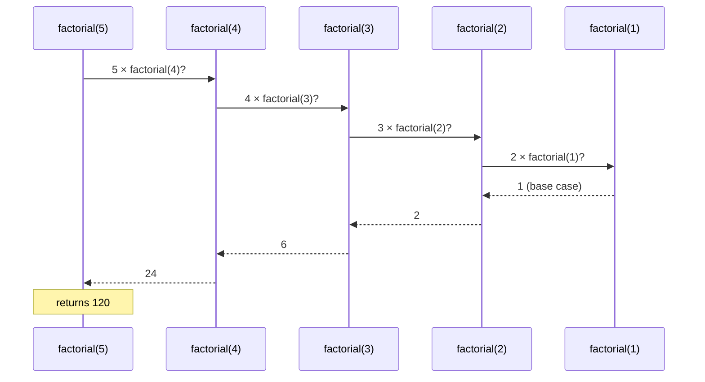
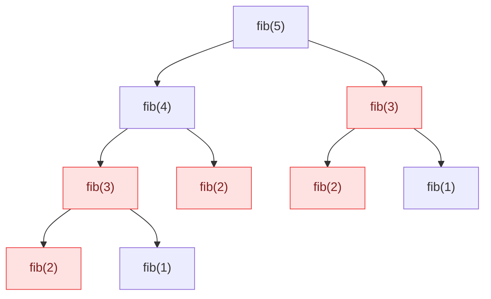
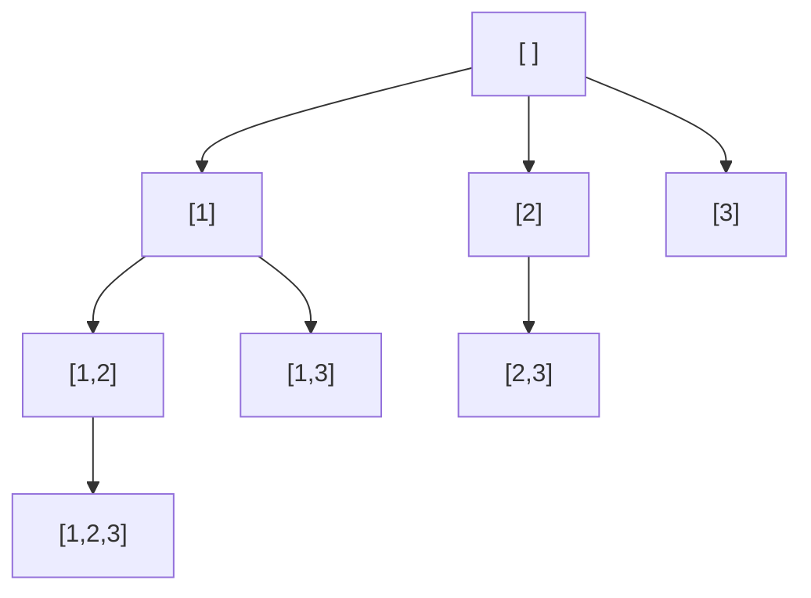

## The big idea

**Russian nesting dolls (matryoshka):** to find the smallest doll, open a doll… and inside is a smaller doll. Open that one… until you reach the tiny one that doesn't open.


Every recursive function has two parts:

1. **Base case:** the smallest doll. A problem so small you can answer it directly. *Without it, recursion never stops.*
2. **Recursive case:** open one doll. Do a little work and call yourself on a **smaller** problem.

## Example 1: countdown

```js
function countdown(n) {
  if (n === 0) {            // base case
    console.log("🚀 Liftoff!");
    return;
  }
  console.log(n);
  countdown(n - 1);         // smaller problem
}
countdown(3); // 3, 2, 1, 🚀 Liftoff!
```

## Example 2: factorial and the call stack

`5! = 5 × 4 × 3 × 2 × 1`, and notice that `5! = 5 × 4!`.

```js
function factorial(n) {
  if (n <= 1) return 1;          // base case
  return n * factorial(n - 1);   // trust that factorial(n-1) works
}
```



Calls go **down** until the base case, then answers flow back **up**.

> 💡 **The leap of faith:** when writing the recursive case, *assume* the call on the smaller problem already works. Just focus on: "if I had the answer for n-1, how do I get the answer for n?"

## Example 3: sum of nested arrays

Recursion shines when the data itself is recursive (trees, nested lists, folders, JSON).

```js
function deepSum(items) {
  let total = 0;
  for (const item of items) {
    total += Array.isArray(item) ? deepSum(item) : item;
  }
  return total;
}

deepSum([1, [2, [3, [4]], 5]]); // 15
```

## Recursion vs loops

| | Recursion | Loop |
| --- | --- | --- |
| Best for | Trees, nested data, divide & conquer, backtracking | Simple repetition over a list |
| Readability | Often shorter for recursive data | Often clearer for flat data |
| Memory | Uses a stack frame per call | Constant |
| Risk | Stack overflow on very deep input (~10,000 calls in JS) | None |

Any recursion *can* be rewritten with a loop and your own stack. Do that when the input could be very deep.

## The Fibonacci trap

```js
// ❌ Beautiful but O(2ⁿ): fib(50) would take hours
const fib = (n) => (n < 2 ? n : fib(n - 1) + fib(n - 2));
```



The same sub-problems are solved again and again. Remember answers (**memoisation**) and it becomes O(n):

```js
function fib(n, memo = new Map()) {
  if (n < 2) return n;
  if (!memo.has(n)) memo.set(n, fib(n - 1, memo) + fib(n - 2, memo));
  return memo.get(n);
}
fib(50); // 12586269025, instantly
```

That idea is the heart of **Dynamic Programming** (next lesson).

---

## Backtracking

> 🧭 **Analogy:** Solving a maze by hand. At each junction, pick a path. Dead end? **Go back** to the last junction and try the next path. Keep going until you find the exit, or until you've tried everything.

Backtracking = recursion that **builds a solution step by step** and **undoes a step** when it leads nowhere.

### The universal template

```js
function backtrack(path, choices) {
  if (isComplete(path)) {
    results.push([...path]); // save a copy
    return;
  }
  for (const choice of choices) {
    if (!isValid(choice, path)) continue;
    path.push(choice);        // 1. choose
    backtrack(path, choices); // 2. explore
    path.pop();               // 3. un-choose (backtrack)
  }
}
```

### Example: all subsets

```js
function subsets(nums) {
  const result = [];
  function build(start, path) {
    result.push([...path]);
    for (let i = start; i < nums.length; i++) {
      path.push(nums[i]);   // choose
      build(i + 1, path);   // explore
      path.pop();           // un-choose
    }
  }
  build(0, []);
  return result;
}

subsets([1, 2, 3]); // [[], [1], [1,2], [1,2,3], [1,3], [2], [2,3], [3]]
```



### Example: permutations

```js
function permutations(items) {
  const result = [];
  const used = new Array(items.length).fill(false);
  function build(path) {
    if (path.length === items.length) return result.push([...path]);
    items.forEach((item, i) => {
      if (used[i]) return;
      used[i] = true; path.push(item);    // choose
      build(path);                        // explore
      used[i] = false; path.pop();        // un-choose
    });
  }
  build([]);
  return result;
}

permutations(["🍎", "🍌", "🍇"]).length; // 6 = 3!
```

### Pruning: cut dead branches early

Backtracking explores a huge tree of possibilities (often O(2ⁿ) or O(n!)). **Pruning** skips branches that can't possibly work, like abandoning a Sudoku guess the moment a row has a duplicate. Good pruning is the difference between milliseconds and hours.

**Classic backtracking problems:** subsets, permutations, combination sum, N-Queens, Sudoku solver, word search in a grid, generating valid parentheses.

## Key takeaways

- Recursion = **base case** + **smaller recursive call**. Trust the smaller call.
- Each call is a frame on the call stack; very deep recursion can overflow it.
- Naive recursion can repeat work exponentially. Memoisation fixes it.
- **Backtracking:** choose → explore → un-choose. Explores all possibilities, with pruning to skip hopeless branches.
