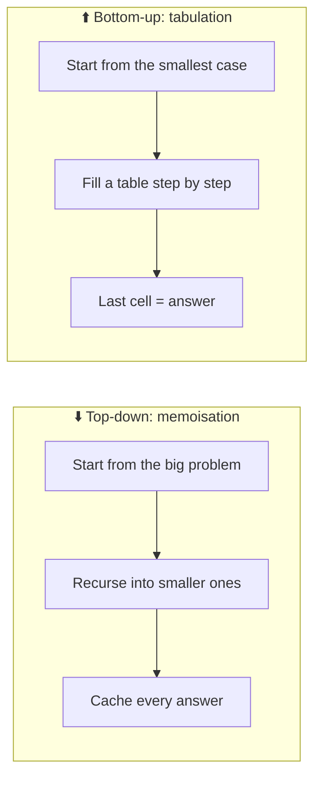
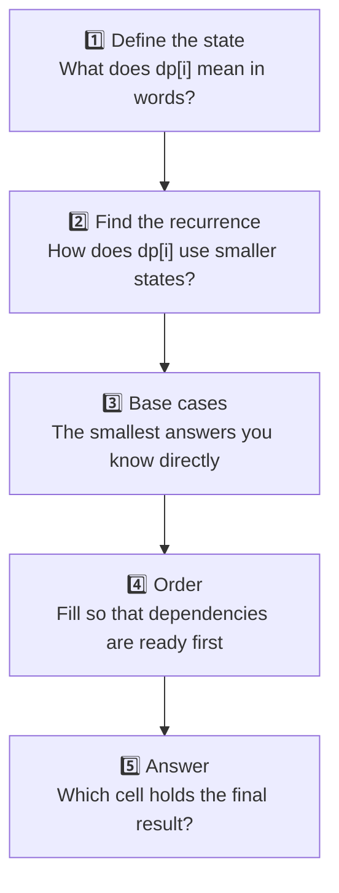

## The big idea

A teacher writes `1 + 1 + 1 + 1 + 1 + 1 + 1 + 1` on the board. *"What's the answer?"* You count: **8**. She adds `+ 1` at the end. *"And now?"* You instantly say **9**. You didn't recount; you **remembered** the previous answer.

> 📘 **Dynamic Programming (DP)** = *"Don't solve the same sub-problem twice. Remember it."*

A problem is a good fit for DP when it has:

1. **Overlapping sub-problems:** the same smaller questions come up again and again.
2. **Optimal substructure:** the best answer can be built from the best answers to smaller questions.

## Two ways to do DP



| | Top-down (memo) | Bottom-up (table) |
| --- | --- | --- |
| Style | Recursion + cache | Loop + array |
| Easier to write? | ✅ Usually (follows the recursive idea) | Needs the right fill order |
| Stack overflow risk | Yes, on deep inputs | No |
| Can save memory? | Harder | ✅ Often keep only the last row |

## Example 1: climbing stairs ⭐

*You can climb 1 or 2 steps at a time. How many different ways are there to climb n steps?*

**Think:** to stand on step n, your last move was either from step n-1 (a 1-step) or from step n-2 (a 2-step). So:

`ways(n) = ways(n - 1) + ways(n - 2)`


**Top-down:**

```js
function climbStairs(n, memo = new Map()) {
  if (n <= 2) return n;                    // 1 way for 1 step, 2 ways for 2 steps
  if (memo.has(n)) return memo.get(n);
  const ways = climbStairs(n - 1, memo) + climbStairs(n - 2, memo);
  memo.set(n, ways);
  return ways;
}
```

**Bottom-up (with O(1) memory):**

```js
function climbStairs(n) {
  if (n <= 2) return n;
  let twoBelow = 1, oneBelow = 2;
  for (let step = 3; step <= n; step++) {
    [twoBelow, oneBelow] = [oneBelow, twoBelow + oneBelow];
  }
  return oneBelow;
}
climbStairs(10); // 89
```

## The 5-step DP recipe



Step 1 is the hardest and the most important. **Write the meaning of `dp[i]` as a sentence** before coding.

## Example 2: coin change

*Coins `[1, 3, 4]`. What is the fewest number of coins that make 6?*

Greedy (always take the biggest coin) fails: 4 + 1 + 1 = **3 coins**, but 3 + 3 = **2 coins**.

1. **State:** `dp[a]` = fewest coins that make amount `a`.
2. **Recurrence:** `dp[a] = 1 + min(dp[a - coin])` for every coin ≤ a.
3. **Base:** `dp[0] = 0`.
4. **Order:** amounts 1, 2, 3, … up to the target.
5. **Answer:** `dp[target]`.

```js
function coinChange(coins, amount) {
  const dp = new Array(amount + 1).fill(Infinity);
  dp[0] = 0;
  for (let a = 1; a <= amount; a++) {
    for (const coin of coins) {
      if (coin <= a) dp[a] = Math.min(dp[a], dp[a - coin] + 1);
    }
  }
  return dp[amount] === Infinity ? -1 : dp[amount];
}

coinChange([1, 3, 4], 6); // 2
```

| amount | 0 | 1 | 2 | 3 | 4 | 5 | 6 |
| --- | --- | --- | --- | --- | --- | --- | --- |
| **dp** | 0 | 1 | 2 | 1 | 1 | 2 | **2** |
| how | – | 1 | 1+1 | 3 | 4 | 4+1 | 3+3 |

## Example 3: a 2D table, longest common subsequence

*Longest sequence of characters appearing in the same order in both strings.* `"ABCDE"` and `"ACE"` → `"ACE"`, length 3. Used by `git diff` and DNA comparison.

**State:** `dp[i][j]` = LCS length of the first `i` chars of `a` and the first `j` chars of `b`.

```js
function lcs(a, b) {
  const dp = Array.from({ length: a.length + 1 }, () => new Array(b.length + 1).fill(0));
  for (let i = 1; i <= a.length; i++) {
    for (let j = 1; j <= b.length; j++) {
      dp[i][j] = a[i - 1] === b[j - 1]
        ? dp[i - 1][j - 1] + 1                 // chars match: extend the diagonal
        : Math.max(dp[i - 1][j], dp[i][j - 1]); // skip a char from one string
    }
  }
  return dp[a.length][b.length];
}
```

|  | "" | A | C | E |
| --- | --- | --- | --- | --- |
| **""** | 0 | 0 | 0 | 0 |
| **A** | 0 | **1** ↘ | 1 | 1 |
| **B** | 0 | 1 | 1 | 1 |
| **C** | 0 | 1 | **2** ↘ | 2 |
| **D** | 0 | 1 | 2 | 2 |
| **E** | 0 | 1 | 2 | **3** ↘ |

## Common DP families

| Family | Example problems | State usually looks like |
| --- | --- | --- |
| **1D sequence** | Climbing stairs, house robber, max subarray | `dp[i]` = best answer using the first i items |
| **Knapsack** | Coin change, subset sum, 0/1 knapsack | `dp[capacity]` or `dp[i][capacity]` |
| **Two strings** | LCS, edit distance, regex matching | `dp[i][j]` over prefixes of both strings |
| **Grid paths** | Unique paths, minimum path sum | `dp[row][col]` |
| **Intervals** | Burst balloons, palindrome partitioning | `dp[left][right]` |

### Bonus: house robber

*Rob houses in a row for maximum money, but never two neighbours.*

**State:** at each house, keep two numbers: the best total if we *skip* this house, and the best total if we *rob* it.

```js
function rob(houses) {
  let bestIfSkipped = 0; // best total so far when the previous house was NOT robbed
  let bestIfRobbed = 0;  // best total so far when the previous house WAS robbed

  for (const money of houses) {
    const skipThis = Math.max(bestIfSkipped, bestIfRobbed); // free to do either before
    const robThis = bestIfSkipped + money;                  // neighbour must be skipped
    bestIfSkipped = skipThis;
    bestIfRobbed = robThis;
  }
  return Math.max(bestIfSkipped, bestIfRobbed);
}
rob([2, 7, 9, 3, 1]); // 12 → 2 + 9 + 1
```

## How to spot a DP problem

Keywords: **"number of ways"**, **"minimum/maximum"**, **"longest/shortest"**, **"can you reach / is it possible"**, and choices at each step that affect the future.

> 💡 **Workflow that always works:** write the plain recursive solution → notice repeated calls → add a memo (top-down DP) → optionally convert it to a table (bottom-up).

## Key takeaways

- DP = recursion + remembering answers to overlapping sub-problems.
- Top-down (memoisation) is easiest to write; bottom-up (tabulation) avoids deep recursion and can save memory.
- Always start by writing what `dp[i]` **means** in plain words.
- Greedy "take the biggest" often fails; DP checks all options efficiently.
- It can turn O(2ⁿ) brute force into O(n) or O(n × m).
