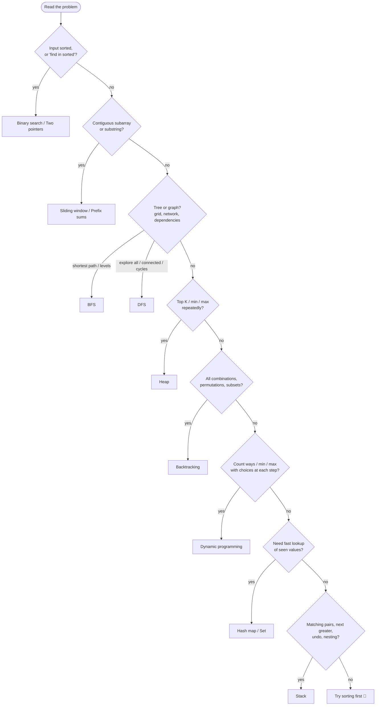
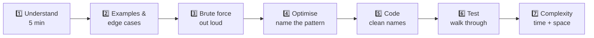

## The big idea

There are thousands of LeetCode problems but only about **15 patterns**. Interviews test whether you can **recognise the pattern** from the wording, then apply its template.

## Pick a technique: decision flowchart



## Keyword → pattern table

| If the problem says… | Think… | Typical complexity |
| --- | --- | --- |
| "sorted array", "find pair with sum" | Two pointers | O(n) |
| "subarray / substring", "longest", "k consecutive" | Sliding window | O(n) |
| "sum of range", "subarray sum equals k" | Prefix sum + hash map | O(n) |
| "find in sorted", "minimum X that works" | Binary search | O(log n) |
| "duplicate", "seen before", "anagram", "frequency" | Hash map / set | O(n) |
| "valid parentheses", "next greater", "undo" | Stack | O(n) |
| "linked list cycle", "middle of list" | Fast & slow pointers | O(n), O(1) space |
| "reverse linked list" | prev/curr/next | O(n) |
| "k largest / smallest / closest", "merge k sorted" | Heap | O(n log k) |
| "shortest path", "minimum steps", "level by level" | BFS | O(V + E) |
| "number of islands", "connected", "all paths" | DFS | O(V + E) |
| "order of tasks with prerequisites" | Topological sort | O(V + E) |
| "all combinations / subsets / permutations" | Backtracking | O(2ⁿ) / O(n!) |
| "number of ways", "min cost", "max profit" | Dynamic programming | O(n) – O(n²) |
| "intervals", "meetings", "overlap" | Sort by start, then sweep | O(n log n) |

## Complexity cheat sheet

### Data structures

| Structure | Access | Search | Insert | Delete |
| --- | --- | --- | --- | --- |
| Array | O(1) | O(n) | O(n)* | O(n)* |
| Hash map / set | – | O(1) | O(1) | O(1) |
| Linked list | O(n) | O(n) | O(1)** | O(1)** |
| Stack / queue | – | O(n) | O(1) | O(1) |
| Balanced BST | O(log n) | O(log n) | O(log n) | O(log n) |
| Heap | min: O(1) | O(n) | O(log n) | O(log n) |

\* O(1) at the end · \*\* when you already hold the node

### What input size allows

| n up to… | Target complexity | Typical approach |
| --- | --- | --- |
| ~10 | O(n!) | Permutations, brute force |
| ~20 | O(2ⁿ) | Backtracking, subsets |
| ~500 | O(n³) | Triple loops, interval DP |
| ~5,000 | O(n²) | Nested loops, 2D DP |
| ~1,000,000 | O(n log n) or O(n) | Sorting, heap, hash map, two pointers |
| bigger | O(log n) or O(1) | Binary search, math |

## Example: intervals (merge overlapping meetings)

```js
function mergeIntervals(intervals) {
  const sorted = intervals.toSorted((a, b) => a[0] - b[0]);
  const merged = [sorted[0]];
  for (const [start, end] of sorted.slice(1)) {
    const last = merged.at(-1);
    if (start <= last[1]) last[1] = Math.max(last[1], end); // overlap → extend
    else merged.push([start, end]);
  }
  return merged;
}
mergeIntervals([[1, 3], [8, 10], [2, 6]]); // [[1, 6], [8, 10]]
```

```mermaid
gantt
    dateFormat X
    axisFormat %s
    section Input
    1-3   :in1, 1, 3
    2-6   :in2, 2, 6
    8-10  :in3, 8, 10
    section Merged
    1-6   :active, out1, 1, 6
    8-10  :active, out2, 8, 10
```



## The interview routine (45 minutes)



1. **Understand:** repeat the problem in your own words. Ask about input size, duplicates, negatives, empty input.
2. **Examples:** work one normal example and one edge case by hand.
3. **Brute force:** say it out loud with its complexity, even if it's slow. It shows you can solve it.
4. **Optimise:** "The bottleneck is the inner search… a hash map makes that O(1)." Name the pattern.
5. **Code:** clear variable names, small helper functions. Talk while you type.
6. **Test:** trace your code with the example. Check the edge cases: empty, one element, all the same, very large.
7. **Complexity:** state the time and space. Mention trade-offs.

> 💡 **Interviewers care about your thinking** as much as the answer. Silence is the enemy; narrate your reasoning.

## Edge cases checklist

- Empty input `[]` / `""`
- One element
- All elements the same
- Negative numbers, zero
- Already sorted / reverse sorted
- Duplicates
- Very large input (performance) and very large numbers (overflow)
- Cycles in graphs / linked lists

## A study plan

| Week | Focus |
| --- | --- |
| 1 | Big-O, arrays, strings, hash maps |
| 2 | Two pointers, sliding window, prefix sums |
| 3 | Stacks, queues, linked lists |
| 4 | Trees, BST, recursion |
| 5 | Graphs: BFS, DFS, topological sort |
| 6 | Heaps, binary search on the answer, intervals |
| 7 | Backtracking |
| 8 | Dynamic programming |

Solve **3–5 problems per pattern** rather than 100 random ones. Recognition comes from repetition.

## Key takeaways

- Most problems map to ~15 patterns; keywords in the question are strong hints.
- Use input size to guess the expected complexity.
- Follow a routine: understand → examples → brute force → optimise → code → test → complexity.
- Talk through your thinking the whole time.
