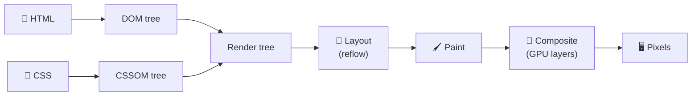
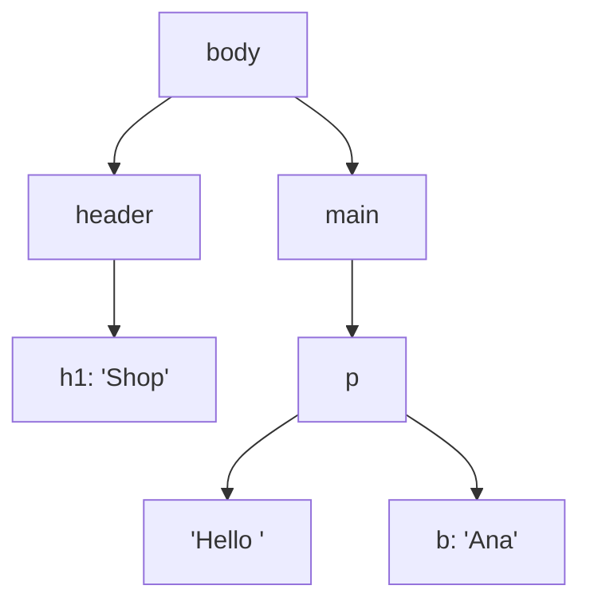

## The big idea

Building a page is like **building a house**:

1. Read the **blueprint** (HTML) → know which rooms exist (**DOM**).
2. Read the **interior design notes** (CSS) → know the colours and sizes (**CSSOM**).
3. Combine them into a **plan** of what's actually visible (**render tree**).
4. **Measure** where every wall goes (**layout**).
5. **Paint** the walls (**paint**).
6. Stack the floors together (**composite**).


## Step by step



### 1. HTML → DOM

The browser reads HTML top to bottom and builds the **Document Object Model**, a tree of nodes that JavaScript can read and change.

```html
<body>
  <header><h1>Shop</h1></header>
  <main><p>Hello <b>Ana</b></p></main>
</body>
```



### 2. CSS → CSSOM

CSS is parsed into its own tree. **CSS is render-blocking**: the browser won't paint anything until it has the CSS, to avoid showing unstyled content that then jumps around.

### 3. Render tree

DOM + CSSOM combined, but **only visible elements**. `display: none` elements, `<head>` and `<script>` are left out. (`visibility: hidden` elements *are* included: they take space but are invisible.)

### 4. Layout (reflow)

The browser calculates the exact **position and size** of every box, based on the viewport width, fonts, padding and so on.

### 5. Paint

Fill in the pixels: text, colours, borders, shadows, images.

### 6. Composite

Some elements get their own **layers** (for example, elements with `transform` or `opacity` animations, or `will-change`). The GPU stacks these layers into the final image.

## JavaScript can block everything

```mermaid
gantt
    title Script loading strategies
    dateFormat x
    axisFormat %L
    section normal script
    parse HTML       :a1, 0, 300
    download JS      :crit, a2, 300, 600
    run JS           :crit, a3, 600, 750
    parse rest       :a4, 750, 1000
    section defer
    parse HTML       :b1, 0, 700
    download JS      :b2, 100, 400
    run after parse  :b3, 700, 850
    section async
    parse HTML       :c1, 0, 700
    download JS      :c2, 100, 400
    run when ready   :crit, c3, 400, 550
```

When the parser meets a normal `<script>`, it **stops building the DOM**, downloads and runs the script, then continues.



| Attribute | Downloads | Runs | Order kept? | Use for |
| --- | --- | --- | --- | --- |
| *(none)* | Blocks parsing | Immediately | ✅ | Avoid in `<head>` |
| `defer` | In parallel | After HTML is parsed | ✅ | Your app scripts ✅ |
| `async` | In parallel | As soon as downloaded | ❌ | Independent scripts (analytics) |
| `type="module"` | In parallel | Deferred by default | ✅ | Modern ES modules |

```html
<script src="/app.js" defer></script>
<script src="https://analytics.example.com/a.js" async></script>
```

## Reflow and repaint: why some changes are expensive

After the first render, every change to the page may redo part of the pipeline:

| You change… | Pipeline steps redone | Cost |
| --- | --- | --- |
| `width`, `height`, `top`, `margin`, font size, adding elements | Layout → Paint → Composite | 🔴 Expensive |
| `color`, `background`, `box-shadow`, `visibility` | Paint → Composite | 🟡 Medium |
| `transform`, `opacity` | Composite only | 🟢 Cheap |

> 💡 **Animate only `transform` and `opacity`.** Moving a box with `transform: translateX(100px)` runs smoothly on the GPU; moving it with `left: 100px` forces layout on every frame.

```css
/* ❌ Janky: triggers layout 60 times per second */
.menu { transition: left 0.3s; }
.menu.open { left: 0; }

/* ✅ Smooth: compositor only */
.menu { transition: transform 0.3s; transform: translateX(-100%); }
.menu.open { transform: translateX(0); }
```

### Layout thrashing

Reading a layout value (`offsetHeight`, `getBoundingClientRect()`) right after writing styles forces the browser to calculate layout **immediately**. In a loop, that's a disaster.

```js
// ❌ Read-write-read-write: forces layout on every iteration
for (const box of boxes) {
  box.style.width = container.offsetWidth / 2 + "px";
}

// ✅ Read once, then write
const half = container.offsetWidth / 2;
for (const box of boxes) box.style.width = half + "px";
```

## 60 frames per second

To feel smooth, the browser draws a new frame every **16.7 ms** (60 fps). Your JavaScript, style calculations, layout and paint must all fit in that budget.


A long task (for example, 200 ms of JavaScript) freezes the page: clicks don't respond and animations stutter. That's what the **INP** metric measures (see *Frontend Performance*).

## Key takeaways

- HTML → DOM, CSS → CSSOM, combined into a render tree, then layout, paint, composite.
- CSS blocks rendering; plain scripts block parsing. Use `defer` or `async`.
- Changing geometry triggers expensive layout; `transform` and `opacity` are cheap.
- Batch DOM reads and writes to avoid layout thrashing.
- You have ~16 ms per frame for smooth 60 fps.
