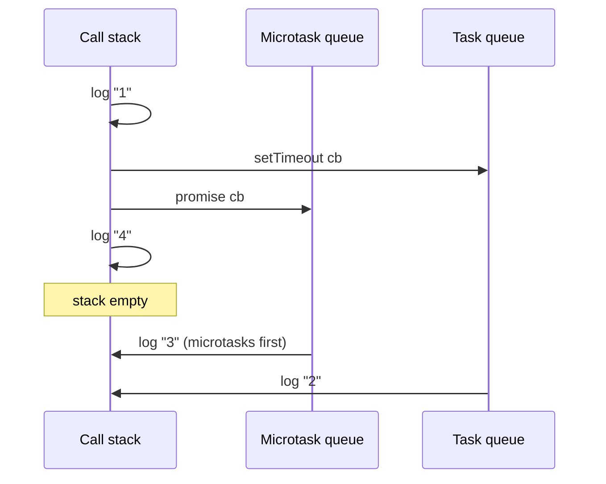
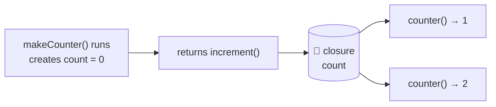
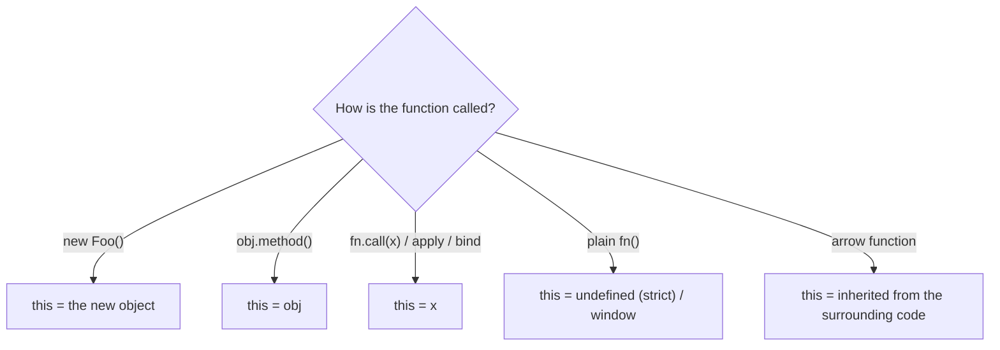

## Part 1: The event loop

### The big idea

JavaScript has **one thread**: it can do only one thing at a time, like a chef working alone in a kitchen. So how does it handle timers, network calls and clicks without freezing?

The chef **delegates**: "Oven, bake this for 20 minutes and ring when done." Meanwhile the chef keeps working. When the oven rings, the task goes onto a **to-do list**, and the chef picks it up once the current job is finished.


| Part | Kitchen analogy | Role |
| --- | --- | --- |
| **Call stack** | The chef's hands | Runs code, one function at a time |
| **Web APIs** (browser) / libuv (Node) | Oven, timer, delivery driver | Do slow work in the background |
| **Microtask queue** | 🔥 VIP to-do list | Promise callbacks, `queueMicrotask` |
| **Task (macrotask) queue** | 📋 Normal to-do list | `setTimeout`, clicks, network events |
| **Event loop** | The chef checking the lists | When the stack is empty: run **all** microtasks, then **one** task |

### The famous quiz

```js
console.log("1");

setTimeout(() => console.log("2"), 0);

Promise.resolve().then(() => console.log("3"));

console.log("4");
```

<details>
<summary>What does it print? Think first, then click.</summary>

**1, 4, 3, 2**

1. `"1"`: synchronous, runs immediately.
2. `setTimeout`: the callback goes to the **task queue** (even with 0 ms).
3. `.then`: the callback goes to the **microtask queue**.
4. `"4"`: synchronous.
5. The stack is empty → run **all microtasks** → `"3"`.
6. Then **one task** → `"2"`.

</details>



### The loop in pseudo-code

```js
while (true) {
  runSynchronousCodeUntilStackIsEmpty();
  while (microtaskQueue.length) runNext(microtaskQueue);   // ALL microtasks
  if (taskQueue.length) runNext(taskQueue);                 // ONE task
  if (timeToRender()) render();                             // ~every 16 ms
}
```

> ⚠️ **Never block the stack.** A 2-second loop means no clicks, no rendering, no timers for 2 seconds. Split heavy work into chunks, or move it to a **Web Worker**.

### async/await is promises underneath

```js
async function loadUser() {
  console.log("A");
  const user = await fetch("/api/user").then((r) => r.json()); // pauses THIS function only
  console.log("C", user.name);
}

loadUser();
console.log("B");
// A, B, C Ana: the rest of loadUser runs later as a microtask
```

## Part 2: Closures

### The big idea

A function is like a **backpack traveller**: wherever it goes, it carries a backpack with the variables that existed where it was **created**.

```js
function makeCounter() {
  let count = 0;                 // packed into the backpack
  return function increment() {
    count++;
    return count;
  };
}

const counter = makeCounter();
counter(); // 1
counter(); // 2: count survives between calls
const other = makeCounter();
other();   // 1: a separate backpack
```



### Where closures are used every day

```js
// 1. Private state (nobody outside can touch `balance`)
function createAccount() {
  let balance = 0;
  return {
    deposit: (amount) => (balance += amount),
    getBalance: () => balance,
  };
}

// 2. Function factories
const multiplier = (factor) => (n) => n * factor;
const double = multiplier(2);
double(21); // 42

// 3. Event handlers and callbacks remember their context
function setupButton(button, userName) {
  button.addEventListener("click", () => alert(`Hi ${userName}`));
}

// 4. React hooks: every render's handlers close over that render's props and state
```

### The classic loop bug

```js
// ❌ var is function-scoped: all callbacks share ONE i
for (var i = 0; i < 3; i++) setTimeout(() => console.log(i), 100); // 3, 3, 3

// ✅ let is block-scoped: each iteration gets its own i
for (let i = 0; i < 3; i++) setTimeout(() => console.log(i), 100); // 0, 1, 2
```

### Stale closures in React

```jsx
function Timer() {
  const [count, setCount] = useState(0);
  useEffect(() => {
    const id = setInterval(() => setCount(count + 1), 1000); // ❌ always sees count = 0
    return () => clearInterval(id);
  }, []);
  // ✅ Fix: setCount((c) => c + 1) uses the latest value
}
```

## Part 3: `this`

`this` is decided by **how a function is called**, not where it's written (except for arrow functions).



```js
const user = {
  name: "Ana",
  greet() { return `Hi, ${this.name}`; },
  greetLater() {
    setTimeout(function () { console.log(this?.name); }, 0); // ❌ undefined: plain call
    setTimeout(() => console.log(this.name), 0);             // ✅ "Ana": arrow inherits this
  },
};

user.greet();                 // "Hi, Ana"
const greet = user.greet;
greet();                      // ❌ this is lost: plain call
const bound = user.greet.bind(user);
bound();                      // ✅ "Hi, Ana"
```

> 💡 In modern code, arrow functions and classes with arrow-function fields avoid most `this` surprises.

## Key takeaways

- JavaScript is single-threaded; the event loop runs **all microtasks** (promises) before **one task** (timers, events).
- Don't block the call stack; heavy work belongs in chunks or Web Workers.
- A closure is a function plus the variables from where it was created: private state, factories, callbacks.
- Use `let`/`const` to avoid the loop bug; use updater functions to avoid stale closures in React.
- `this` depends on how a function is called; arrow functions inherit it.
