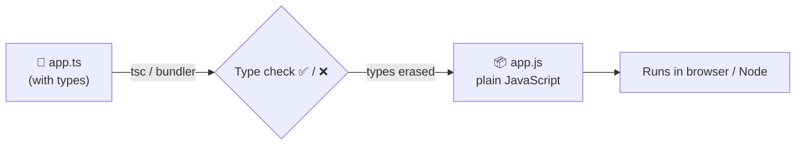
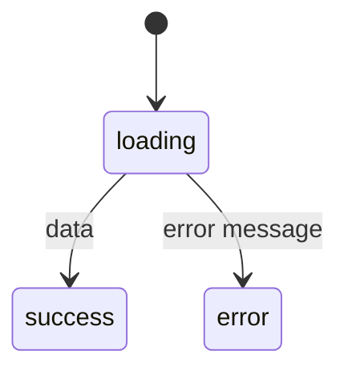

## The big idea

Imagine electrical plugs with no shapes: every plug fits every socket, and you only find out it's the wrong voltage when something explodes. **Shaped plugs** stop you *before* you plug in.

TypeScript adds **shapes (types)** to JavaScript. Mistakes show up as red squiggles in your editor instead of crashes in production.



Types exist **only at compile time**. They're erased from the output, so TypeScript adds zero runtime cost.

```ts
function total(price: number, quantity: number): number {
  return price * quantity;
}

total(9.99, "3");
//          ~~~ ❌ Argument of type 'string' is not assignable to parameter of type 'number'.
```

## Basic types

```ts
let title: string = "Keyboard";
let price: number = 49.99;
let inStock: boolean = true;
let tags: string[] = ["tech", "sale"];
let point: [number, number] = [10, 20];   // tuple
let anything: unknown = JSON.parse(input); // safe "I don't know yet"
let nothing: null = null;

// Type inference: you rarely need to write the type
let count = 5;          // inferred as number
count = "five";         // ❌ error
```

| Type | Meaning |
| --- | --- |
| `unknown` | Could be anything: you **must check** before using it ✅ |
| `any` | Turns type checking **off** ⚠️ avoid |
| `void` | A function returns nothing |
| `never` | Can never happen (a function that always throws) |

## Object shapes: `interface` and `type`

```ts
interface User {
  id: number;
  name: string;
  email: string;
  avatarUrl?: string;         // optional
  readonly createdAt: Date;   // can't be changed after creation
}

type Point = { x: number; y: number };

function greet(user: User) {
  return `Hi ${user.name}`;
}
```

| | `interface` | `type` |
| --- | --- | --- |
| Object shapes | ✅ | ✅ |
| Unions, tuples, primitives | ❌ | ✅ |
| Extending | `extends` | `&` (intersection) |
| Declaration merging | ✅ | ❌ |

> 💡 **Rule of thumb:** use `interface` for object shapes and public APIs, `type` for unions and everything else. Consistency matters more than the choice.

## Union types and narrowing ⭐

A value that can be **one of several** types:

```ts
type Status = "idle" | "loading" | "success" | "error";  // literal union

function badgeColor(status: Status) {
  switch (status) {
    case "idle": return "gray";
    case "loading": return "blue";
    case "success": return "green";
    case "error": return "red";
  }
}

badgeColor("pending"); // ❌ not a valid Status: typo caught!
```

**Narrowing:** TypeScript tracks what a value can be after each check.

```ts
function format(value: string | number | Date) {
  if (typeof value === "string") return value.toUpperCase();   // value: string here
  if (typeof value === "number") return value.toFixed(2);      // value: number here
  return value.toISOString();                                  // value: Date here
}
```

### Discriminated unions: model states safely

```ts
type RequestState<T> =
  | { status: "loading" }
  | { status: "error"; error: string }
  | { status: "success"; data: T };

function render(state: RequestState<User[]>) {
  switch (state.status) {
    case "loading": return "Loading…";
    case "error":   return `Error: ${state.error}`;          // error exists only here
    case "success": return `${state.data.length} users`;     // data exists only here
  }
}
```



Impossible states (like "loading **and** has an error") can't even be written. That's a whole class of UI bugs gone.

## Generics: types with parameters

A generic is a **type placeholder**, like a function argument but for types.

```ts
// Without generics: we lose the type
function firstAny(items: any[]): any { return items[0]; }

// With generics: T is whatever type the caller uses
function first<T>(items: T[]): T | undefined {
  return items[0];
}

const n = first([1, 2, 3]);        // n: number | undefined
const s = first(["a", "b"]);       // s: string | undefined
```

```ts
// A typed API helper
async function fetchJson<T>(url: string): Promise<T> {
  const response = await fetch(url);
  if (!response.ok) throw new Error(`HTTP ${response.status}`);
  return response.json() as Promise<T>;
}

const users = await fetchJson<User[]>("/api/users"); // users: User[]
```

**Constraints** limit what T can be:

```ts
function longest<T extends { length: number }>(a: T, b: T): T {
  return a.length >= b.length ? a : b;
}
longest("hello", "hi");      // ✅ strings have length
longest([1, 2], [1, 2, 3]);  // ✅ arrays have length
longest(10, 20);             // ❌ numbers don't
```

## Utility types: transform existing types

| Utility | Result | Example use |
| --- | --- | --- |
| `Partial<User>` | All fields optional | PATCH request body |
| `Required<User>` | All fields required | After validation |
| `Readonly<User>` | Nothing can be changed | Immutable state |
| `Pick<User, "id" \| "name">` | Only those fields | Public profile |
| `Omit<User, "password">` | Everything except those | API response |
| `Record<string, number>` | Object with those key/value types | Lookup tables |
| `ReturnType<typeof fn>` | What a function returns | Derive types from code |

```ts
type UserUpdate = Partial<Omit<User, "id" | "createdAt">>;

function updateUser(id: number, changes: UserUpdate) { /* … */ }
updateUser(1, { name: "Ana" });        // ✅
updateUser(1, { id: 2 });              // ❌ id can't be updated
```

## Types from runtime validation

TypeScript can't check data arriving **at runtime** (API responses, form input). Validate it with a schema library and derive the type from the schema, so there's one source of truth (remember **DRY**).

```ts
import { z } from "zod";

const UserSchema = z.object({
  id: z.number(),
  name: z.string().min(1),
  email: z.string().email(),
});

type User = z.infer<typeof UserSchema>; // derived: never out of sync

const user = UserSchema.parse(await response.json()); // throws on bad data
```

## tsconfig essentials

```json
{
  "compilerOptions": {
    "strict": true,                  // turn on all the important checks ✅
    "noUncheckedIndexedAccess": true, // arr[i] might be undefined
    "target": "ES2022",
    "module": "ESNext",
    "moduleResolution": "bundler"
  }
}
```

Always use `"strict": true` in new projects.

## Key takeaways

- TypeScript = JavaScript + compile-time types; they're erased at runtime.
- Prefer inference; annotate function parameters and public APIs.
- Union types + narrowing, especially **discriminated unions**, make impossible states impossible.
- Generics are type parameters: reusable, type-safe functions and components.
- Utility types (`Partial`, `Pick`, `Omit`, `Record`) reshape existing types.
- Validate external data at runtime (Zod) and derive types from the schema.
