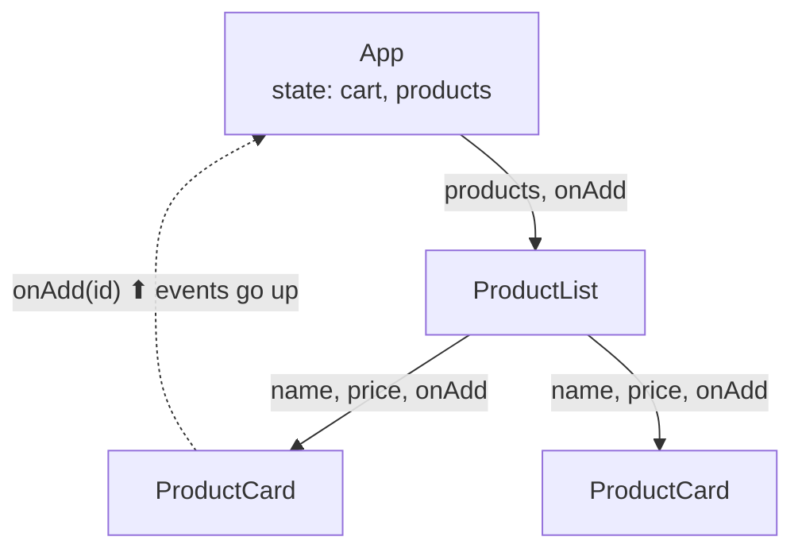
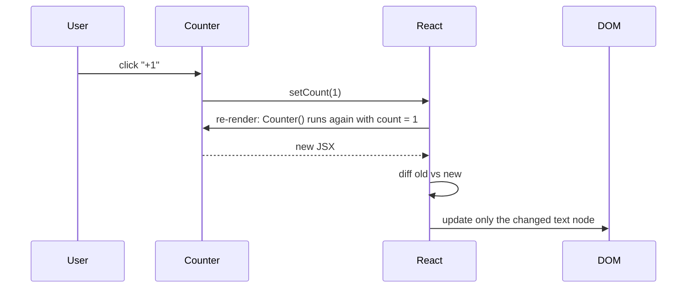
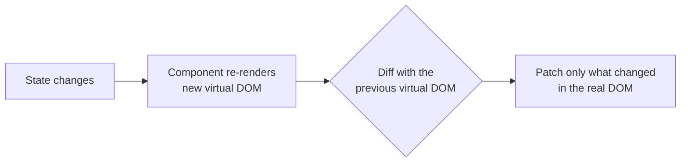
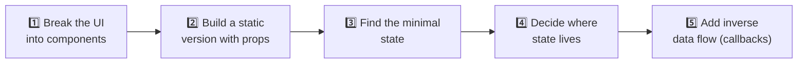

## The big idea

A UI built with React is like **LEGO**: small, reusable bricks (**components**) snap together into bigger ones, and the bigger ones form the whole page.

And React's core idea fits in one line:

> 🎯 **UI = f(state)**. You describe what the screen should look like for the current data. When the data changes, React updates the screen for you.


## Components and JSX

A component is a function that returns **JSX**, an HTML-like syntax for describing UI.

```jsx
function ProductCard({ name, price, imageUrl, onAdd }) {
  return (
    <article className="card">
      
      <h3>{name}</h3>
      <p>${price.toFixed(2)}</p>
      <button onClick={onAdd}>Add to cart</button>
    </article>
  );
}
```

JSX is just JavaScript underneath: `<h3>{name}</h3>` compiles to a function call like `jsx("h3", { children: name })`.

**JSX rules:** return one root element (or a fragment `<>…</>`), use `className` instead of `class`, write `{expression}` for JavaScript values, and close every tag (``).

## Props: data flows down

Props are a component's **inputs**, passed from parent to child, and **read-only** for the child.

```jsx
function ProductList({ products, onAdd }) {
  return (
    <div className="grid">
      {products.map((p) => (
        <ProductCard key={p.id} {...p} onAdd={() => onAdd(p.id)} />
      ))}
    </div>
  );
}
```



**Data flows down (props); events flow up (callbacks).** This one-way flow makes apps predictable.

> 💡 **Always give list items a stable `key`** (like a database ID). Keys tell React which item is which between renders. Using the array index as the key causes bugs when items are reordered or removed.

## State: data that changes

State is a component's **memory**. When state changes, React re-renders that component (and its children).

```jsx
import { useState } from "react";

function Counter() {
  const [count, setCount] = useState(0);

  return (
    <div>
      <p>You clicked {count} times</p>
      <button onClick={() => setCount(count + 1)}>+1</button>
      <button onClick={() => setCount(0)}>Reset</button>
    </div>
  );
}
```



### State rules

1. **Never mutate state directly.** Create a new value.

```jsx
// ❌ React won't notice
cart.items.push(product);
setCart(cart);

// ✅ New object and new array
setCart({ ...cart, items: [...cart.items, product] });
```

2. **Use the updater form** when the next state depends on the previous one:

```jsx
setCount((c) => c + 1); // always uses the latest value
```

3. **Keep state minimal.** Derive everything you can during render.

```jsx
// ❌ Duplicated state that can get out of sync
const [items, setItems] = useState([]);
const [total, setTotal] = useState(0);

// ✅ Derived value
const total = items.reduce((sum, item) => sum + item.price * item.qty, 0);
```

## Virtual DOM and reconciliation

Updating the real DOM is relatively slow. React keeps a lightweight copy (the **virtual DOM**), compares the new version with the previous one (**diffing**), and applies only the minimal changes.



Diffing shortcuts React uses:

- **Different element type** (`<div>` → `<section>`) → throw away the old subtree and build a new one.
- **Same type** → keep the DOM node, update only the changed attributes.
- **Lists** → match children by `key`.

## Handling forms

```jsx
function SignupForm({ onSubmit }) {
  const [email, setEmail] = useState("");
  const isValid = email.includes("@");

  return (
    <form
      onSubmit={(e) => {
        e.preventDefault();
        onSubmit({ email });
      }}
    >
      <label>
        Email
        <input type="email" value={email} onChange={(e) => setEmail(e.target.value)} />
      </label>
      <button disabled={!isValid}>Sign up</button>
    </form>
  );
}
```

This is a **controlled input**: React state is the single source of truth for the input's value. For big forms, libraries like **React Hook Form** keep things fast and tidy.

## Conditional rendering

```jsx
{isLoading && <Spinner />}
{error ? <ErrorMessage error={error} /> : <UserList users={users} />}
{items.length === 0 && <EmptyState />}   // ⚠️ not {items.length && …}, which renders "0"
```

## Thinking in React: 5 steps



**Where should state live?** In the **closest common parent** of all components that need it. If two siblings need the same data, **lift the state up** to their parent.

## Key takeaways

- Components are reusable functions returning JSX; UI = f(state).
- Props flow down and are read-only; events flow up through callbacks.
- State is component memory; never mutate it, and derive what you can.
- React diffs a virtual DOM and patches only what changed; stable `key`s matter.
- Put state in the closest common parent that needs it.
