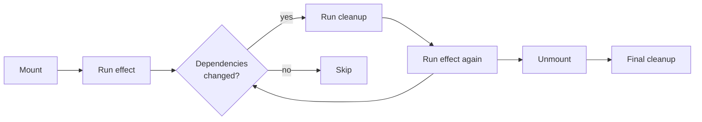
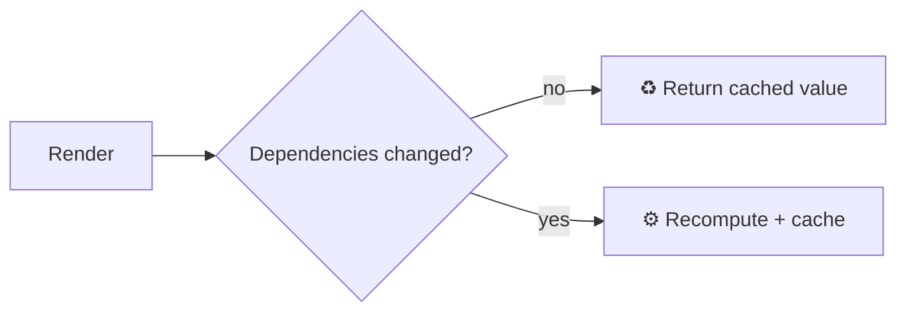
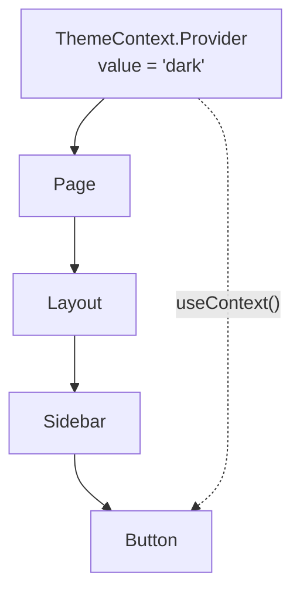

## The big idea

Hooks are **special abilities** you can plug into a function component: memory (`useState`), side effects (`useEffect`), references to DOM nodes (`useRef`) and more. They let small functions do what used to require classes.


## The two rules of hooks

1. **Only call hooks at the top level** of a component or custom hook: never inside `if`, loops or nested functions.
2. **Only call hooks from React functions** (components or custom hooks).

**Why?** React identifies each hook by its **call order**. If a hook is sometimes skipped, the order shifts and every hook after it gets the wrong data.

```jsx
// ❌ Conditional hook: order changes between renders
if (user) {
  const [name, setName] = useState(user.name);
}

// ✅ Always call it; put the condition inside
const [name, setName] = useState(user?.name ?? "");
```

## useState: memory

```jsx
const [todos, setTodos] = useState([]);
const [filter, setFilter] = useState("all");

// Lazy initial value: the function runs only on the first render
const [settings, setSettings] = useState(() => JSON.parse(localStorage.getItem("settings") ?? "{}"));
```

For complex state with many transitions, `useReducer` keeps the logic in one place (it's the **State pattern**!):

```jsx
function cartReducer(state, action) {
  switch (action.type) {
    case "add": return { ...state, items: [...state.items, action.item] };
    case "remove": return { ...state, items: state.items.filter((i) => i.id !== action.id) };
    case "clear": return { ...state, items: [] };
    default: throw new Error(`Unknown action ${action.type}`);
  }
}

const [cart, dispatch] = useReducer(cartReducer, { items: [] });
dispatch({ type: "add", item });
```

## useEffect: sync with the outside world

`useEffect` runs **after** React has painted the screen. Use it to synchronise with things **outside React**: subscriptions, timers, browser APIs, non-React widgets.

```jsx
useEffect(() => {
  // setup
  const onResize = () => setWidth(window.innerWidth);
  window.addEventListener("resize", onResize);

  // cleanup: runs before the next effect and on unmount
  return () => window.removeEventListener("resize", onResize);
}, []); // dependency array
```



| Dependency array | Effect runs… |
| --- | --- |
| *(none)* | After **every** render ⚠️ |
| `[]` | Once after mount (+ cleanup on unmount) |
| `[userId]` | After mount, and whenever `userId` changes |

### Fetching data with an effect (and avoiding race conditions)

```jsx
function UserProfile({ userId }) {
  const [user, setUser] = useState(null);

  useEffect(() => {
    const controller = new AbortController();
    fetch(`/api/users/${userId}`, { signal: controller.signal })
      .then((r) => r.json())
      .then(setUser)
      .catch((e) => { if (e.name !== "AbortError") console.error(e); });
    return () => controller.abort(); // cancel if userId changes before the response arrives
  }, [userId]);

  return user ? <h2>{user.name}</h2> : <Spinner />;
}
```

> 💡 In real apps, use a data-fetching library (**TanStack Query**, **SWR**) or framework features (Next.js Server Components). They handle caching, deduplication, retries and race conditions for you.

### You might not need an effect

Effects are for **external systems**. Many effects are unnecessary:

```jsx
// ❌ Effect + extra state just to derive a value (causes an extra render)
const [fullName, setFullName] = useState("");
useEffect(() => setFullName(`${first} ${last}`), [first, last]);

// ✅ Just calculate it during render
const fullName = `${first} ${last}`;
```

```jsx
// ❌ Effect reacting to a user event
useEffect(() => { if (submitted) sendAnalytics(); }, [submitted]);

// ✅ Do it in the event handler
function handleSubmit() { sendAnalytics(); }
```

### The infinite loop

```jsx
// ❌ Sets state → re-render → new object in deps → effect runs → sets state → …
const options = { page: 1 };
useEffect(() => { fetchData(options).then(setData); }, [options]); // new object every render!

// ✅ Depend on primitive values
useEffect(() => { fetchData({ page }).then(setData); }, [page]);
```

## useRef: a box that doesn't trigger renders

```jsx
function SearchBox() {
  const inputRef = useRef(null);          // 1. reference a DOM node
  const renderCount = useRef(0);          // 2. mutable value that survives renders
  renderCount.current++;

  return (
    <>
      <input ref={inputRef} />
      <button onClick={() => inputRef.current.focus()}>Focus</button>
    </>
  );
}
```

| | `useState` | `useRef` |
| --- | --- | --- |
| Survives re-renders | ✅ | ✅ |
| Changing it re-renders | ✅ | ❌ |
| Use for | Values shown on screen | DOM nodes, timers, previous values |

## useMemo and useCallback: remember expensive things

```jsx
// Remember an expensive calculation until its inputs change
const sortedProducts = useMemo(
  () => products.toSorted((a, b) => a.price - b.price),
  [products],
);

// Remember a function identity (useful when passing it to a memoised child)
const handleAdd = useCallback((id) => addToCart(id), [addToCart]);
```



> ⚠️ **Don't memoise everything.** Memoisation has its own cost. Use it for genuinely expensive calculations, or to keep props stable for `React.memo` children. The **React Compiler** can now add memoisation automatically.

## useContext: skip prop drilling

Passing a prop through 5 layers that don't use it ("prop drilling") is tedious. Context makes a value available to a whole subtree.

```jsx
const ThemeContext = createContext("light");

function App() {
  const [theme, setTheme] = useState("dark");
  return (
    <ThemeContext.Provider value={theme}>
      <Page />
    </ThemeContext.Provider>
  );
}

function Button() {
  const theme = useContext(ThemeContext); // no props passed through Page!
  return <button className={`btn-${theme}`}>OK</button>;
}
```



⚠️ Every component using a context re-renders when its value changes. Good for rarely changing values (theme, current user, locale); for fast-changing global state, see *State Management*.

## Custom hooks: reuse logic

Any function starting with `use` that calls other hooks is a custom hook. It's the main way to **share stateful logic** between components.

```jsx
function useLocalStorage(key, initialValue) {
  const [value, setValue] = useState(() => {
    try {
      return JSON.parse(localStorage.getItem(key)) ?? initialValue;
    } catch {
      return initialValue;
    }
  });

  useEffect(() => {
    try { localStorage.setItem(key, JSON.stringify(value)); } catch {}
  }, [key, value]);

  return [value, setValue];
}

// Use it like useState, but persisted
const [theme, setTheme] = useLocalStorage("theme", "light");
```

```jsx
function useDebounce(value, delayMs = 300) {
  const [debounced, setDebounced] = useState(value);
  useEffect(() => {
    const id = setTimeout(() => setDebounced(value), delayMs);
    return () => clearTimeout(id);
  }, [value, delayMs]);
  return debounced;
}

const debouncedQuery = useDebounce(query); // search only after typing pauses
```

## Newer hooks worth knowing (React 19)

| Hook | What it does |
| --- | --- |
| `useId` | Stable unique IDs for accessibility attributes |
| `useTransition` | Mark an update as non-urgent so typing stays responsive |
| `useDeferredValue` | Show a slightly stale value while the new one renders |
| `useActionState` | Handle form actions: pending state, result, errors |
| `useOptimistic` | Show the expected result instantly, before the server confirms |
| `use` | Read a promise or context during render (with Suspense) |

## Key takeaways

- Call hooks at the top level, in the same order every render.
- `useState`/`useReducer` for memory; `useEffect` only to sync with external systems (with cleanup).
- Derive values during render instead of syncing them with effects.
- `useRef` holds values that shouldn't trigger renders, including DOM nodes.
- `useMemo`/`useCallback` for expensive work or stable props, not everywhere.
- Extract reusable logic into custom hooks.
