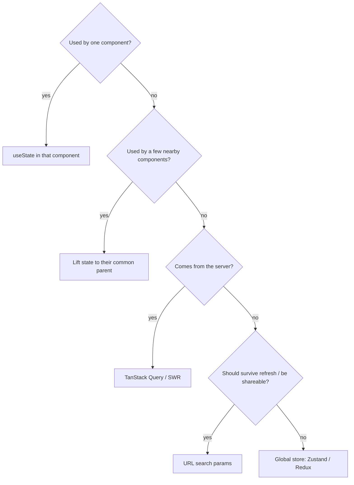
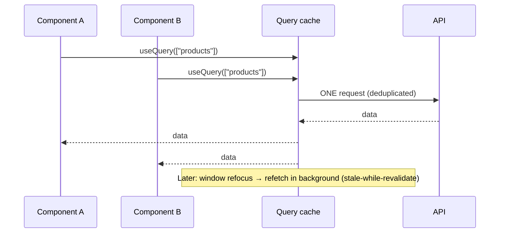
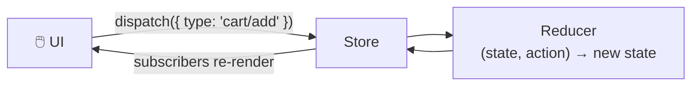

## The big idea

Not all data is the same. Think of a household:

- **Your pocket** 👖: things only you need right now (a note) → **local state**.
- **The family whiteboard** 📋: things everyone at home needs (the shopping list) → **global client state**.
- **The bank** 🏦: the real source of truth lives elsewhere; you just keep a recent copy → **server state**.
- **The house address** 🏠: where you are right now → **URL state**.

The biggest mistake is putting *everything* in one global store.


| Kind | Examples | Best tool |
| --- | --- | --- |
| **Local UI state** | Is this dropdown open? Form input text | `useState`, `useReducer` |
| **Global client state** | Theme, logged-in user, shopping cart, sidebar open | Context, **Zustand**, **Redux Toolkit** |
| **Server state** | Products, orders, user profiles from the API | **TanStack Query**, SWR, RTK Query |
| **URL state** | Current page, filters, search query, selected tab | The router (`?q=shoes&page=2`) |

## Start local, lift only when needed



## Server state: TanStack Query ⭐

About 80% of "global state" in typical apps is really **cached server data**. It has special needs: loading and error states, caching, background refetching, deduplication, retries and invalidation after mutations. Don't hand-roll that with `useEffect` + `useState`.

```jsx
import { useQuery, useMutation, useQueryClient } from "@tanstack/react-query";

function Products() {
  const { data, isPending, error } = useQuery({
    queryKey: ["products", { category: "keyboards" }],
    queryFn: () => api.getProducts({ category: "keyboards" }),
    staleTime: 60_000, // treat data as fresh for 1 minute
  });

  if (isPending) return <Spinner />;
  if (error) return <ErrorMessage error={error} />;
  return <ProductGrid products={data} />;
}

function AddProductButton() {
  const queryClient = useQueryClient();
  const mutation = useMutation({
    mutationFn: api.createProduct,
    onSuccess: () => queryClient.invalidateQueries({ queryKey: ["products"] }), // refetch lists
  });
  return <button onClick={() => mutation.mutate({ name: "New" })}>Add</button>;
}
```



## Global client state: Zustand (simple)

Zustand is a tiny store with almost no boilerplate.

```js
import { create } from "zustand";

export const useCartStore = create((set) => ({
  items: [],
  add: (product) => set((state) => ({ items: [...state.items, product] })),
  remove: (id) => set((state) => ({ items: state.items.filter((i) => i.id !== id) })),
  clear: () => set({ items: [] }),
}));

// Any component, no Provider needed. Select only what you use to avoid extra renders:
const count = useCartStore((state) => state.items.length);
const add = useCartStore((state) => state.add);
```

## Global client state: Redux Toolkit (structured)

Redux is the classic, predictable pattern: **one store**, state changed only by **dispatching actions** handled by pure **reducers**.



**Redux Toolkit (RTK)** is the modern, official way to write Redux, with far less boilerplate:

```js
import { createSlice, configureStore } from "@reduxjs/toolkit";

const cartSlice = createSlice({
  name: "cart",
  initialState: { items: [] },
  reducers: {
    add(state, action) {
      state.items.push(action.payload); // looks like mutation; Immer makes it immutable
    },
    remove(state, action) {
      state.items = state.items.filter((i) => i.id !== action.payload);
    },
  },
});

export const { add, remove } = cartSlice.actions;
export const store = configureStore({ reducer: { cart: cartSlice.reducer } });
```

```jsx
const items = useSelector((state) => state.cart.items);
const dispatch = useDispatch();
<button onClick={() => dispatch(add(product))}>Add</button>
```

Redux shines in **large apps with complex shared state and many developers**: strict conventions, excellent DevTools (time-travel debugging) and middleware. **RTK Query** adds server-state caching, similar to TanStack Query.

## Comparison

| | Context | Zustand | Redux Toolkit | TanStack Query |
| --- | --- | --- | --- | --- |
| For | Rarely changing values | Client state | Complex client state | **Server** state |
| Boilerplate | Low | Very low | Medium | Low |
| Re-render control | ❌ All consumers | ✅ Selectors | ✅ Selectors | ✅ Per query |
| DevTools | ❌ | ✅ | ✅✅ | ✅ |
| Learning curve | Easy | Easy | Medium | Medium |

## URL state: often forgotten

Filters, search terms, pagination and tabs belong in the **URL**: they survive a refresh, can be bookmarked and shared, and the back button just works.

```jsx
// Next.js App Router
const searchParams = useSearchParams();
const router = useRouter();
const category = searchParams.get("category") ?? "all";

function setCategory(next) {
  const params = new URLSearchParams(searchParams);
  params.set("category", next);
  router.push(`?${params}`);
}
```

## Common mistakes

- Copying server data into Redux/Zustand, then fighting to keep it fresh. Use a server-state library.
- One giant store for everything, including "is this modal open".
- Storing derived data (totals, filtered lists) instead of computing it.
- Putting fast-changing values in Context, which re-renders every consumer.

## Key takeaways

- Separate the four kinds of state: local, global client, server, URL.
- Start with local state; lift it up; go global only when truly needed.
- Server data → TanStack Query / SWR / RTK Query (caching, refetching, deduplication).
- Small global state → Zustand. Large, complex, team-heavy apps → Redux Toolkit.
- Filters and pagination belong in the URL.
