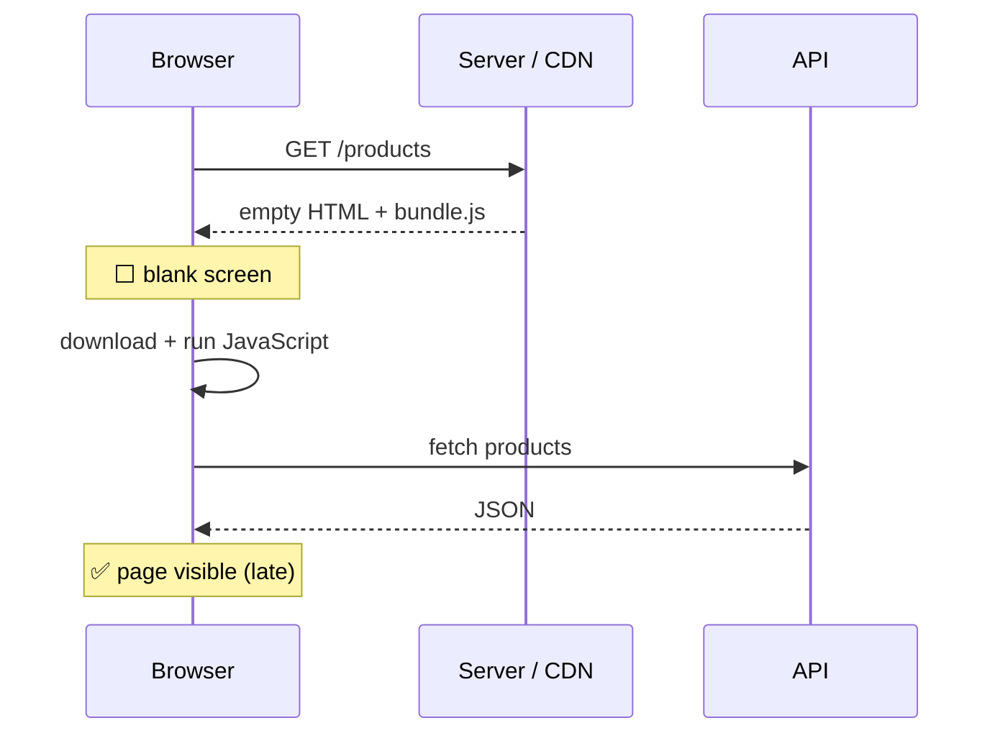
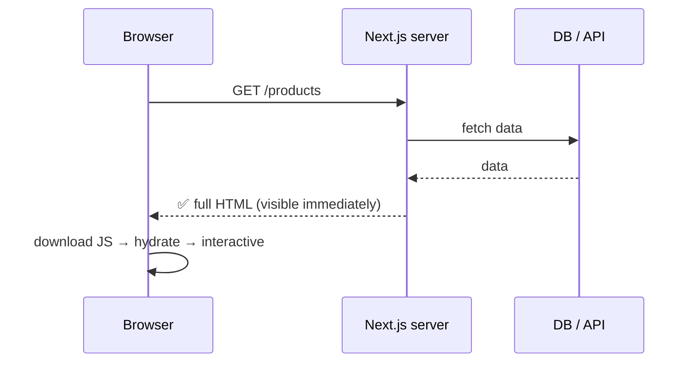
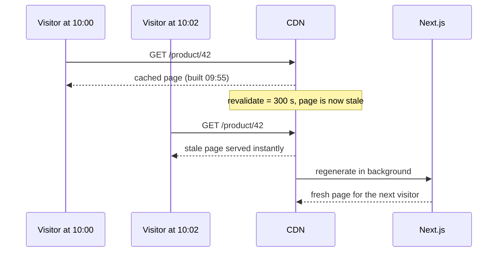
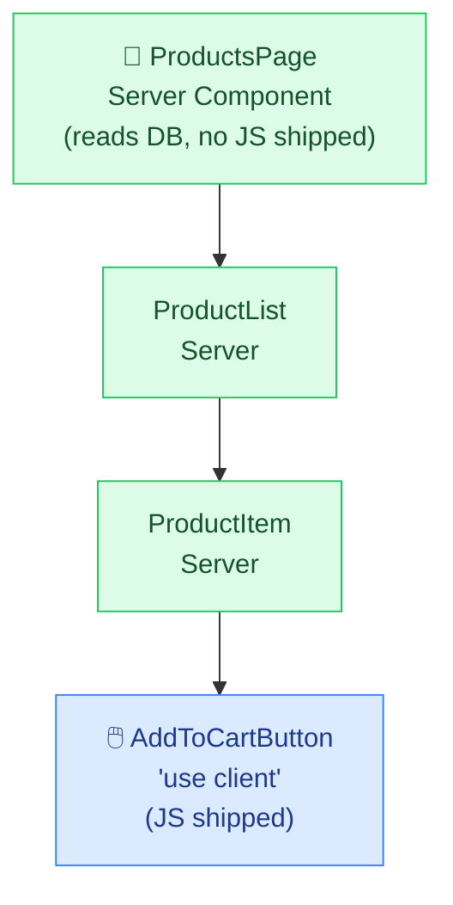
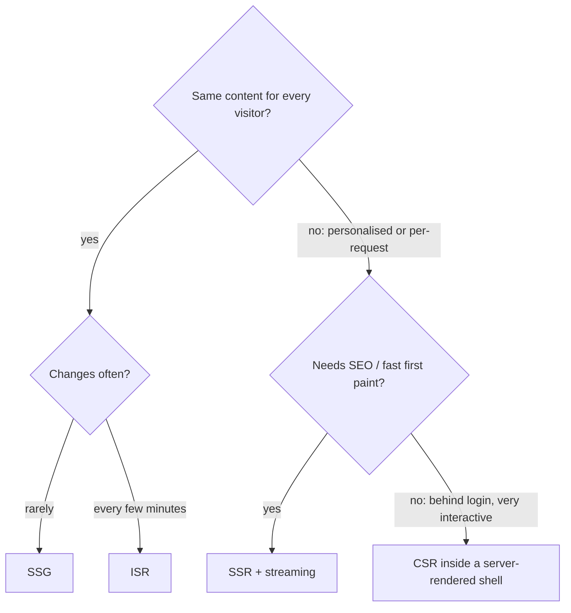

## The big idea

Getting a meal at a restaurant:

- **CSR** 🧑‍🍳 *Cook it yourself*: the restaurant hands you raw ingredients and a recipe (an empty HTML page + JavaScript). You cook at your table. Slow to start eating.
- **SSR** 🍝 *Cooked to order*: the kitchen cooks your meal fresh when you order. Always fresh, but you wait for the kitchen.
- **SSG** 🥪 *Pre-made sandwiches*: prepared in the morning, grabbed instantly. Super fast, but only as fresh as the morning.
- **ISR** 🔄 *Pre-made, restocked regularly*: sandwiches are remade every few minutes in the background.


## CSR: Client-Side Rendering

The server sends an almost empty HTML file. The browser downloads JavaScript, runs it, fetches data, then builds the page.



✅ Rich interactivity, cheap hosting (static files). ❌ Slow first paint on slow devices, weak SEO, big bundles.

**Good for:** dashboards behind a login, admin panels, highly interactive tools.

## SSR: Server-Side Rendering

The server runs React **for each request**, fetches data, and sends complete HTML. Then JavaScript **hydrates** it (attaches event handlers) to make it interactive.



✅ Fast first content, great SEO, always fresh data. ❌ A server does work on every request; time to first byte depends on data speed.

**Good for:** personalised pages, search results, frequently changing data.

## SSG: Static Site Generation

Pages are rendered **once at build time** into HTML files and served from a CDN.

✅ Fastest possible, cheapest, very reliable. ❌ Data is only as fresh as the last build; not practical for millions of pages.

**Good for:** blogs, docs, marketing pages, this learning site's lessons!

## ISR: Incremental Static Regeneration

Static pages that **refresh themselves** in the background after a set time, or on demand.



✅ Static speed with fresh-enough data. **Good for:** e-commerce product pages, news articles.

## Comparison

| | CSR | SSR | SSG | ISR |
| --- | --- | --- | --- | --- |
| HTML built | In the browser | Per request, on the server | At build time | At build time + background refresh |
| First content | 🐢 Slow | ⚡ Fast | ⚡⚡ Fastest | ⚡⚡ Fastest |
| Data freshness | Live | Live | Build time | Every N seconds |
| SEO | ❌ Weak | ✅ | ✅ | ✅ |
| Server cost | None | Per request | None | Low |

## React Server Components (the App Router default)

In the Next.js **App Router**, components are **Server Components by default**. They run **only on the server**, can read the database directly, and send **zero JavaScript** to the browser.

```tsx
// app/products/page.tsx — a Server Component (the default)
import { db } from "@/lib/db";
import AddToCartButton from "./AddToCartButton";

export default async function ProductsPage() {
  const products = await db.products.findMany(); // runs on the server, secrets stay safe
  return (
    <ul>
      {products.map((p) => (
        <li key={p.id}>
          {p.name}: ${p.price}
          <AddToCartButton productId={p.id} />
        </li>
      ))}
    </ul>
  );
}
```

```tsx
// app/products/AddToCartButton.tsx — a Client Component (interactive)
"use client";
import { useState } from "react";

export default function AddToCartButton({ productId }: { productId: string }) {
  const [added, setAdded] = useState(false);
  return <button onClick={() => setAdded(true)}>{added ? "✓ Added" : "Add to cart"}</button>;
}
```



| | Server Component | Client Component (`"use client"`) |
| --- | --- | --- |
| Runs | On the server only | Server (for the first HTML) + browser |
| Can use | `async/await`, DB, secrets, file system | `useState`, `useEffect`, event handlers, browser APIs |
| JavaScript sent | None | Yes |
| Use for | Fetching data, static content, layout | Interactivity: buttons, forms, animations |

> 💡 **Keep client components small and at the leaves** of the tree. The more stays on the server, the less JavaScript your users download.

## Controlling caching in the App Router

```tsx
// Static (SSG): the default when a page uses no request-specific data
export default async function Page() { /* … */ }

// ISR: regenerate at most every 5 minutes
export const revalidate = 300;

// SSR: render on every request
export const dynamic = "force-dynamic";

// Pre-build known dynamic routes (like this app does for every lesson)
export async function generateStaticParams() {
  return getAllLessons().map((l) => ({ category: l.categorySlug, slug: l.slug }));
}

// On-demand: refresh after a CMS edit or mutation
import { revalidatePath } from "next/cache";
revalidatePath("/products");
```

## Streaming with Suspense

Don't make the whole page wait for the slowest query. Send the fast parts first and **stream** the rest when ready.

```tsx
import { Suspense } from "react";

// In Next.js 15+, params is a Promise
export default async function ProductPage({ params }: { params: Promise<{ id: string }> }) {
  const { id } = await params;
  return (
    <>
      <ProductDetails id={id} />               {/* fast: shows immediately */}
      <Suspense fallback={<ReviewsSkeleton />}>
        <Reviews id={id} />                    {/* slow: streams in later */}
      </Suspense>
    </>
  );
}
```

## Which mode should I use?



Real apps **mix modes per page**: a static marketing homepage, ISR product pages, an SSR search page and a client-heavy dashboard.

## Key takeaways

- CSR builds HTML in the browser; SSR per request on the server; SSG at build time; ISR at build time with background refreshes.
- Server Components run only on the server and ship no JS; add `"use client"` only where you need interactivity.
- Use `revalidate`, `dynamic` and `generateStaticParams` to choose per page.
- Stream slow parts with Suspense so fast content appears first.
