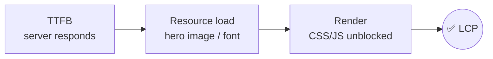
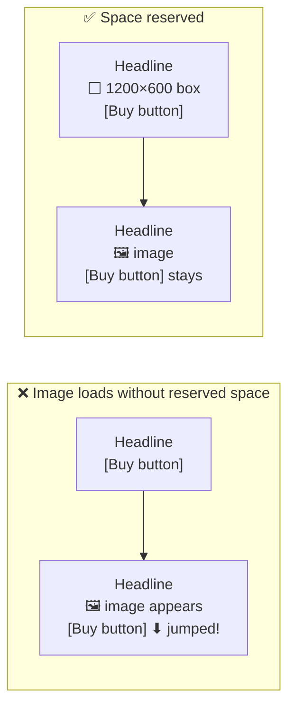
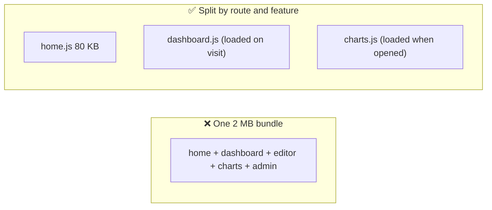
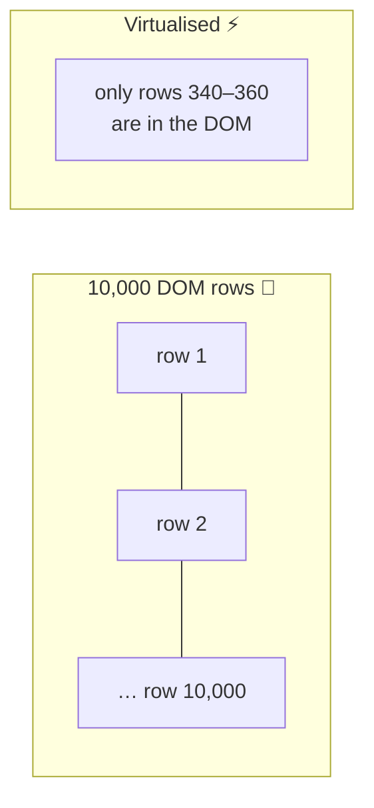

## The big idea

Users judge speed by **feel**, not by a stopwatch:

1. **"Is it loading?"** Something meaningful appears quickly.
2. **"Can I use it?"** Clicks and typing respond instantly.
3. **"Is it stable?"** Things don't jump around while I read.

Google measures exactly these three feelings with the **Core Web Vitals**.


| Metric | Measures | Good | Poor |
| --- | --- | --- | --- |
| **LCP**: Largest Contentful Paint | When the biggest visible element (hero image, headline) has rendered | ≤ 2.5 s | > 4 s |
| **INP**: Interaction to Next Paint | How quickly the page responds to clicks, taps and key presses | ≤ 200 ms | > 500 ms |
| **CLS**: Cumulative Layout Shift | How much visible content jumps around unexpectedly | ≤ 0.1 | > 0.25 |

> 💡 Measure with **Lighthouse** and Chrome DevTools (lab data) and with real-user data: PageSpeed Insights, the `web-vitals` library or your analytics. Real users on slow phones matter most.

## Fixing LCP: show the main content sooner



**1. Optimise images (usually the LCP element)**

```html
<!-- ✅ Modern format, right size, loaded with high priority -->

```

In Next.js, `<Image src={hero} priority alt="…" />` does this for you (resizing, AVIF/WebP, `srcset`, lazy loading).

| Do | Why |
| --- | --- |
| Use **AVIF/WebP** | 30–50% smaller than JPEG |
| Serve the **right size** | Don't send a 4000px image to a 400px phone |
| `fetchpriority="high"` on the hero | Browser fetches it first |
| **Don't lazy-load** the hero | Lazy-load only below-the-fold images |
| Use a **CDN** | Serve from a location near the user |

**2. Faster server response (TTFB):** cache HTML at the edge (SSG/ISR), use a CDN, speed up slow queries.

**3. Remove render blockers:** inline critical CSS, `defer` scripts, and preload key fonts with `font-display: swap`.

```html
<link rel="preload" href="/fonts/inter.woff2" as="font" type="font/woff2" crossorigin />
<link rel="preconnect" href="https://cdn.example.com" />
```

## Fixing INP: keep the main thread free

INP gets worse when **long JavaScript tasks** (> 50 ms) block the main thread: the browser can't respond to a click until the current task finishes.

```mermaid
gantt
    title A click that arrives during a long task
    dateFormat x
    axisFormat %L
    section Main thread
    Long JavaScript task    :crit, t1, 0, 400
    Handle the click        :t2, 400, 450
    Paint                   :t3, 450, 470
    section User
    Click, then wait 350 ms :active, u1, 50, 400
```



**Fixes:**

- **Ship less JavaScript:** code-split, remove unused libraries, keep work in Server Components.
- **Break up long tasks:** yield to the browser between chunks (`await scheduler.yield()` or `setTimeout`).
- **Move heavy work off the main thread:** Web Workers for parsing, image processing, big calculations.
- **Make urgent updates urgent:** in React, wrap non-urgent updates in `startTransition` so typing stays responsive.
- **Debounce** expensive handlers (search as you type).

```jsx
const [query, setQuery] = useState("");
const [isPending, startTransition] = useTransition();

function onChange(e) {
  setQuery(e.target.value);                       // urgent: update the input now
  startTransition(() => setFilter(e.target.value)); // non-urgent: filter 10,000 rows later
}
```

## Fixing CLS: stop things jumping



- Always set **`width` and `height`** (or `aspect-ratio`) on images, videos and iframes.
- Reserve space for **ads, embeds and banners**.
- Use `font-display: swap` with a well-matched fallback font (Next.js `next/font` does this).
- Don't insert content **above** existing content (except in response to a user action).

## Code splitting: load only what's needed



```jsx
import { lazy, Suspense } from "react";
const ChartEditor = lazy(() => import("./ChartEditor")); // separate chunk

<Suspense fallback={<Spinner />}>
  {showEditor && <ChartEditor />}
</Suspense>

// Next.js
const Map = dynamic(() => import("./Map"), { ssr: false, loading: () => <MapSkeleton /> });
```

Next.js already splits every route automatically. Check what's in your bundles with `@next/bundle-analyzer`, and watch out for heavy libraries (moment.js, all of lodash, huge icon packs).

## Rendering performance in React

| Problem | Fix |
| --- | --- |
| Re-rendering big subtrees on every keystroke | Move state down (closer to where it's used); split components |
| Expensive child re-renders with the same props | `React.memo` + stable props (`useCallback` / `useMemo`), or the React Compiler |
| Rendering 10,000 rows | **Virtualisation**: render only the ~20 visible rows (TanStack Virtual, react-window) |
| Context updates re-render everything | Split contexts, or use a store with selectors |



> 💡 **Measure before optimising.** Use the React DevTools Profiler to find components that actually render slowly. Guessing leads to `useMemo` everywhere and no real gain.

## Caching and network

- **HTTP caching:** `Cache-Control: public, max-age=31536000, immutable` for hashed static files (`app.3f9a1c.js`); short or `no-cache` for HTML.
- **CDN** for static assets and cacheable pages.
- **Compression:** Brotli or gzip for text files.
- **HTTP/2 and HTTP/3:** many files over one connection.
- **Prefetch** the likely next page (Next.js `<Link>` does this automatically).

## A performance budget

Set limits and check them in CI so performance doesn't slowly decay:

| Budget | Target |
| --- | --- |
| JavaScript (compressed) on first load | < 170 KB |
| LCP (p75, mobile) | < 2.5 s |
| INP (p75) | < 200 ms |
| CLS (p75) | < 0.1 |

## Key takeaways

- Core Web Vitals: **LCP** (loading), **INP** (responsiveness), **CLS** (stability).
- LCP: optimise and prioritise the hero image, reduce TTFB, remove render blockers.
- INP: ship less JS, break up long tasks, use Web Workers and transitions.
- CLS: reserve space with width/height or aspect-ratio for all media and embeds.
- Code-split, virtualise long lists, and profile before memoising.
