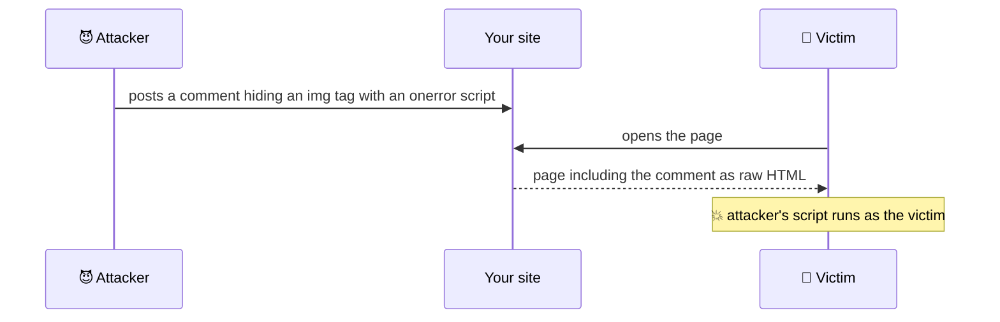
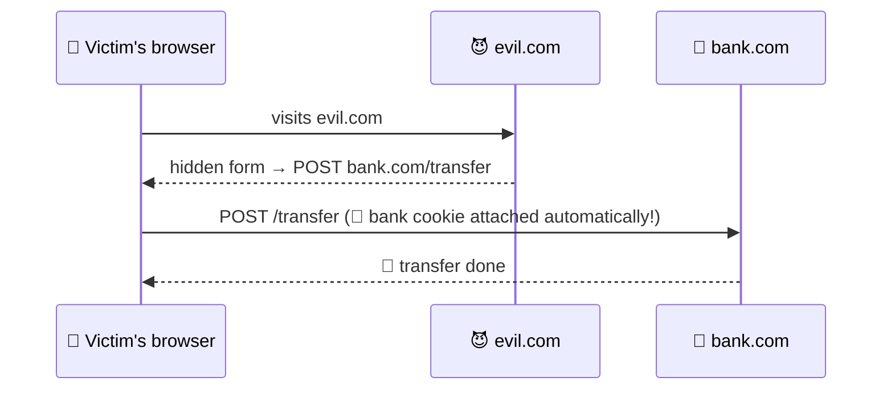
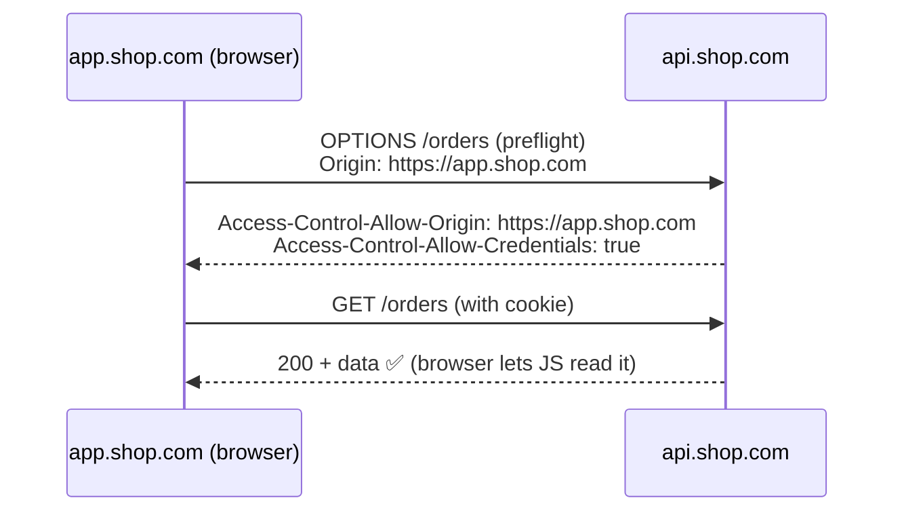
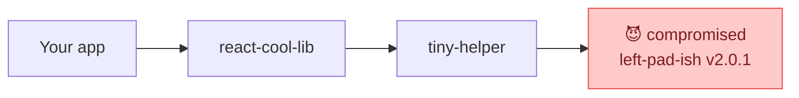

## The big idea

The browser is a **shared building**: your app, third-party scripts, browser extensions and other websites all live in it. Browser security is about making sure the **wrong code can't read or act on your users' data**.


## 1. XSS: Cross-Site Scripting ⭐

An attacker gets **their JavaScript to run on your page**, so it can steal tokens, read the page, or act as the user.



### How React protects you (mostly)

React **escapes** everything you put in `{}`: `<script>` becomes harmless text.

```jsx
const comment = '';
<p>{comment}</p>   // ✅ shown as text, not executed
```

### Where XSS still sneaks in

```jsx
// ❌ 1. dangerouslySetInnerHTML with user content
<div dangerouslySetInnerHTML={{ __html: userBio }} />

// ✅ Sanitise first
import DOMPurify from "dompurify";
<div dangerouslySetInnerHTML={{ __html: DOMPurify.sanitize(userBio) }} />

// ❌ 2. javascript: URLs
<a href={user.website}>Website</a>   // user.website = "javascript:steal()"

// ✅ Allow only http(s)
const safeUrl = /^https?:\/\//i.test(user.website) ? user.website : "#";

// ❌ 3. Direct DOM APIs
element.innerHTML = userInput;
// ✅
element.textContent = userInput;
```

### Content Security Policy (CSP): the safety net

A CSP header tells the browser **which scripts are allowed to run**. Even if an attacker injects a `<script>`, the browser refuses to run it.

```http
Content-Security-Policy:
  default-src 'self';
  script-src 'self' 'nonce-r4nd0m';
  img-src 'self' https://cdn.example.com data:;
  connect-src 'self' https://api.example.com;
  frame-ancestors 'none';
```

## 2. CSRF: Cross-Site Request Forgery

You're logged into your bank. You visit an evil site, which silently submits a form to the bank. Your browser **automatically attaches your bank cookie**, so the bank thinks *you* made the transfer.



**Defences:**

| Defence | How it helps |
| --- | --- |
| `SameSite=Lax` or `Strict` cookies | The browser doesn't send the cookie on cross-site POSTs (the default in modern browsers is Lax) |
| CSRF tokens | A secret value in the form that evil.com can't know |
| Check the `Origin` header | Reject requests from unexpected origins |
| Tokens in headers instead of cookies | `Authorization: Bearer …` isn't sent automatically |

## 3. Where to store tokens?

| Storage | XSS can steal it? | CSRF risk? | Verdict |
| --- | --- | --- | --- |
| `localStorage` / `sessionStorage` | ❌ **Yes**: any script can read it | No | Avoid for sensitive tokens |
| JS memory (a variable) | Harder (lost on refresh) | No | OK for short-lived access tokens |
| **`HttpOnly` + `Secure` + `SameSite` cookie** | ✅ No: JS can't read it | Mitigated by SameSite | ✅ Recommended for sessions / refresh tokens |

```http
Set-Cookie: session=abc123; HttpOnly; Secure; SameSite=Lax; Path=/; Max-Age=86400
```

> 💡 A popular pattern is the **BFF (Backend for Frontend)**: the browser talks only to your own server with an HttpOnly session cookie, and that server holds the real API tokens. Tokens never touch browser JavaScript.

## 4. CORS: often misunderstood

The **Same-Origin Policy** stops JavaScript on `evil.com` from reading responses from `api.bank.com`. **CORS** is how a server *relaxes* that rule for origins it trusts.



- CORS is enforced **by the browser**. It doesn't protect your API from curl or Postman; it protects your users from other websites.
- ❌ Never combine `Access-Control-Allow-Origin: *` with credentials, and never blindly reflect whatever `Origin` arrives.
- ✅ Allow-list exact origins.

## 5. Clickjacking

An evil page loads your site in an **invisible iframe** on top of a fake "Win a prize!" button. The user clicks "prize" but actually clicks "Delete account" on your site.

**Defence:** forbid framing.

```http
Content-Security-Policy: frame-ancestors 'none';
X-Frame-Options: DENY
```

## 6. Supply chain: your dependencies

A typical frontend app has **1,000+ npm packages**. One compromised package can steal data from every site that uses it.



- Commit your **lockfile** and use `npm ci` in CI.
- Run `npm audit`, Dependabot or Snyk.
- Prefer fewer, well-maintained dependencies.
- Load third-party scripts with **Subresource Integrity** (SRI):

```html
<script src="https://cdn.example.com/lib.min.js"
        integrity="sha384-oqVuAfXRKap7fdgcCY5uykM6+R9GqQ8K/uxy9rx7HNQlGYl1kPzQho1wx4JwY8wC"
        crossorigin="anonymous"></script>
```

## 7. Never trust the frontend

> ⚠️ **Everything in the browser can be changed by the user.** Hidden form fields, disabled buttons, client-side validation, prices in JavaScript, "isAdmin" flags: all of it can be edited in DevTools.

Frontend validation is for **user experience**. The **backend must validate and authorise everything** again. And never put secrets (API keys with write access, database passwords) in frontend code: they end up in the bundle for anyone to read.

## Security headers checklist

| Header | Purpose |
| --- | --- |
| `Content-Security-Policy` | Limit where scripts, styles and frames can come from |
| `Strict-Transport-Security` | Force HTTPS |
| `X-Content-Type-Options: nosniff` | Stop MIME-type guessing |
| `Referrer-Policy: strict-origin-when-cross-origin` | Don't leak full URLs |
| `Permissions-Policy` | Disable camera, microphone and geolocation unless needed |

## Key takeaways

- **XSS:** never inject unsanitised HTML; avoid `dangerouslySetInnerHTML` and `javascript:` URLs; add a CSP.
- **CSRF:** use `SameSite` cookies, CSRF tokens and Origin checks.
- Store session tokens in **HttpOnly, Secure, SameSite** cookies, not `localStorage`.
- CORS relaxes the same-origin policy; allow-list exact origins.
- Block clickjacking with `frame-ancestors`; audit dependencies; never trust the client.
