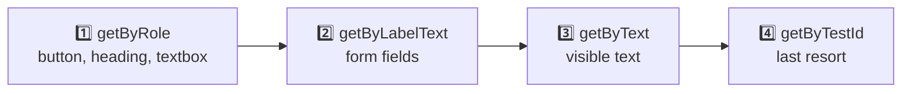
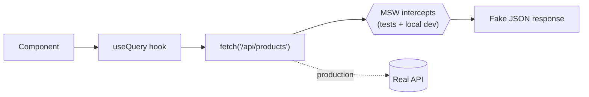
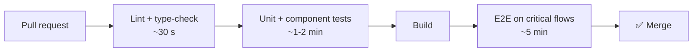

## The big idea

A car factory tests at several levels: each **bolt** (unit), each **engine** (integration), and finally a **test drive** of the whole car (end-to-end). Each level catches different problems, at a different cost.

> 🎯 *"Write tests. Not too many. Mostly integration."* (Guillermo Rauch)
>
> 🎯 *"The more your tests resemble the way your software is used, the more confidence they can give you."* (Kent C. Dodds)


| Layer | Tests | Tools | Speed | Confidence |
| --- | --- | --- | --- | --- |
| **Static** | Types and lint errors | TypeScript, ESLint | ⚡⚡⚡ | Catches typos and type bugs |
| **Unit** | One function in isolation | Vitest / Jest | ⚡⚡ | Logic is correct |
| **Integration / component** ⭐ | Components working together, as a user sees them | Testing Library + MSW | ⚡ | Features work |
| **End-to-end** | The real app in a real browser | Playwright / Cypress | 🐢 | Critical user journeys work |

## Unit tests: pure logic

Best for pure functions: formatters, calculations, validation, reducers.

```ts
// cart.ts
export function cartTotal(items: { price: number; qty: number }[], discount = 0) {
  const subtotal = items.reduce((sum, item) => sum + item.price * item.qty, 0);
  return Math.round(subtotal * (1 - discount) * 100) / 100;
}
```

```ts
// cart.test.ts
import { describe, it, expect } from "vitest";
import { cartTotal } from "./cart";

describe("cartTotal", () => {
  it("adds price × quantity for every item", () => {
    expect(cartTotal([{ price: 10, qty: 2 }, { price: 5, qty: 1 }])).toBe(25);
  });

  it("applies a discount", () => {
    expect(cartTotal([{ price: 100, qty: 1 }], 0.1)).toBe(90);
  });

  it("returns 0 for an empty cart", () => {
    expect(cartTotal([])).toBe(0);
  });
});
```

**Arrange → Act → Assert:** set up the data, run the code, check the result. One behaviour per test, with a name that reads like a sentence.

## Component tests with Testing Library ⭐

Testing Library renders a component and lets you interact with it **the way a user does**: find elements by their visible text and role, click, type, and check what appears.

```tsx
// LoginForm.test.tsx
import { render, screen } from "@testing-library/react";
import userEvent from "@testing-library/user-event";
import { LoginForm } from "./LoginForm";

it("shows an error when the password is too short", async () => {
  const user = userEvent.setup();
  render(<LoginForm onSubmit={vi.fn()} />);

  await user.type(screen.getByLabelText(/email/i), "ana@mail.com");
  await user.type(screen.getByLabelText(/password/i), "123");
  await user.click(screen.getByRole("button", { name: /log in/i }));

  expect(screen.getByRole("alert")).toHaveTextContent(/at least 8 characters/i);
});

it("submits valid credentials", async () => {
  const user = userEvent.setup();
  const onSubmit = vi.fn();
  render(<LoginForm onSubmit={onSubmit} />);

  await user.type(screen.getByLabelText(/email/i), "ana@mail.com");
  await user.type(screen.getByLabelText(/password/i), "correct-horse");
  await user.click(screen.getByRole("button", { name: /log in/i }));

  expect(onSubmit).toHaveBeenCalledWith({ email: "ana@mail.com", password: "correct-horse" });
});
```

### Query priority: find elements like a user



`getByRole` also checks accessibility for free: if a screen reader can't find your button, neither can your test.

### Test behaviour, not implementation

| ❌ Implementation details (brittle) | ✅ Behaviour (robust) |
| --- | --- |
| "state `isOpen` is true" | "the menu items are visible" |
| "`handleClick` was called" | "the counter shows 1" |
| Find by CSS class `.btn-primary` | Find by role "button" named "Save" |
| Snapshot of the whole DOM | Specific assertions on what matters |

Tests that check behaviour survive refactors; tests that check internals break every time you change code, even when nothing is actually broken.

## Mock the network, not your code: MSW

**Mock Service Worker** intercepts `fetch` requests at the network level. Your components, hooks and data libraries run for real; only the server is fake.

```ts
// mocks/handlers.ts
import { http, HttpResponse } from "msw";

export const handlers = [
  http.get("/api/products", () =>
    HttpResponse.json([{ id: 1, name: "Keyboard", price: 49.99 }]),
  ),
  http.post("/api/cart", () => new HttpResponse(null, { status: 201 })),
];
```

```tsx
it("lists products from the API", async () => {
  render(<ProductsPage />);
  expect(await screen.findByText("Keyboard")).toBeInTheDocument(); // findBy waits for async UI
});

it("shows an error when the API fails", async () => {
  server.use(http.get("/api/products", () => new HttpResponse(null, { status: 500 })));
  render(<ProductsPage />);
  expect(await screen.findByRole("alert")).toHaveTextContent(/something went wrong/i);
});
```



The same handlers can power local development and Storybook: one set of mocks for everything.

## End-to-end tests with Playwright

E2E tests drive a **real browser** against the running app. They're slower and more fragile, so keep them for **critical journeys**: sign up, log in, checkout, payment.

```ts
// e2e/checkout.spec.ts
import { test, expect } from "@playwright/test";

test("a customer can buy a keyboard", async ({ page }) => {
  await page.goto("/");
  await page.getByRole("link", { name: "Keyboards" }).click();
  await page.getByRole("button", { name: "Add Keyboard to cart" }).click();
  await page.getByRole("link", { name: /cart \(1\)/i }).click();
  await page.getByRole("button", { name: "Checkout" }).click();

  await page.getByLabel("Card number").fill("4242 4242 4242 4242");
  await page.getByRole("button", { name: "Pay" }).click();

  await expect(page.getByRole("heading", { name: "Thank you for your order" })).toBeVisible();
});
```

Playwright auto-waits for elements, runs Chromium, Firefox and WebKit, records traces and videos of failures, and runs tests in parallel.

## Other useful test types

| Type | Catches | Tools |
| --- | --- | --- |
| **Visual regression** | Unintended style changes | Playwright screenshots, Chromatic |
| **Accessibility** | Missing labels, poor contrast | axe-core, `jest-axe`, Playwright + axe |
| **Performance** | Slow pages, big bundles | Lighthouse CI, bundle size checks |
| **Contract** | Frontend and API disagreeing on shapes | Pact, shared schemas (OpenAPI / Zod) |

## A practical CI pipeline



Fast checks run first, so most mistakes fail within a minute.

## What NOT to test

- Third-party libraries (React, the router): they have their own tests.
- Trivial code with no logic (a component that only renders props).
- Exact CSS or implementation details.
- Aiming for **100% coverage**: coverage shows what *isn't* tested, not what's *well* tested. Target the risky, valuable paths.

## Key takeaways

- Follow the testing trophy: static checks, some unit tests, **mostly integration tests**, a few E2E tests.
- Test behaviour the way users interact: roles, labels and visible text.
- Mock the network (MSW), not your own modules.
- Keep E2E tests (Playwright) for critical journeys like checkout.
- Run fast checks first in CI; don't chase 100% coverage.
