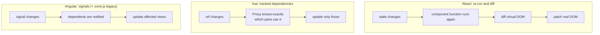
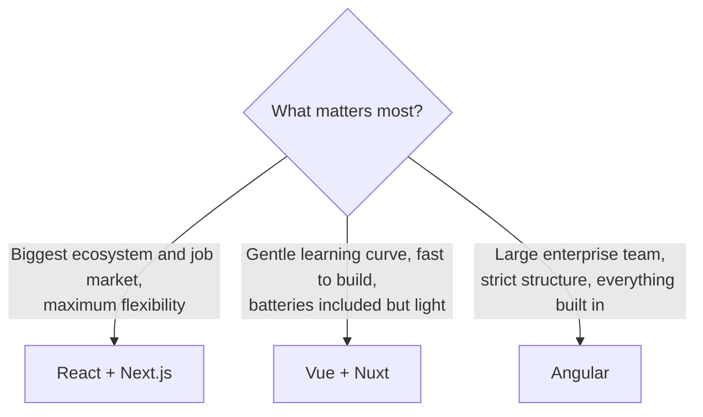

## The big idea

Three ways to furnish a home:

- **React** 🧱 = **a box of LEGO**: a flexible core (UI components) and you pick the other pieces yourself (router, state, forms). Huge community.
- **Vue** 🪑 = **a well-designed starter kit**: friendly, gentle learning curve, official router and state library included.
- **Angular** 🏢 = **a fully furnished office**: everything built in (router, forms, HTTP, DI, testing), with strong conventions. Great for large enterprise teams.


## The same counter, three ways

### React

```jsx
import { useState } from "react";

export function Counter() {
  const [count, setCount] = useState(0);
  const double = count * 2;
  return (
    <button onClick={() => setCount(count + 1)}>
      Clicked {count} times (double: {double})
    </button>
  );
}
```

### Vue 3 (Composition API, single-file component)

```vue
<script setup>
import { ref, computed } from "vue";

const count = ref(0);
const double = computed(() => count.value * 2);
</script>

<template>
  <button @click="count++">Clicked {{ count }} times (double: {{ double }})</button>
</template>

<style scoped>
button { font-weight: bold; }
</style>
```

### Angular (standalone component with signals)

```ts
import { Component, signal, computed } from "@angular/core";

@Component({
  selector: "app-counter",
  standalone: true,
  template: `
    <button (click)="increment()">
      Clicked {{ count() }} times (double: {{ double() }})
    </button>
  `,
})
export class CounterComponent {
  count = signal(0);
  double = computed(() => this.count() * 2);
  increment() {
    this.count.update((c) => c + 1);
  }
}
```

## How reactivity works

The biggest difference is **how each framework knows what to update**.



- **React** re-renders the component and diffs the result. Simple mental model; sometimes needs memoisation.
- **Vue** wraps state in **Proxies** (remember the Proxy pattern?) and tracks exactly which template parts read which values: fine-grained updates with no memoisation.
- **Angular** historically checked the whole tree after every event (zone.js); modern Angular uses **signals** for fine-grained updates, much like Vue.

## Side-by-side

| | React | Vue | Angular |
| --- | --- | --- | --- |
| **Type** | UI library | Progressive framework | Full framework |
| **Maintained by** | Meta + community | Evan You + community | Google |
| **Templates** | JSX (JavaScript) | HTML templates (`v-if`, `v-for`) or JSX | HTML templates (`@if`, `@for`) |
| **Language** | JS or TS | JS or TS | TypeScript (required) |
| **Reactivity** | Re-render + diff | Proxy-based tracking | Signals |
| **State management** | Many choices (Zustand, Redux, TanStack Query) | Pinia (official) | Services + signals, NgRx |
| **Routing** | React Router / Next.js | Vue Router (official) | Built in |
| **Forms, HTTP, DI** | Pick libraries | Pick libraries | ✅ Built in |
| **Meta-framework** | **Next.js**, Remix | **Nuxt** | Angular SSR / Analog |
| **Learning curve** | Medium | Gentle | Steeper |
| **Job market** | Largest | Strong (esp. Asia and Europe) | Strong in enterprise |

## Concepts map across frameworks

Once you know one, the others are mostly new syntax:

| Concept | React | Vue | Angular |
| --- | --- | --- | --- |
| Local state | `useState` | `ref` / `reactive` | `signal` |
| Derived value | compute in render / `useMemo` | `computed` | `computed` |
| Side effect | `useEffect` | `watch` / `watchEffect` | `effect` |
| Props in | props | `defineProps` | `input()` |
| Events out | callback props | `defineEmits` / `$emit` | `output()` |
| Conditional | `{cond && <X/>}` | `v-if` | `@if` |
| List | `items.map(...)` | `v-for` | `@for` |
| Shared logic | custom hooks | composables | services |
| Global state | Context / stores | Pinia | injectable services |

## How to choose



> 💡 **The skills transfer.** Components, props, state, derived values, effects, routing and data fetching exist in all three. Learn the concepts deeply in one; switching later takes days, not months.

## Key takeaways

- **React:** a flexible UI library with the biggest ecosystem; pair it with Next.js.
- **Vue:** approachable, fine-grained reactivity through Proxies, official router and Pinia; pair it with Nuxt.
- **Angular:** a complete, opinionated, TypeScript-first framework for large teams; now with signals.
- The core concepts are the same everywhere. Choose based on team, project size and ecosystem.
