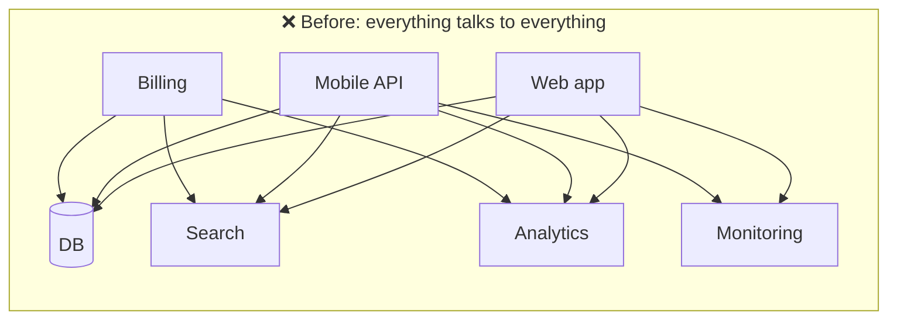
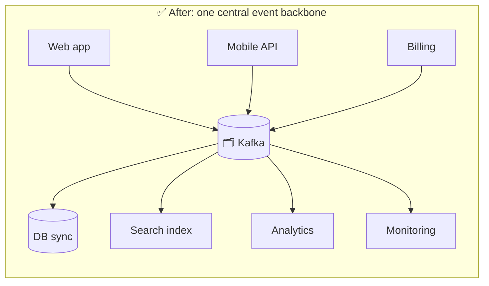
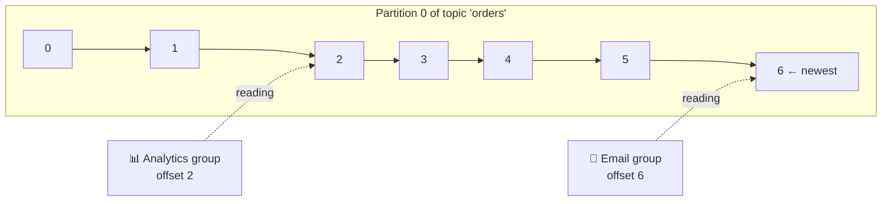
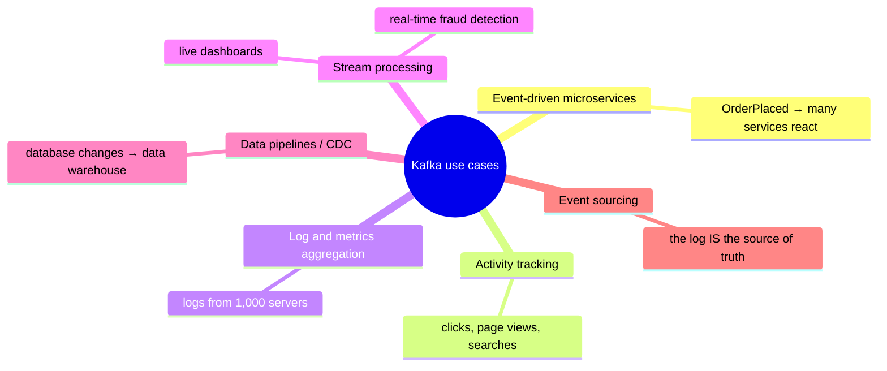

## The big idea

Imagine a **newspaper printing press** that never throws old editions away. Reporters (producers) keep adding new stories to the end. Readers (consumers) each keep a **bookmark** of how far they've read. A new reader can start from today's edition, or go back and read everything from the first day. Nobody's reading affects anyone else's.

That's Kafka: an **append-only log of events**, stored durably, split across many servers, that any number of readers can consume **at their own pace**, and **replay**.


## Why was Kafka created?

LinkedIn built Kafka around 2010. They had dozens of systems that all needed the same data (page views, profile updates, messages), and point-to-point connections had become spaghetti:





Producers publish once; any number of consumers read independently. Adding a new consumer requires **zero changes** to the producers.

## Core vocabulary

| Term | Meaning | Analogy |
| --- | --- | --- |
| **Event / record / message** | A fact that happened: key, value, timestamp, headers | One newspaper story |
| **Topic** | A named stream of related events, e.g. `orders` | A newspaper section (Sports, Business) |
| **Partition** | A topic is split into ordered logs spread across brokers | Several printing presses for one section |
| **Offset** | The position of a record within a partition (0, 1, 2…) | The page number |
| **Producer** | An app that writes events | A reporter |
| **Consumer** | An app that reads events | A reader |
| **Consumer group** | Consumers sharing the work of reading a topic | A team splitting the sections between them |
| **Broker** | A Kafka server that stores partitions | A printing plant |
| **Cluster** | A group of brokers working together | The whole newspaper company |

## Kafka is a log, not a traditional queue

This is the most important idea:

| | Traditional queue (e.g. RabbitMQ) | Kafka |
| --- | --- | --- |
| After a message is consumed | Deleted | **Kept** (for days, weeks, or forever) |
| Multiple independent readers | Needs one queue per reader | ✅ Built in: each group has its own offsets |
| Replay old messages | ❌ | ✅ Rewind the offset |
| Ordering | Per queue | Per **partition** |
| Throughput | Tens of thousands of messages/s per node | **Millions** of messages/s per cluster |



The analytics consumer is behind; the email consumer is up to date. They don't affect each other.

## A first taste (Node.js with KafkaJS)

```js
import { Kafka } from "kafkajs";

const kafka = new Kafka({ clientId: "shop", brokers: ["localhost:9092"] });

// Producer: append an event
const producer = kafka.producer();
await producer.connect();
await producer.send({
  topic: "orders",
  messages: [{ key: "customer-7", value: JSON.stringify({ orderId: "ord_42", totalCents: 8997 }) }],
});

// Consumer: read events as part of a group
const consumer = kafka.consumer({ groupId: "email-service" });
await consumer.connect();
await consumer.subscribe({ topic: "orders", fromBeginning: true });
await consumer.run({
  eachMessage: async ({ partition, message }) => {
    const order = JSON.parse(message.value.toString());
    console.log(`partition ${partition} offset ${message.offset}:`, order);
  },
});
```

## What is Kafka used for?



**Who uses it:** LinkedIn (trillions of messages per day), Netflix, Uber, Airbnb, banks, retailers. Over 80% of Fortune 100 companies.

## Why is it so fast?

- **Sequential disk writes:** appending to the end of a file is very fast, even on spinning disks.
- **Zero-copy:** data goes from disk to network without being copied through the application.
- **Batching and compression:** many records are sent and stored together.
- **Partitioning:** work is spread over many brokers and consumed in parallel.

## Key takeaways

- Kafka is a **distributed, durable, append-only log** of events.
- Producers write to **topics**; topics are split into **partitions**; each record has an **offset**.
- Records **stay** after being read; each consumer group tracks its own offset and can replay.
- It decouples producers from any number of consumers at very high throughput.
- Used for event-driven microservices, activity tracking, pipelines, CDC and stream processing.
