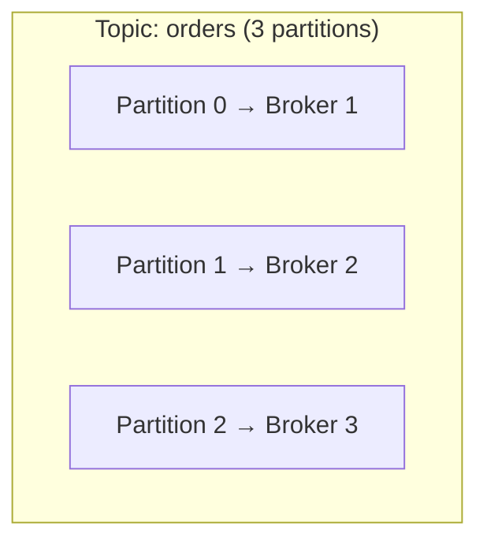
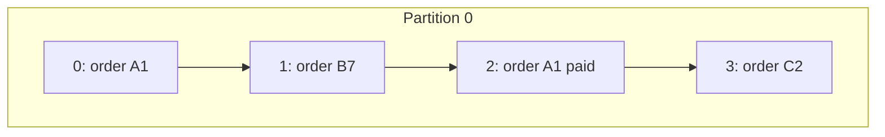
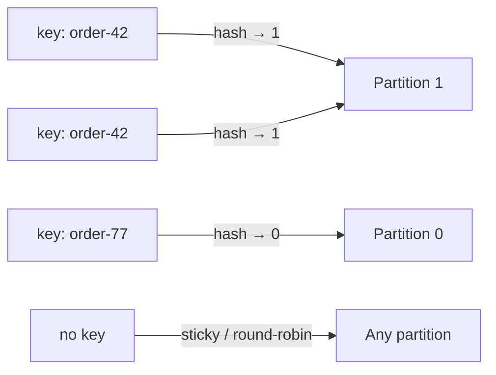
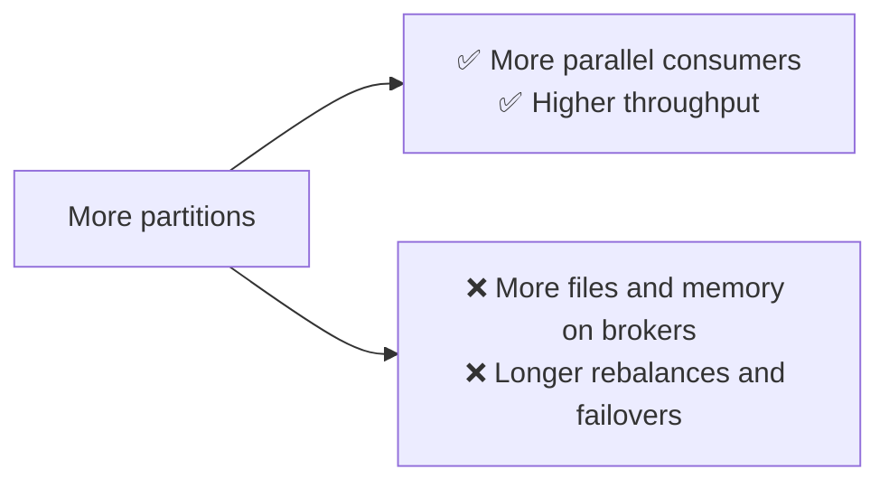
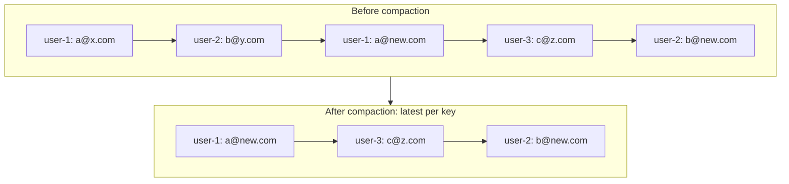

## The big idea

A supermarket with **one checkout lane** is simple, but slow. With **eight lanes**, eight customers are served at once. The catch: customers in *different* lanes can finish in any order; only customers **in the same lane** keep their order.

A Kafka **topic** is the store; its **partitions** are the checkout lanes.


## Topics

A topic is a named stream of related events: `orders`, `payments`, `page-views`, `user-signups`.

```bash
kafka-topics.sh --create --topic orders --partitions 6 --replication-factor 3 --bootstrap-server localhost:9092
```

**Naming tips:** use a consistent scheme such as `<domain>.<entity>.<event>`: `shop.orders.placed`, `shop.payments.completed`.

## Partitions: the unit of parallelism

Each partition is an **ordered, append-only log** stored on one broker (plus copies on others). Splitting a topic into partitions lets Kafka:

- **Spread the data** across many brokers (a topic can be bigger than one disk).
- **Spread the load**: writes and reads for different partitions happen on different machines.
- **Consume in parallel**: each partition can be read by a different consumer in a group.



## Offsets: positions in a partition

Every record in a partition gets a sequential **offset**: 0, 1, 2, 3… Offsets are **per partition**: partition 0 and partition 1 both have an offset 5, and they're different records.



A record is uniquely identified by **(topic, partition, offset)**.

## Keys decide the partition, and the ordering ⭐

When a producer sends a record **with a key**, Kafka picks the partition by hashing the key:

```text
partition = hash(key) % number_of_partitions
```

**The same key always goes to the same partition**, so all events for that key stay **in order**.

```js
await producer.send({
  topic: "orders",
  messages: [
    { key: "order-42", value: JSON.stringify({ type: "OrderPlaced" }) },
    { key: "order-42", value: JSON.stringify({ type: "OrderPaid" }) },     // same partition, after Placed
    { key: "order-42", value: JSON.stringify({ type: "OrderShipped" }) },  // same partition, after Paid
    { key: "order-77", value: JSON.stringify({ type: "OrderPlaced" }) },   // maybe a different partition
  ],
});
```



| Situation | Ordering |
| --- | --- |
| Same key | ✅ Guaranteed in order |
| Different keys | ❌ No ordering between them |
| No key | ❌ Spread for balance; no ordering |

> 💡 **Choose the key = the entity whose events must stay in order**: order ID, account ID, user ID. Ordering across the *whole* topic is only possible with a single partition, which kills parallelism.

### Watch out for hot partitions

If one key is far more active than others (one mega-seller, one celebrity), its partition gets overloaded while others sit idle. Pick keys with **many distinct, evenly active** values.

## How many partitions?



- Partitions = the **maximum number of consumers** in a group that can work in parallel.
- A common starting point: estimate target throughput ÷ throughput per consumer, then add headroom.
- You can **increase** partitions later, but it **changes which partition each key maps to**, breaking per-key ordering for existing keys. So plan ahead; you **cannot decrease** them.

## Retention: how long records live

Kafka doesn't delete records when they're read. It deletes them based on **retention policy**:

| Setting | Meaning | Example |
| --- | --- | --- |
| `retention.ms` | Delete records older than this | `604800000` (7 days, the default) |
| `retention.bytes` | Delete the oldest once a partition exceeds this size | `10 GB` |
| `retention.ms=-1` | Keep forever | Event sourcing, audit logs |

Under the hood, each partition is stored as **segment files**; whole old segments are deleted at once, which is very cheap.

## Log compaction: keep the latest per key

For some topics you only care about the **latest value for each key**, like a user's current email address. **Compaction** removes older records with the same key, keeping at least the newest one.



```bash
kafka-configs.sh --alter --entity-type topics --entity-name user-profiles \
  --add-config cleanup.policy=compact --bootstrap-server localhost:9092
```

A record with a key and a **null value** is a **tombstone**: it tells compaction to delete that key entirely. Compacted topics are great for restoring state (Kafka itself stores consumer offsets in a compacted topic, `__consumer_offsets`).

## Key takeaways

- A **topic** is a named stream; it's split into **partitions** for scale and parallelism.
- Each partition is an ordered log; records have per-partition **offsets**.
- The **key** decides the partition: same key → same partition → guaranteed order.
- Partition count caps consumer parallelism; you can add partitions but it remaps keys.
- **Retention** deletes old records by time or size; **compaction** keeps the latest value per key.
