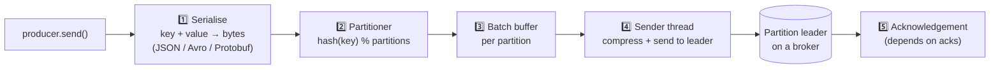
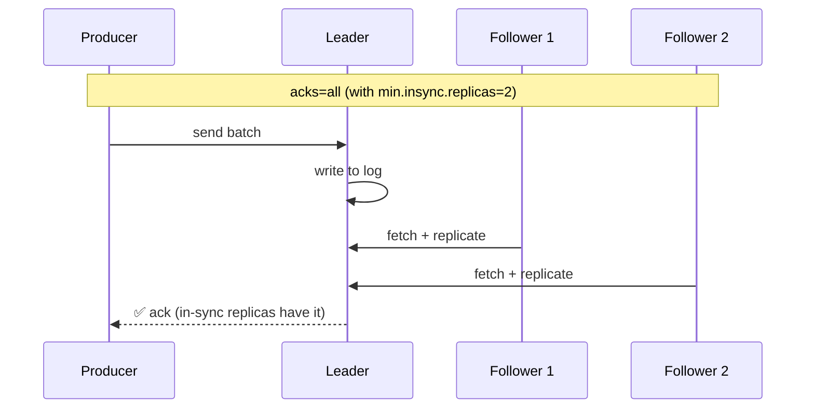
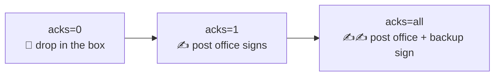
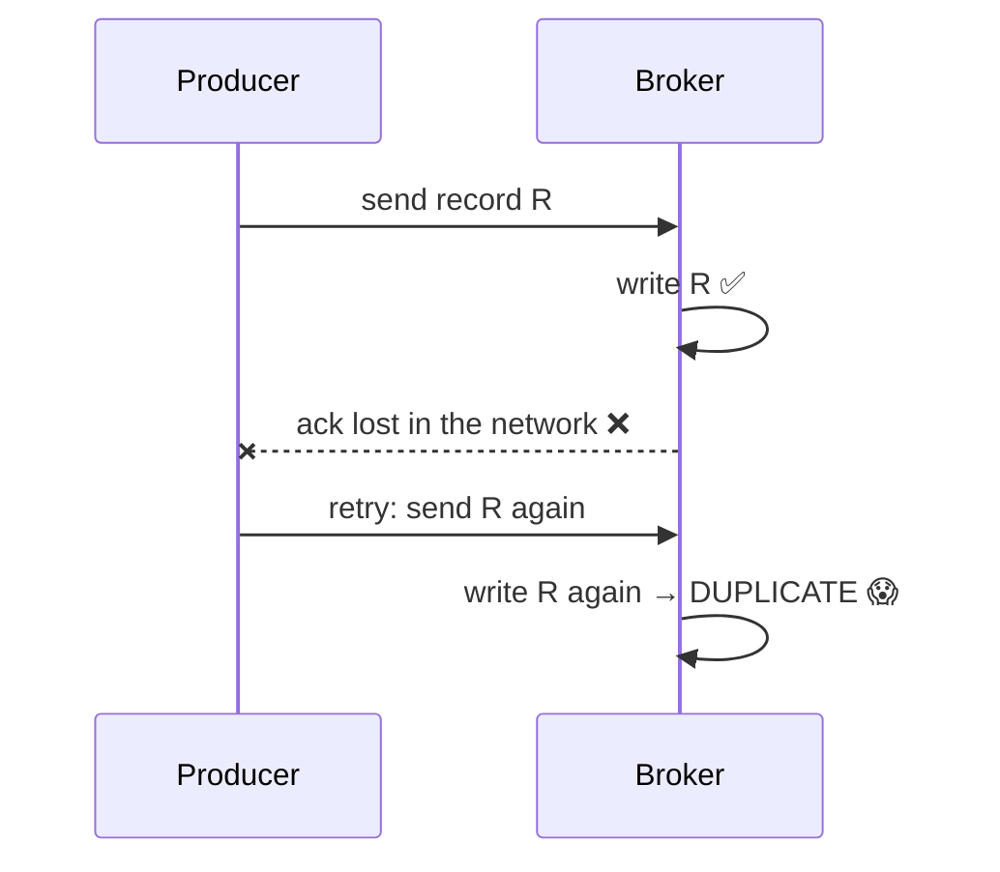
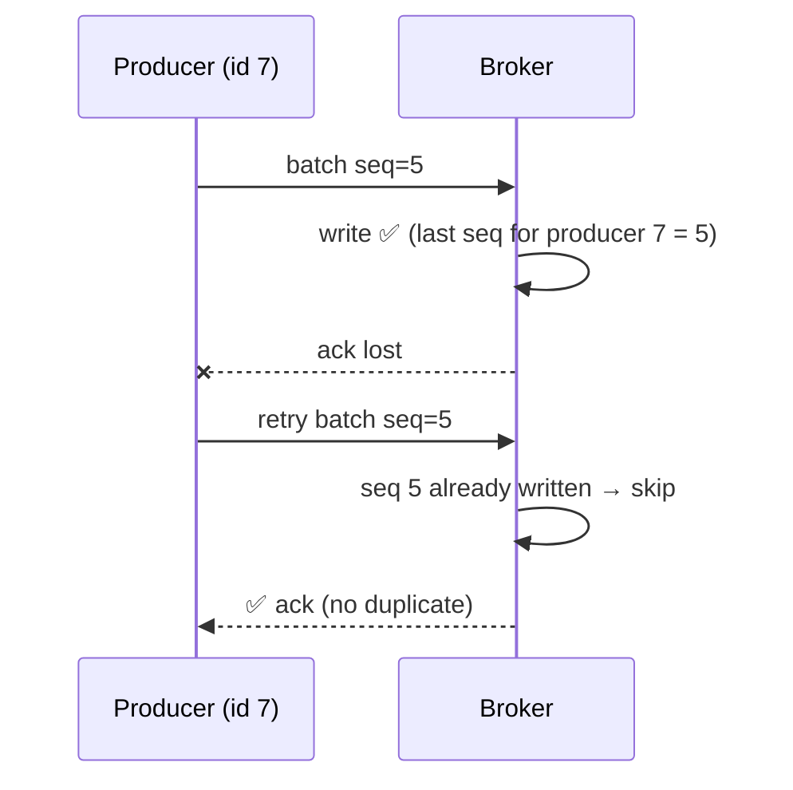

## The big idea

A **postal worker** doesn't drive to the sorting office for every single letter. They collect letters in a **bag**, and drive when the bag is full or when enough time has passed. They can also ask for **delivery confirmation**: none, "the post office received it", or "the post office *and* its backup received it".

A Kafka producer works the same way: it **batches** records, **compresses** them, sends them to the right partition leader, and waits for the level of **acknowledgement** you choose.


## The journey of a record



## Batching and compression: the speed knobs

| Setting | Meaning | Trade-off |
| --- | --- | --- |
| `linger.ms` | Wait up to N ms to fill a batch | Higher = bigger batches, better throughput, slightly more latency |
| `batch.size` | Max bytes per batch per partition | Bigger = fewer requests |
| `compression.type` | `none`, `gzip`, `snappy`, `lz4`, `zstd` | Smaller network and disk usage for some CPU. `lz4`/`zstd` are popular |

> 💡 A few milliseconds of `linger.ms` (5–20 ms) plus `lz4` or `zstd` compression can multiply throughput several times, because whole batches are compressed together.

## acks: how safe is "sent"? ⭐

The most important producer setting. It controls **how many brokers must confirm** a write before the producer considers it successful.



| `acks` | Producer waits for | Speed | Can lose data? |
| --- | --- | --- | --- |
| `0` | Nothing ("fire and forget") | ⚡⚡⚡ | ❌ Yes, easily |
| `1` | The leader wrote it | ⚡⚡ | ⚠️ Yes, if the leader dies before followers copy it |
| `all` (`-1`) | All **in-sync replicas** have it | ⚡ | ✅ No (with `min.insync.replicas ≥ 2`) |



**For important data** (orders, payments): `acks=all`, `replication.factor=3`, `min.insync.replicas=2`. With these, a write is confirmed only when at least two brokers have it, so losing any single broker loses nothing. (acks=all has been the default since Kafka 3.0.)

## Retries and the idempotent producer

Networks fail, and producers retry automatically. But a retry can create a **duplicate**:



The **idempotent producer** fixes this. Each producer gets an ID, and every batch gets a **sequence number** per partition. The broker drops any batch it has already written.



```properties
enable.idempotence=true   # default since Kafka 3.0
acks=all                  # required for idempotence
retries=2147483647
max.in.flight.requests.per.connection=5   # ordering still preserved with idempotence
```

It also **preserves ordering** during retries. Without it, a retried batch could land after a later batch.

## Producing from Node.js (KafkaJS)

```js
import { Kafka, CompressionTypes } from "kafkajs";

const kafka = new Kafka({ clientId: "orders-service", brokers: ["kafka-1:9092", "kafka-2:9092"] });
const producer = kafka.producer({ idempotent: true, maxInFlightRequests: 5 });

await producer.connect();

export async function publishOrderPlaced(order) {
  await producer.send({
    topic: "shop.orders.placed",
    acks: -1,                                  // all in-sync replicas
    compression: CompressionTypes.GZIP,
    messages: [
      {
        key: order.id,                         // keeps all events for this order in order
        value: JSON.stringify({ orderId: order.id, customerId: order.customerId, totalCents: order.totalCents }),
        headers: { eventType: "OrderPlaced", eventId: crypto.randomUUID(), schemaVersion: "1" },
      },
    ],
  });
}

process.on("SIGTERM", async () => {
  await producer.disconnect(); // flush pending batches before exiting
});
```

## Serialisation and schemas

Kafka stores **bytes**; it doesn't care about the format. But producers and consumers must agree on it.

| Format | Pros | Cons |
| --- | --- | --- |
| **JSON** | Human-readable, easy | Larger, no enforced schema |
| **Avro** | Compact, schema evolution rules | Needs a schema registry |
| **Protobuf** | Compact, typed, great tooling | Needs generated code |

A **Schema Registry** (Confluent, Apicurio) stores versioned schemas and rejects producers that would send incompatible data, so a producer can't silently break every consumer.

## Producer checklist

- [ ] `acks=all` + idempotence for important data
- [ ] A meaningful **key** for ordering (entity ID)
- [ ] Batching (`linger.ms`) and compression (`lz4`/`zstd`) tuned for throughput
- [ ] Event metadata in headers: event ID, type, schema version
- [ ] A schema (Avro/Protobuf/JSON Schema) with compatibility rules
- [ ] Flush and close the producer on shutdown
- [ ] Use the **outbox pattern** when writing to a database and Kafka together (see *Microservices → Sagas & Outbox*)

## Key takeaways

- Producers serialise, partition (by key), batch, compress and send records to partition leaders.
- `linger.ms`, `batch.size` and compression are your throughput knobs.
- `acks=all` + `min.insync.replicas=2` + replication factor 3 = no data loss if one broker dies.
- The **idempotent producer** (default in modern Kafka) prevents duplicates and reordering from retries.
- Agree on a schema; a schema registry stops producers from breaking consumers.
