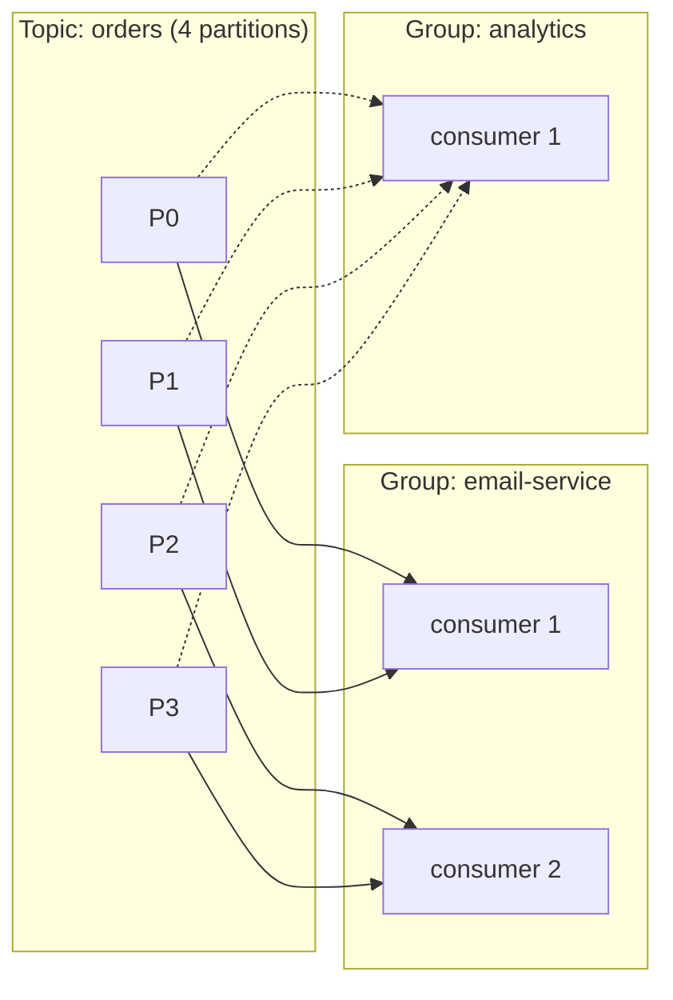
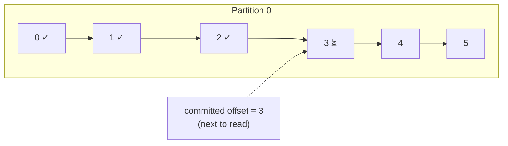
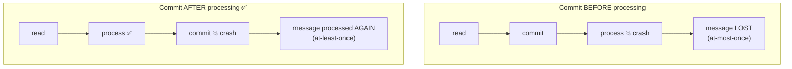
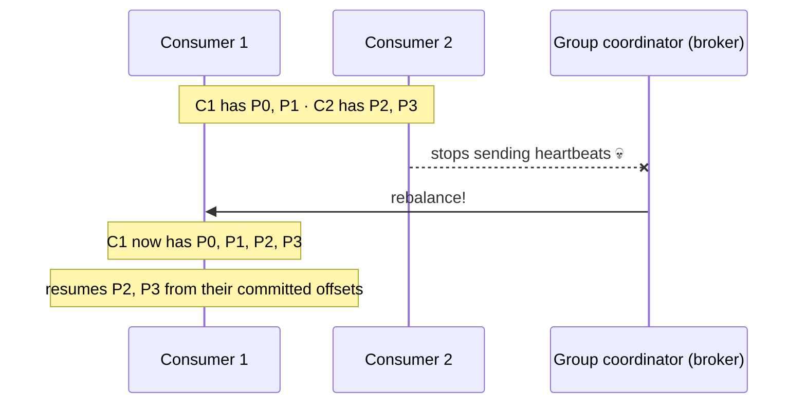
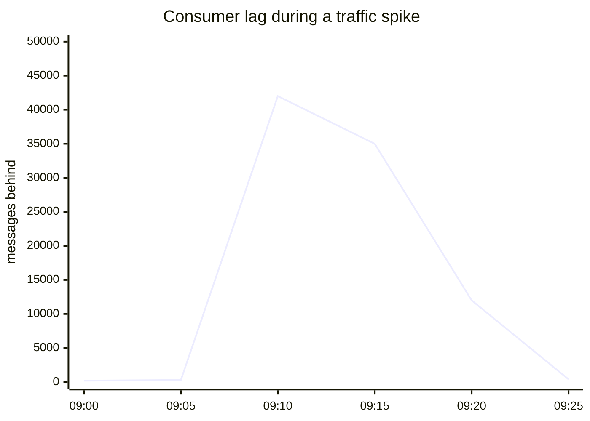
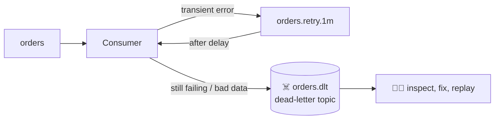

## The big idea

A pile of mail must be sorted. **One person** can do it alone, slowly. A **team** can split the pile so each person takes a few mail bags, and nobody sorts the same bag twice. If someone goes home, their bags are handed to the others. A **different team** (say, the auditors) can read the same mail independently, without affecting the sorters.

- The team = a **consumer group**.
- The mail bags = **partitions**.
- Each team member = a **consumer**.


## Consumer groups: the rules

1. Each partition is read by **exactly one consumer in a group** at a time.
2. One consumer can read **several partitions**.
3. **Different groups** each get **all** the messages, independently, with their own offsets.



### Scaling a group

| Consumers in the group | 4 partitions → |
| --- | --- |
| 1 | That consumer reads all 4 |
| 2 | 2 partitions each |
| 4 | 1 partition each ✅ maximum parallelism |
| 6 | 4 busy, **2 idle** ❌ (no partition left for them) |

> 💡 **The number of partitions is the maximum parallelism of a consumer group.** Plan partitions for the number of consumers you'll need at peak.

## Offsets and commits

Each group stores, per partition, the **offset of the next record to read**. This is the **committed offset**, saved in Kafka's internal `__consumer_offsets` topic. If a consumer crashes, its replacement continues from the last committed offset.



### When to commit decides your guarantee



The standard choice is **at-least-once**: process, then commit, and make processing **idempotent** so a repeat does no harm.

```js
const consumer = kafka.consumer({ groupId: "email-service" });
await consumer.connect();
await consumer.subscribe({ topic: "shop.orders.placed" });

await consumer.run({
  autoCommit: false,
  eachMessage: async ({ topic, partition, message }) => {
    const eventId = message.headers.eventId.toString();
    if (!(await processedEvents.has(eventId))) {         // idempotency check
      await sendOrderConfirmation(JSON.parse(message.value.toString()));
      await processedEvents.add(eventId);
    }
    await consumer.commitOffsets([
      { topic, partition, offset: (BigInt(message.offset) + 1n).toString() }, // commit the NEXT offset
    ]);
  },
});
```

> ⚠️ Auto-commit (the default in many clients) commits on a timer, **regardless** of whether processing finished. Understand it before relying on it.

## Rebalancing

When a consumer **joins**, **leaves** or **crashes**, the group **rebalances**: partitions are reassigned among the remaining members.



- A consumer is considered dead if it misses heartbeats for `session.timeout.ms`, or doesn't call `poll` within `max.poll.interval.ms` (processing too slowly!).
- Older **eager** rebalancing stopped the whole group; modern **cooperative** rebalancing moves only the affected partitions.
- **Static membership** (`group.instance.id`) avoids rebalances when a pod simply restarts.

## Consumer lag: the key health metric

**Lag** = latest offset in the partition − committed offset of the group. It tells you how far behind a consumer is.



Growing lag means consumers can't keep up: **add consumers** (up to the partition count), speed up processing, or process in batches. Alert on lag that keeps growing. Tools: Burrow, Kafka UI, Prometheus exporters.

## Handling failures: retries and dead-letter topics

What if a message **can't** be processed (bad data, a downstream API is down)? Don't block the partition forever.



- Retry **transient** errors a few times with backoff (in-process, or through retry topics).
- Send **poison messages** to a **dead-letter topic** with error details in headers, then move on.
- Monitor the DLT and replay messages after fixing the bug.

## Consumer checklist

- [ ] One group per logical application (`email-service`, `analytics`)
- [ ] Commit after processing; make processing idempotent
- [ ] Keep processing time under `max.poll.interval.ms`, or process asynchronously in batches
- [ ] Monitor consumer lag and alert on growth
- [ ] Retry transient errors; dead-letter poison messages
- [ ] Graceful shutdown: finish the current batch, commit, leave the group

## Key takeaways

- A **consumer group** shares a topic's partitions: each partition goes to one consumer in the group.
- Different groups read the same data independently, each with its own **committed offsets**.
- Partitions cap parallelism; extra consumers sit idle.
- Commit **after** processing for at-least-once, and make handlers idempotent.
- Rebalances reassign partitions when members change; watch **lag**; use dead-letter topics for poison messages.
