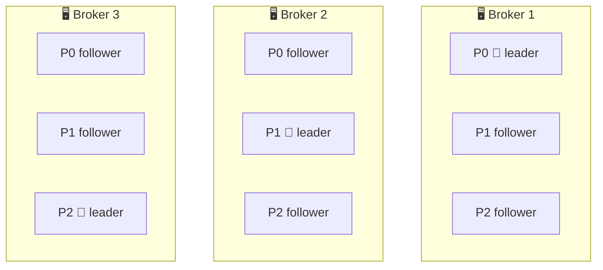
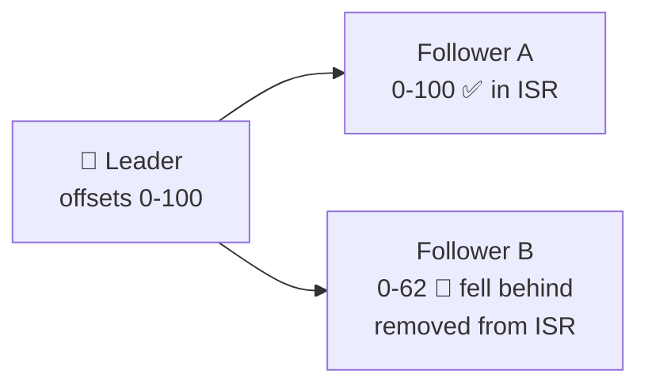
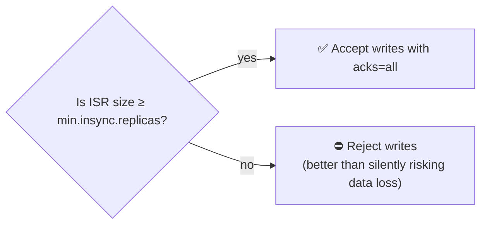
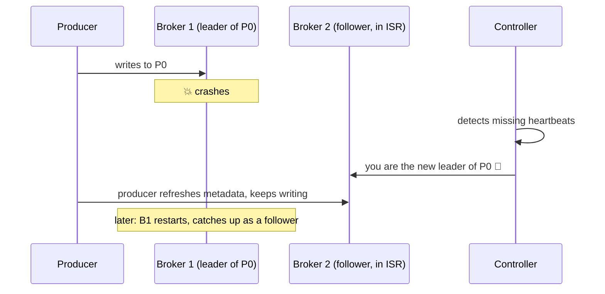
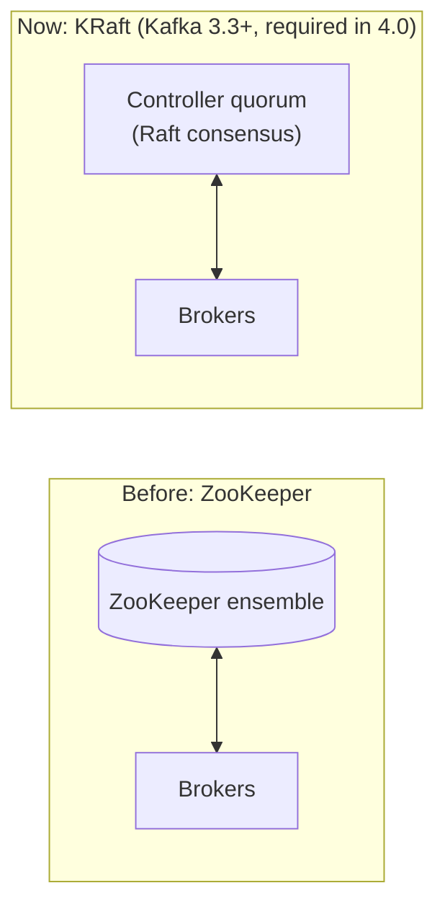
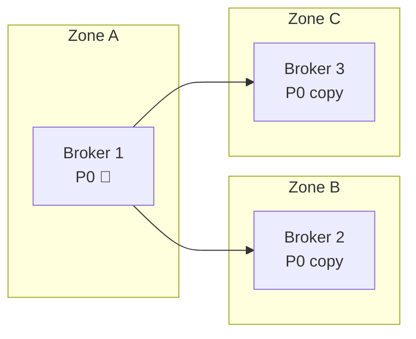

## The big idea

Important documents are kept in **several safes in different buildings**. One copy is the **master** that everyone writes to; the others are **copies** kept up to date. If the building with the master burns down, one of the up-to-date copies becomes the new master, and work continues.

In Kafka, every partition has one **leader** replica and several **follower** replicas on different brokers.

## Brokers and clusters

- A **broker** is a Kafka server. It stores partition replicas and serves producers and consumers.
- A **cluster** is a group of brokers (3 at minimum for production; large clusters run hundreds).
- Partitions and their replicas are **spread across brokers** so load and risk are shared.

## Replication factor

`replication.factor=3` means every partition has **3 copies** on 3 different brokers: one leader + two followers.

- **Producers write** to the leader.
- **Followers fetch** from the leader to stay in sync.
- **Consumers read** from the leader by default (or from a nearby follower, with rack-aware settings).
- Leadership is spread so each broker leads some partitions.

## In-sync replicas (ISR)

A follower is **in sync** if it has caught up with the leader recently (within `replica.lag.time.max.ms`, 30 s by default). The leader plus all caught-up followers form the **ISR** (in-sync replica set).

## The durability trio ⭐

These three settings together decide whether an acknowledged write can ever be lost:

| Setting | Where | Recommended |
| --- | --- | --- |
| `replication.factor` | Topic | **3** |
| `min.insync.replicas` | Topic / broker | **2** |
| `acks` | Producer | **all** |

With these, a write is acknowledged only when **at least 2 replicas** have it. So:

| Brokers down | Can still write? | Data lost? |
| --- | --- | --- |
| 0 | ✅ | No |
| 1 | ✅ (2 replicas left in sync) | No |
| 2 | ❌ Producers get `NotEnoughReplicas` (writes pause) | No |

> 💡 Kafka chooses **consistency over availability** here: with too few in-sync copies, it refuses writes rather than risk losing confirmed data.

## When a broker fails: leader election

Only replicas **in the ISR** can become leader, so the new leader has every acknowledged record. (Setting `unclean.leader.election.enable=true` allows an out-of-sync replica to become leader: more available, but it **can lose data**. Keep it `false` for important topics.)

## The controller and KRaft

One broker acts as the **controller**: it tracks which brokers are alive and elects partition leaders.

Kafka used to depend on a separate **ZooKeeper** cluster for metadata. **KRaft** mode moves metadata into Kafka itself using the **Raft** consensus algorithm: one fewer system to run, faster failover, and support for millions of partitions. Kafka 4.0 removed ZooKeeper entirely.

## Racks and regions

- **Rack awareness** (`broker.rack`): Kafka places replicas in different racks or availability zones, so losing a whole zone doesn't lose a partition.
- **Multi-region:** tools like **MirrorMaker 2** or Cluster Linking copy topics between clusters for disaster recovery and geo-locality.

## Key takeaways

- A cluster is a group of **brokers**; each partition has one **leader** and several **followers** on different brokers.
- The **ISR** is the set of replicas that are caught up with the leader.
- `replication.factor=3` + `min.insync.replicas=2` + `acks=all` = no acknowledged data loss when one broker fails.
- When a leader dies, the controller elects a new leader from the ISR.
- **KRaft** replaced ZooKeeper; rack awareness spreads replicas across failure zones.
