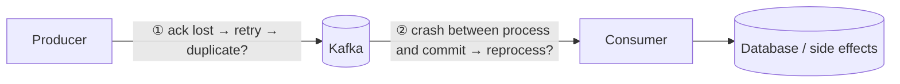
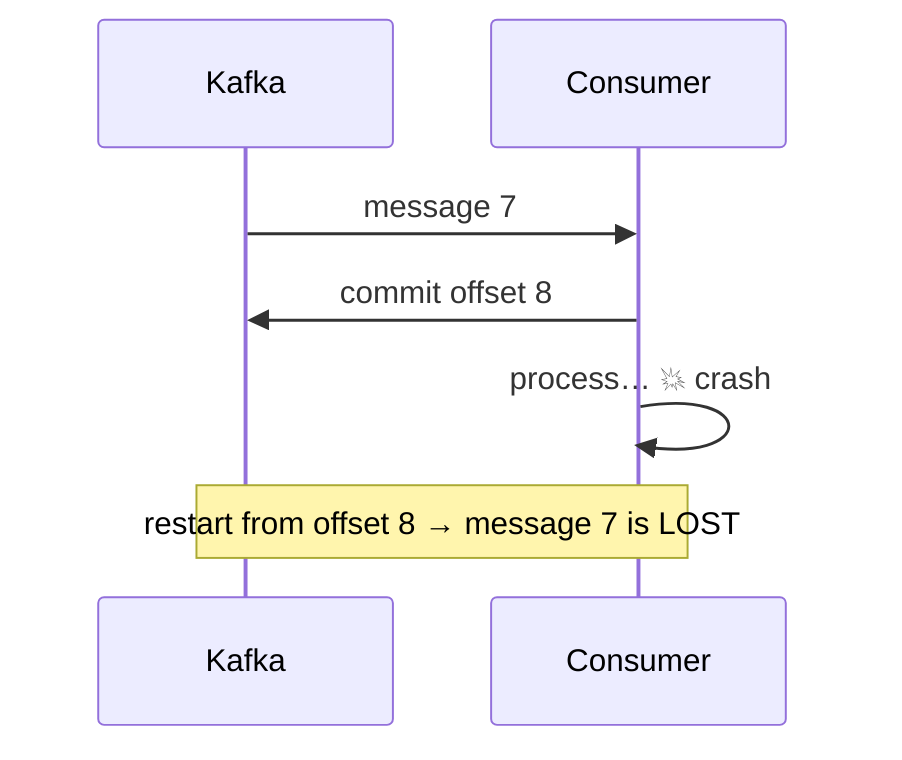
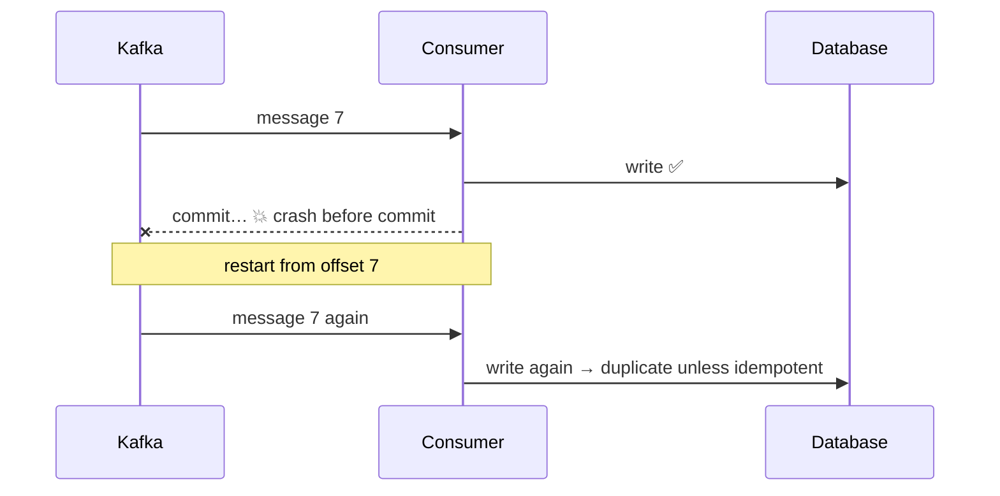
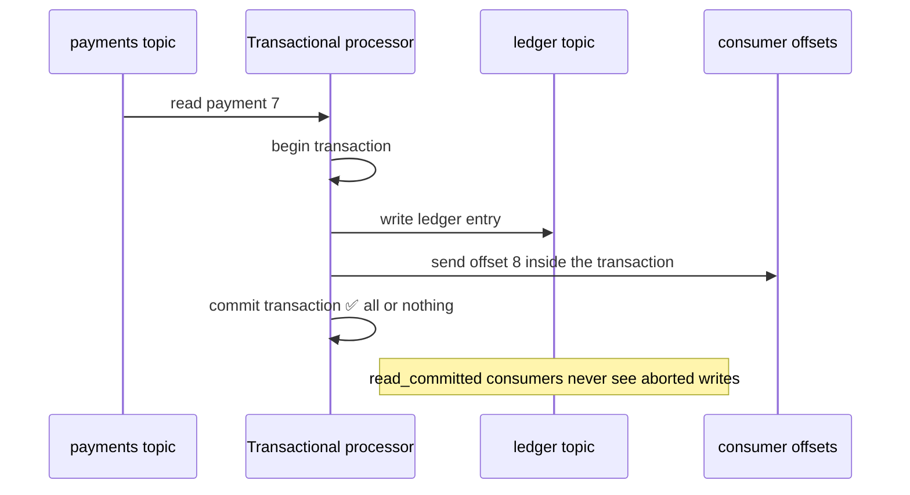
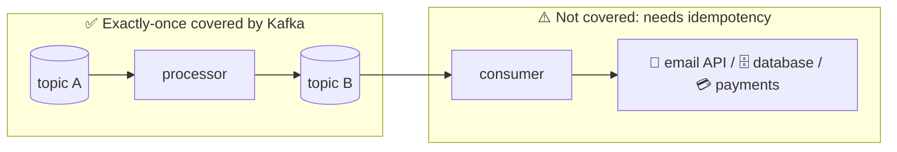

## The big idea

Sending an important parcel:

- **At most once** 📮: you drop it in a postbox. It arrives once, or it's lost. Never twice.
- **At least once** 📦📦: you keep resending until you get a signature. It always arrives, but sometimes the recipient gets two.
- **Exactly once** ✅: it always arrives, and exactly one copy counts. The hardest to achieve.


## Where things can go wrong

A message can be lost or duplicated at **two points**: when the producer writes it, and when the consumer processes it.



## At-most-once

**Consumer commits the offset before processing.** If it crashes during processing, the message is skipped forever.



**Use for:** metrics or logs where losing a little is acceptable and duplicates would be worse.

## At-least-once ⭐ (the usual default)

**Producer:** `acks=all` with retries. **Consumer:** process first, commit after. Nothing is lost, but a crash between processing and committing causes **reprocessing**.



**Fix the duplicates on the consumer side with idempotency:**

```js
// Option 1: remember processed event IDs (same transaction as the business change)
await db.transaction(async (tx) => {
  const inserted = await tx.query(
    "INSERT INTO processed_events (event_id) VALUES ($1) ON CONFLICT DO NOTHING RETURNING 1",
    [eventId],
  );
  if (inserted.rowCount === 0) return;             // already processed → skip
  await tx.query("UPDATE accounts SET balance = balance + $1 WHERE id = $2", [amount, accountId]);
});

// Option 2: make the operation naturally idempotent (an upsert with the final value)
await db.query(
  "INSERT INTO order_status (order_id, status) VALUES ($1, $2) ON CONFLICT (order_id) DO UPDATE SET status = $2",
  [orderId, status],
);
```

> 💡 **At-least-once delivery + idempotent processing = effectively exactly-once results.** This works with any broker and any database, and it's what most production systems do.

## Exactly-once semantics (EOS) in Kafka

Kafka offers real exactly-once guarantees **within Kafka**, using two features.

### 1. Idempotent producer (no duplicates on write)

Covered in *Producers*: producer ID + sequence numbers let the broker drop retried duplicates. It's on by default in modern Kafka.

### 2. Transactions (atomic read-process-write)

A stream processor reads from topic A, transforms the record, and writes to topic B. Kafka transactions make **"write the output + commit the input offset"** one atomic step: either both happen or neither does.



```js
const producer = kafka.producer({ transactionalId: "ledger-writer-1", idempotent: true, maxInFlightRequests: 1 });
await producer.connect();

await consumer.run({
  autoCommit: false,
  eachMessage: async ({ topic, partition, message }) => {
    const tx = await producer.transaction();
    try {
      await tx.send({ topic: "ledger", messages: [{ key: message.key, value: toLedgerEntry(message.value) }] });
      await tx.sendOffsets({
        consumerGroupId: "ledger-writer",
        topics: [{ topic, partitions: [{ partition, offset: (BigInt(message.offset) + 1n).toString() }] }],
      });
      await tx.commit();
    } catch (error) {
      await tx.abort(); // nothing written, offset not committed → the message will be retried
      throw error;
    }
  },
});
```

Consumers of `ledger` must use `isolation.level=read_committed` so they skip records from aborted transactions.

**Kafka Streams** enables all of this with a single setting: `processing.guarantee=exactly_once_v2`.

### The limit of exactly-once

Kafka's transactions cover **Kafka → Kafka**. The moment you write to an **external** system (a database, an email API, a payment provider), Kafka can't include it in its transaction.



For external side effects, you're back to **at-least-once + idempotency** (idempotency keys, upserts, processed-event tables, or storing the offset in the same database transaction as the data).

## Choosing a guarantee

| Guarantee | Producer config | Consumer pattern | Use for |
| --- | --- | --- | --- |
| At-most-once | `acks=0` or `1` | Commit, then process | Metrics, logs, telemetry |
| At-least-once | `acks=all`, idempotence | Process, then commit + **idempotent handler** | Most business events ✅ |
| Exactly-once (in Kafka) | Transactions | `read_committed`, `sendOffsets` in the transaction | Stream processing, financial pipelines |

## Key takeaways

- Loss or duplication can happen when producing and when consuming.
- **At-most-once:** commit before processing; may lose messages.
- **At-least-once:** process before committing; may duplicate, so handlers must be **idempotent**. This is the standard.
- **Exactly-once:** idempotent producer + transactions make read-process-write atomic *inside Kafka*.
- For external systems, exactly-once *results* come from at-least-once delivery + idempotent processing.
