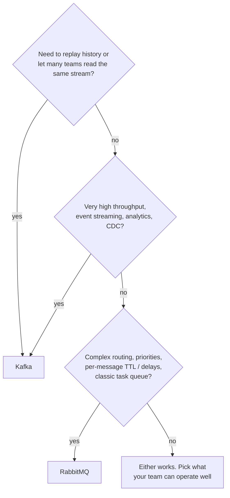
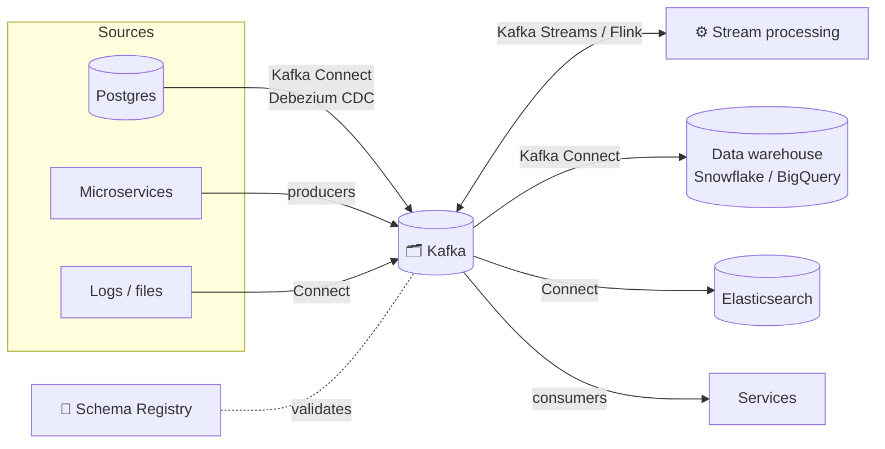
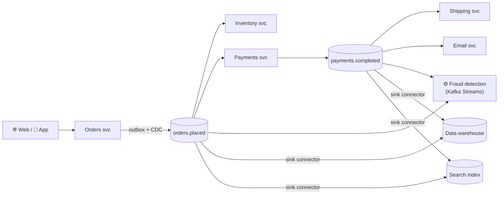

## The big idea

- **RabbitMQ** is like a **post office**: it receives letters, routes each one to the right mailbox using clever rules, and once a letter is delivered, it's gone from the post office.
- **Kafka** is like a **library archive**: every document is stored in order and kept. Anyone can come and read from any point, as many times as they like.

Both move messages between systems, but they're built on different ideas.


## Side-by-side

| | RabbitMQ | Kafka |
| --- | --- | --- |
| **Model** | Message broker with queues | Distributed commit log |
| **After consumption** | Message is removed | Message is kept (retention) |
| **Replay** | ❌ Not built in | ✅ Rewind offsets |
| **Routing** | ✅ Rich: direct, topic, fanout, headers exchanges | Simple: topic + partition by key |
| **Ordering** | Per queue (with one consumer) | Per partition |
| **Throughput** | High (tens of thousands of msgs/s per node) | Very high (millions of msgs/s per cluster) |
| **Consumer model** | Broker **pushes** to consumers | Consumers **pull** at their own pace |
| **Per-message features** | Priorities, TTL, delays, per-message ack/nack | Batches, offsets, compaction |
| **Multiple independent readers** | One queue per reader (fanout) | ✅ Consumer groups on one topic |
| **Stream processing** | ❌ | ✅ Kafka Streams, Flink, ksqlDB |
| **Typical latency** | Very low for individual messages | Low, optimised for throughput |
| **Operational weight** | Lighter | Heavier (but managed services exist) |

## When to choose which



✅ **Kafka shines for:** event-driven microservices where many services react to the same events, activity tracking, log aggregation, data pipelines into warehouses, CDC, event sourcing, real-time analytics.

✅ **RabbitMQ shines for:** background job queues ("resize this image"), request/reply, complex routing rules, priority queues, delayed messages, smaller systems.

Many companies run **both**: RabbitMQ (or SQS, BullMQ) for task queues and Kafka as the event backbone.

## The Kafka ecosystem



### Kafka Connect: integration without code

Ready-made **connectors** move data between Kafka and other systems, configured with JSON instead of custom code.

- **Source connectors** pull data *into* Kafka: databases (Debezium CDC), S3, MQTT, Salesforce.
- **Sink connectors** push data *out*: Elasticsearch, S3, Snowflake, BigQuery, MongoDB, Postgres.

```json
{
  "name": "orders-cdc",
  "config": {
    "connector.class": "io.debezium.connector.postgresql.PostgresConnector",
    "database.hostname": "orders-db",
    "database.dbname": "orders",
    "table.include.list": "public.orders,public.outbox",
    "topic.prefix": "shop"
  }
}
```

**Change Data Capture (CDC)** with Debezium reads the database's transaction log and turns every insert, update and delete into a Kafka event: the easiest way to implement the **outbox pattern** or to stream database changes to search indexes and warehouses.

### Kafka Streams: processing inside your app

A Java library for **stateful stream processing**: filtering, mapping, joining streams, windowed aggregations, with exactly-once support. No separate cluster needed; it runs inside your service.

```java
// Count orders per customer in 1-minute windows (Kafka Streams, Java)
builder.stream("shop.orders.placed", Consumed.with(Serdes.String(), orderSerde))
    .groupByKey()
    .windowedBy(TimeWindows.ofSizeWithNoGrace(Duration.ofMinutes(1)))
    .count()
    .toStream()
    .to("orders-per-customer-per-minute");
```

Alternatives: **Apache Flink** (a powerful separate processing cluster), **ksqlDB** (SQL over streams).

### Schema Registry: contracts for events

Stores versioned **Avro / Protobuf / JSON Schema** definitions for each topic and enforces **compatibility rules**, so a producer can't publish an event that breaks existing consumers.

| Compatibility | Allowed change |
| --- | --- |
| **Backward** (default) | New schema can read old data: e.g. add an optional field |
| **Forward** | Old schema can read new data |
| **Full** | Both directions |

## A real-world picture: an e-commerce event backbone



Each service owns its data, publishes facts as events, and reacts to other services' events. Analytics, search and fraud detection plug in **without touching** the services that produce the events.

## Managed options

Running Kafka yourself takes real expertise. Managed services handle brokers, upgrades and scaling: **Confluent Cloud**, **Amazon MSK**, **Aiven**, **Redpanda** (a Kafka-compatible engine), **Azure Event Hubs** (Kafka-compatible API).

## Key takeaways

- RabbitMQ = smart routing + delete after delivery; Kafka = durable, replayable, ordered log at huge scale.
- Choose Kafka for event streaming, many independent consumers, replay and analytics; RabbitMQ for task queues, routing and per-message features.
- **Kafka Connect** integrates databases and data stores without code; **Debezium** provides CDC.
- **Kafka Streams / Flink** process streams in real time; **Schema Registry** keeps event contracts safe.
- An event backbone lets new consumers plug in without changing producers.
