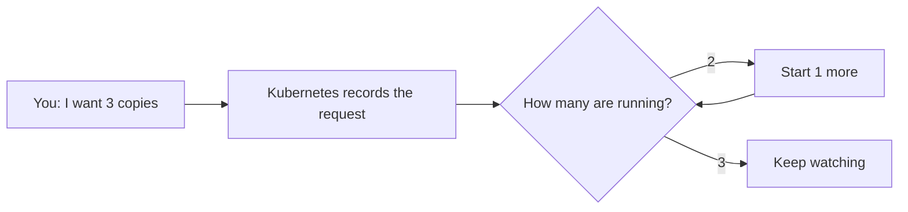
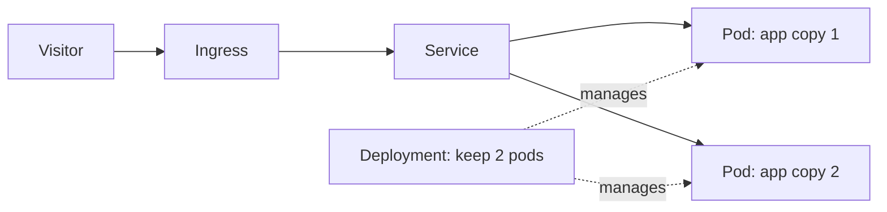

## First: the short version

**Kubernetes (K8s) runs containers for you.**

It runs them on one or many servers, restarts them when they fail, runs more copies when needed, and replaces old versions carefully. You tell it the result you want; it keeps checking and working toward that result.

If that sentence is all you remember today, that is a good start.


## A familiar example

Imagine an online shop API. It needs three running copies so the site stays available.

Without Kubernetes, someone must notice when a container dies and start it again. During a busy sale, someone must start extra copies. Deploying a new version can interrupt visitors.

With Kubernetes, you can say: **“Keep three copies of `shop-api` version 1.8 running.”** Kubernetes does the repetitive work.

| Situation | Kubernetes response |
| --- | --- |
| One app copy crashes | Starts a replacement |
| A server fails | Moves affected work to a healthy server |
| Traffic grows | Can add more copies automatically |
| You publish a new version | Replaces copies gradually, then can undo it |

## The one idea that explains Kubernetes

Kubernetes stores two things:

1. **Desired state** — what you asked for. Example: “three copies.”
2. **Actual state** — what is running right now. Example: “only two copies.”

When they differ, Kubernetes tries to close the gap.



This is why Kubernetes is called **declarative**. You say *what the finished situation should be*, not every command needed to get there.

```yaml
# This means: keep three copies of this app running.
apiVersion: apps/v1
kind: Deployment
metadata:
  name: shop-api
spec:
  replicas: 3
  selector:
    matchLabels:
      app: shop-api
  template:
    metadata:
      labels:
        app: shop-api
    spec:
      containers:
        - name: api
          image: registry.example.com/shop-api:1.8.0
```

You save that as a YAML file and apply it:

```bash
kubectl apply -f shop-api.yaml
```

Do not worry about every line yet. The next lessons explain each piece.

## The six words you will meet most

| Word | Plain meaning |
| --- | --- |
| **Cluster** | The whole Kubernetes system: one or more servers working together |
| **Node** | One server in that cluster |
| **Pod** | The smallest thing Kubernetes runs; usually one app container |
| **Deployment** | A manager that keeps the requested number of pods alive |
| **Service** | A stable internal address for a changing group of pods |
| **Ingress** | Rules for sending web traffic from the internet to Services |



You do not need to memorize this diagram. Read it left to right: visitor → front door → stable address → app copies.

## Do you need Kubernetes?

Probably **not yet** if you have one small app and a small team. A platform such as Render, Railway, Vercel, Cloud Run, or a simple Docker server is usually easier.

Kubernetes starts to make sense when you have several services, need reliable rolling deployments and automatic recovery, or have a team ready to operate it. For most real teams, use a managed service such as EKS, GKE, or AKS rather than building the Kubernetes control plane yourself.

## Before the next lesson

- A container is your packaged app.
- A pod runs that app in Kubernetes.
- A Deployment keeps the right number of pods alive.
- Kubernetes repeatedly compares “what I asked for” with “what exists.”

Next, learn where these pieces live: the cluster, its servers, and the control plane.
