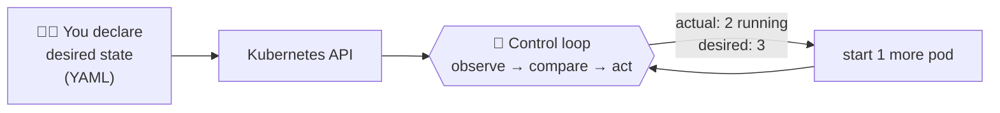
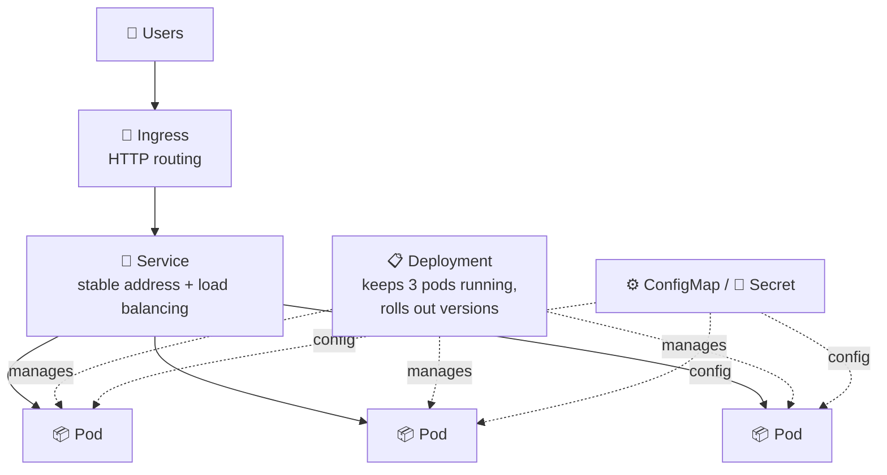
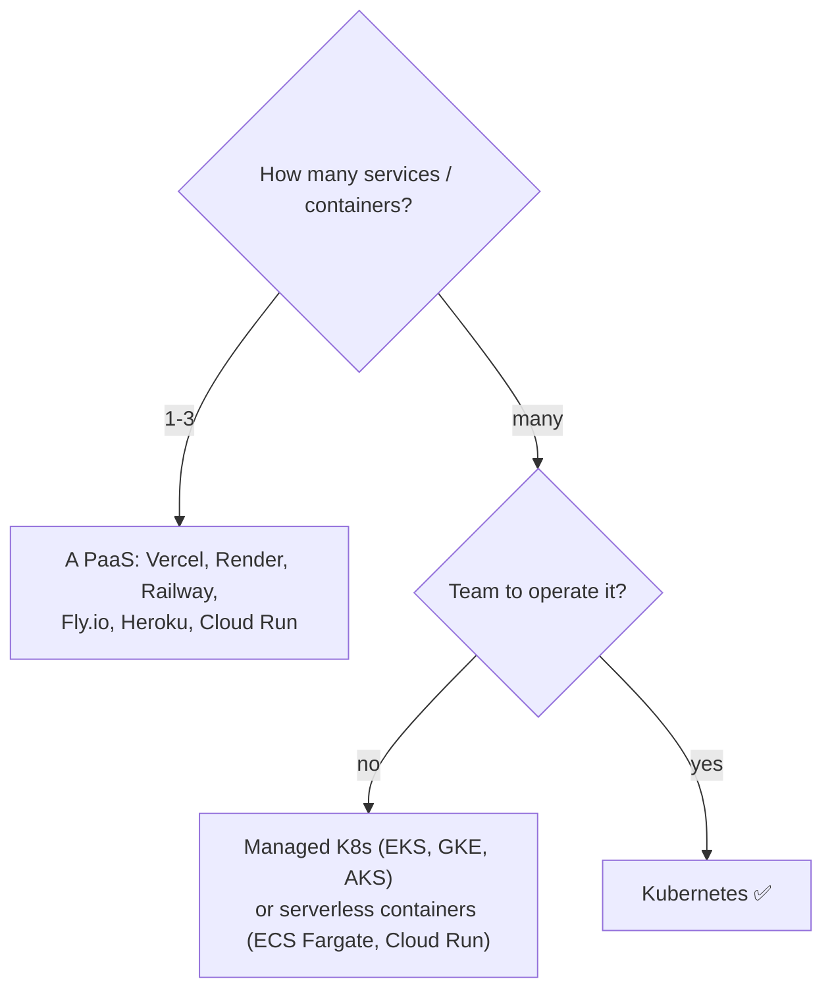

## The big idea

A single musician can play alone. A **100-person orchestra** needs a **conductor**: someone who makes sure every instrument starts on time, replaces a sick violinist, and keeps everyone in sync.

Docker gives you containers (the musicians). **Kubernetes** (K8s) is the **conductor**: it decides where each container runs, restarts the ones that crash, scales them up and down, and rolls out new versions without stopping the music.


> 📘 The name comes from Greek for **helmsman** (the person steering a ship). "K8s" = K + 8 letters + s. Google open-sourced it in 2014, based on its internal system Borg. It is now run by the Cloud Native Computing Foundation (CNCF).

## The problems it solves

Running one container is easy: `docker run my-app`. Running **production** is not:

| Problem | Without Kubernetes | With Kubernetes |
| --- | --- | --- |
| A container crashes at 3 a.m. | Someone gets paged, SSHes in, restarts it | **Self-healing**: restarted automatically |
| A server dies | Manually move its containers elsewhere | **Rescheduled** onto healthy nodes |
| Traffic spikes 10× | Manually start more copies | **Autoscaling** adds replicas |
| Deploying a new version | Stop old, start new → downtime | **Rolling updates** with zero downtime, and rollback |
| "Which server has space?" | Spreadsheets and guesswork | **Scheduler** places containers by CPU/memory needs |
| Service A needs to find service B | Hard-coded IP addresses | **Service discovery** and load balancing built in |
| Passwords and config | Baked into images or scattered files | **ConfigMaps and Secrets** |

## The core idea: desired state ⭐

You don't tell Kubernetes *how* to do things step by step. You **declare what you want** in YAML ("I want 3 copies of my API, version 1.8"), and Kubernetes **continuously works to make reality match**.



```yaml
# "I want 3 replicas of my API, version 1.8"
apiVersion: apps/v1
kind: Deployment
metadata:
  name: shop-api
spec:
  replicas: 3
  selector:
    matchLabels: { app: shop-api }
  template:
    metadata:
      labels: { app: shop-api }
    spec:
      containers:
        - name: api
          image: registry.example.com/shop-api:1.8.0
          ports: [{ containerPort: 3000 }]
```

```bash
kubectl apply -f deployment.yaml   # "make it so"
```

A pod crashes → actual (2) ≠ desired (3) → Kubernetes starts a new one. **No human needed.** This "control loop" idea powers everything in Kubernetes.

| Imperative (how) | Declarative (what) ✅ |
| --- | --- |
| "Start container A on server 3" | "There should be 3 copies of A" |
| "Stop version 1, start version 2" | "The version should be 2" |
| Breaks when reality changes | Keeps fixing reality automatically |

## Key building blocks (a preview)



| Object | One-line meaning | Lesson |
| --- | --- | --- |
| **Pod** | The smallest unit: one or more containers running together | Pods |
| **Deployment** | Keeps N identical pods running; handles rollouts | Deployments |
| **Service** | A stable name/IP that load-balances across pods | Services & Ingress |
| **Ingress** | HTTP(S) routing from the internet to services | Services & Ingress |
| **ConfigMap / Secret** | Configuration and sensitive values | Config & Storage |
| **PersistentVolume** | Storage that outlives pods | Config & Storage |
| **HPA** | Autoscaling pods based on load | Scaling & Health |

## Do you actually need Kubernetes?

Kubernetes is powerful, and complex. Be honest about your needs (remember **KISS**).



✅ **Good fit:** many services, several teams, the need for portability across clouds, strong automation of deploys and scaling.

❌ **Probably overkill:** a single web app, a small team with no ops experience, a prototype. A PaaS gets you to production faster.

> 💡 If you do use Kubernetes, use a **managed** control plane (Amazon EKS, Google GKE, Azure AKS). Running the control plane yourself is a job in itself.

## Key takeaways

- Kubernetes orchestrates containers across many machines: scheduling, self-healing, scaling, rollouts and discovery.
- You **declare desired state** in YAML; control loops keep reality matching it.
- Core objects: Pods, Deployments, Services, Ingress, ConfigMaps/Secrets, volumes, autoscalers.
- It's powerful but complex. Use it when the scale and team justify it, preferably managed.
