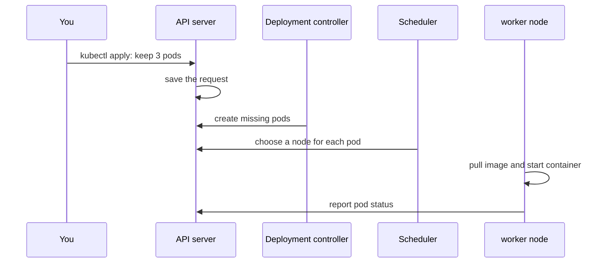

## The picture to keep in your head

A Kubernetes **cluster** is a group of servers. Some servers make decisions; other servers run your apps.


| Part | Simple job |
| --- | --- |
| **Control plane** | Receives requests, remembers what you want, and decides where work should run |
| **Worker node** | A server that actually starts and runs pods |

Think of a restaurant company: head office plans and tracks; each restaurant cooks and serves.

## The control plane: the decision team

You do not normally operate these parts one by one. Knowing their jobs helps when you read errors or diagrams.

| Name | Plain-English job |
| --- | --- |
| **API server** | The front door. `kubectl` sends requests here. |
| **etcd** | The cluster’s important notebook: it stores the requested configuration and status. |
| **Scheduler** | Chooses a worker node for a new pod. |
| **Controllers** | Watch for missing or broken things and create replacements. |

`etcd` is important because it holds the cluster’s records. This is one reason managed Kubernetes (EKS, GKE, AKS) is usually the right choice: the provider operates and backs up the control plane.

## Worker nodes: where your app runs

Each worker node is a server. It has a few helpers:

| Helper | What it does |
| --- | --- |
| **kubelet** | Receives “run this pod” instructions and reports back |
| **Container runtime** | Downloads images and starts containers |
| **Networking** | Lets pods talk to each other and lets Services route traffic |

You do not SSH into a node to start your app. You ask Kubernetes, and the node helpers do it.

## What happens after `kubectl apply`?

Suppose you apply a Deployment that asks for three pods:



The key point: components react to the shared record in the API server. You do not need to call the scheduler or node yourself.

## How does Kubernetes choose a node?

For a new pod, the scheduler first removes nodes that cannot run it, then chooses a good remaining node.

The usual questions are simple:

- Does this node have enough requested CPU and memory?
- Does the pod require a special node, such as one with a GPU?
- Should copies be spread across different servers or zones?

If no node has enough room, the pod stays `Pending`. That is a useful clue, not a mysterious failure.

## `kubectl`: your safe starting commands

`kubectl` is the command-line tool that talks to the API server.

```bash
kubectl get nodes                 # What servers are available?
kubectl get pods -A               # What pods exist in all namespaces?
kubectl cluster-info              # Which cluster am I connected to?
kubectl config current-context    # Which cluster/context will commands use?
```

Always check the current context before changing anything important. It is easy to have a development and production cluster in the same config.

## Namespaces: folders inside one cluster

A **namespace** is like a folder or a separate workspace inside the same cluster. It prevents names and permissions from becoming one big pile.

```text
cluster
├── team-shop       → shop-api, shop-web
├── team-payments   → payments-api
└── kube-system     → Kubernetes own system components
```

```bash
kubectl get pods -n team-shop
kubectl get pods -A
```

Use namespaces for teams or environments such as `dev`, `staging`, and `production`.

## Remember this

- A cluster is a group of servers.
- The control plane records and decides; worker nodes run pods.
- `kubectl` talks to the API server, not directly to nodes.
- A pod that cannot find room often shows as `Pending`.
- A namespace is a grouping boundary inside the cluster.
